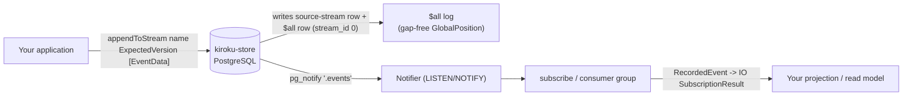

# Kiroku foundation documentation set

This ExecPlan is a living document. The sections Progress, Surprises & Discoveries,
Decision Log, and Outcomes & Retrospective must be kept up to date as work proceeds.


## Purpose / Big Picture

After this change, the unified keiro-runtime documentation site (a fumadocs / Next.js +
MDX app living in this repo) contains a complete, accurate, navigable documentation set for
**kiroku** — the append-only PostgreSQL **event store** that is the persistence foundation
of the keiro runtime family. A reader who lands on `/docs/kiroku` can:

- understand what kiroku *is* (an event STORE, not a decider/aggregate framework) and how
  its storage model works (streams, categories, the `$all` log, gap-free global order);
- follow a hands-on **tutorial** that migrates a database, opens a `Store`, appends events
  with optimistic concurrency (`ExpectedVersion`), reads a stream back, and runs a live
  subscription — all with code that compiles against the **real** kiroku API;
- look up the exact signatures of the `Store` effect operations and the core domain types
  (`EventData`, `RecordedEvent`, `ExpectedVersion`, `StreamName`, `StreamVersion`,
  `GlobalPosition`) in a **reference** section;
- complete focused **how-to** tasks (run against Postgres, enable OpenTelemetry via
  `kiroku-otel`, build a projection, integrate with shibuya via `shibuya-kiroku-adapter`);
- copy a **cookbook** recipe; and
- learn the user-land **decider / evolve** pattern that kiroku deliberately does *not*
  ship, presented as an application pattern layered on top of the store.

You can see it working by running the docs dev server (`pnpm dev`) and browsing
`http://localhost:3000/docs/kiroku`: the kiroku tree appears in the sidebar with the page
order defined in `content/docs/kiroku/meta.json`; Haskell snippets render in PragmataPro with
ligatures (`->`, `=>`, `<-`, `::`, `>>=` shown as glyphs); and at least one `mermaid`
diagram (the append → store → subscribe flow) renders as an interactive, zoomable diagram.

This is the **content** plan. It populates `content/docs/kiroku/` only. It does *not* build
the app, the highlighter, the font, the Mermaid component, or the IA/template system — those
are owned by sibling plans (see Context). This plan PORTS kiroku's already-written docs
(under the kiroku source tree) into the site's IA and FILLS the known gaps.


## Progress

Use a checklist to summarize granular steps. Every stopping point must be documented here,
even if it requires splitting a partially completed task into two ("done" vs. "remaining").
This section must always reflect the actual current state of the work.

- [ ] M0. Preconditions verified (Plan A scaffold present; Plan D IA + templates present;
      `content/docs/kiroku/` directory exists; kiroku source tree readable for cross-checking).
- [ ] M1. Landing + overview page (`index.mdx`) authored.
- [ ] M2. Getting-started tutorial authored (migrate → withStore → append → read → subscribe).
- [ ] M3. Explanation pages authored (event sourcing; append-only log; streams & categories;
      `$all` + global order; optimistic concurrency; subscriptions & consumer groups;
      causation & correlation).
- [ ] M4. Reference seed authored (Store effect ops + core type signatures).
- [ ] M5. How-to guides authored (run against Postgres; enable OpenTelemetry; build a
      projection; integrate with shibuya).
- [ ] M6. Cookbook recipe authored (idempotent append with a supplied EventId).
- [ ] M7. Known-gap tutorial authored (user-land decider/evolve pattern).
- [ ] M8. `content/docs/kiroku/meta.json` populated and ordered; site builds; sidebar renders;
      ligatures + mermaid verified; snippets cross-checked against the real API.

- [ ] Example incomplete step. *(Replace with real granular sub-steps as you work; split any
      partially done page into "done" vs "remaining" here.)*


## Surprises & Discoveries

Document unexpected behaviors, bugs, optimizations, or insights discovered during
implementation. Provide concise evidence.

(None yet.)


## Decision Log

Record every decision made while working on the plan.

- Decision: kiroku is documented as an event **store**, never as a decider/aggregate
  framework. `decide`/`evolve`/`fold`/`apply`/`project` are presented as user-land patterns,
  not library APIs.
  Rationale: The library ships no such typeclasses; this is a deliberate design boundary
  confirmed by reading the source (no `decide`/`evolve` anywhere in `kiroku-store`). Mislabeling
  it would make every downstream example wrong.
  Date: 2026-05-30
- Decision: Author against the **real** API names transcribed inline in this plan; verify by
  cross-checking the kiroku source modules and (optionally) compiling `kiroku-jitsurei` before
  declaring snippets correct.
  Rationale: Snippet accuracy is an explicit acceptance criterion.
  Date: 2026-05-30


## Outcomes & Retrospective

Summarize outcomes, gaps, and lessons learned at major milestones or at completion.
Compare the result against the original purpose.

(To be filled during and after implementation.)


## Context and Orientation

Read this whole section before editing. It is written so that a novice with only this file
and the working tree can complete the work.

### What you are building

You are writing MDX content files under `content/docs/kiroku/` in **this** repository
(`/Users/shinzui/Keikaku/bokuno/keiro-runtime-docs`). The site itself is a **fumadocs**
documentation app (Next.js 16 + React 19 + MDX, TypeScript, Tailwind v4, built and served
with **pnpm** on **Node 22**). Content lives under `content/docs/`. Each directory has a
`meta.json` that controls the sidebar (its `pages` array lists child page slugs / nested
directory names in display order). A page is an `.mdx` file with YAML frontmatter
(`title`, `description`) followed by MDX body.

The documented **code samples are Haskell** (the site is TypeScript, the subject is a
Haskell library). Every Haskell snippet must use kiroku's real API, transcribed below.

### Sibling plans and how this plan depends on them (reference by path only)

This plan is **Plan E** in the master plan
`docs/masterplans/1-keiro-runtime-docs-infrastructure-and-kiroku-foundation.md`.

- **HARD DEP — Plan A** (`docs/plans/1-scaffold-the-fumadocs-documentation-app.md`):
  scaffolds the fumadocs app. After Plan A, `pnpm dev` serves a styled empty docs site;
  `source.config.ts`, `lib/source.ts`, `mdx-components.tsx`, `app/global.css`, the layouts,
  and `content/docs/` with `index.mdx` + `meta.json` all exist. **You cannot build or preview
  your pages until Plan A is done.**
- **HARD DEP — Plan D** (`docs/plans/4-documentation-information-architecture-and-authoring-system.md`):
  defines the product-first IA, the location `content/docs/kiroku/`, the per-doc-type page
  **templates** (one per Diátaxis type: Tutorial, How-To Guide, Reference, Explanation, plus
  Cookbook), the shared MDX components to prefer (fumadocs-ui built-ins: `Callout`, `Steps`,
  `Tabs`, `Cards`, `TypeTable`), and the authoring/style conventions. **Copy the matching
  template for each page from Plan D's templates; do not invent a different page shape.**
- **SOFT DEP — Plan B** (`docs/plans/2-pragmatapro-font-and-shiki-code-ligatures.md` —
  confirm exact slug in `docs/plans/`): PragmataPro font + Shiki Haskell highlighting +
  ligatures. If Plan B is not yet merged, your `haskell` fences still render (plain), and the
  ligature acceptance check is deferred — note it in Progress.
- **SOFT DEP — Plan C** (`docs/plans/3-beautiful-mermaid-diagrams-with-zoom-pan.md` — confirm
  exact slug): interactive Mermaid. If Plan C is not yet merged, a ```` ```mermaid ```` fence
  renders as a code block instead of a diagram; the interactivity check is deferred.

Because B and C are soft deps, you author the ` ```haskell ` and ` ```mermaid ` fences now
regardless; they light up automatically once B and C land.

### Integration point you own a slice of

`content/docs/**` + `meta.json` is the shared content tree. Plan D **structures** it (creates
the directory skeleton and top-level `content/docs/meta.json`); **this plan populates the
`kiroku/` subtree**, including `content/docs/kiroku/meta.json`. Do not modify other products'
subtrees. When you touch `content/docs/meta.json` (top-level), only ensure `kiroku` is listed;
do not reorder or remove sibling products.

### The subject: kiroku, transcribed from source (use these REAL names)

Source of truth on disk (read-only, for cross-checking — do **not** edit it):
`/Users/shinzui/Keikaku/bokuno/kiroku-project/kiroku`. The facts below are transcribed
verbatim from that tree (cabal files, the `.hs` modules, the bootstrap `.sql`, and
`docs/`). Treat this subsection as your API cheat-sheet; you should rarely need to open the
source except to confirm a detail or to compile the example.

**What kiroku is.** kiroku (記録, "record/chronicle") is a high-performance, append-only
**PostgreSQL event store**. The core package is `kiroku-store`, built on `hasql` +
`effectful-core`. It is **NOT** a decider/aggregate/CQRS framework: there is **no**
`decide` / `evolve` / `fold` / `apply` / `project` typeclass anywhere in the library. Those
are user-land patterns you write on top of `appendToStream` / `readStream*`. State this
framing prominently; it shapes every page.

**Sub-packages (the family inside the kiroku repo):**

| Package | Responsibility |
|---|---|
| `kiroku-store` | Core. Append/read/link/lifecycle/transaction/subscription/consumer-group/causation/notification/observability over immutable events. `hasql` + `effectful-core`. |
| `kiroku-store-migrations` | Embedded forward-only `codd` migrations (Template Haskell `embedDir`) + the `kiroku-store-migrate` executable. Owns the schema. |
| `kiroku-otel` | W3C trace-context inject/extract on event metadata, and a `KirokuEvent → IO ()` handler turning subscription state transitions into OpenTelemetry spans. |
| `kiroku-test-support` | `ephemeral-pg` test harness (shared server + per-test template-cloned databases, auto-migrated). |
| `shibuya-kiroku-adapter` | Bridges a kiroku subscription / consumer group into the **shibuya** pull queue-processing runtime, with ack-coupled checkpointing. |
| `kiroku-jitsurei` | Runnable worked example (executable `kiroku-consumer-group-example`): appends 120 events across 40 streams in category `example`, runs a 4-member consumer group, asserts complete + disjoint partitioning. The main idiomatic-usage seed. |

**Exposed modules of `kiroku-store` (import these paths):**

```text
Kiroku.Store                  -- umbrella; re-exports Types/Connection/Effect/Effect.Resource/Error/
                              --   Append/Causation/Lifecycle/Link/Read/Settings/Subscription/Transaction
Kiroku.Store.Types            -- core domain types
Kiroku.Store.Effect           -- the `Store` dynamic effect (GADT) + interpreters
Kiroku.Store.Effect.Resource  -- resourcet-style store handle for the effect
Kiroku.Store.Append           -- appendToStream / appendMultiStream
Kiroku.Store.Read             -- reads (stream / $all / category) + stream-id lookups
Kiroku.Store.Link             -- linkToStream
Kiroku.Store.Lifecycle        -- soft/hard/undelete stream
Kiroku.Store.Transaction      -- explicit BEGIN/COMMIT + serialization retry (escape hatch)
Kiroku.Store.Causation        -- correlation/causation graph reads
Kiroku.Store.Connection       -- ConnectionSettings, KirokuStore handle, withStore
Kiroku.Store.Settings         -- StoreSettings (enrich/decode hooks)
Kiroku.Store.Error            -- StoreError ADT
Kiroku.Store.Notification     -- LISTEN/NOTIFY notifier
Kiroku.Store.Observability    -- KirokuEvent operational-event taxonomy
Kiroku.Store.Subscription     -- subscribe / withSubscription (+ re-exports Subscription.Types)
```

**Core domain types (`Kiroku.Store.Types`, verbatim):**

```haskell
newtype StreamName     = StreamName Text       -- e.g. "orders-1"; prefix before first '-' = category
newtype StreamId       = StreamId Int64        -- DB surrogate id (rarely used by app code)
newtype EventId        = EventId UUID          -- UUIDv7 by default (NOT a typeid)
newtype EventType      = EventType Text        -- free-form discriminator, e.g. "OrderCreated"
newtype StreamVersion  = StreamVersion Int64   -- per-stream version; starts at 0, +1 per event
newtype GlobalPosition = GlobalPosition Int64  -- gap-free global $all counter; subscription cursor
newtype CategoryName   = CategoryName Text     -- prefix of a StreamName before first '-'
```

```haskell
data ExpectedVersion
  = NoStream                    -- must NOT exist; creates it. Else StreamAlreadyExists. (aggregate creation)
  | StreamExists                -- must exist (not soft-deleted), version irrelevant. Else StreamNotFound
  | ExactVersion !StreamVersion -- current version must match exactly. Else WrongExpectedVersion
  | AnyVersion                  -- upsert / create-or-append (INSERT ... ON CONFLICT DO UPDATE)
```

```haskell
-- append INPUT
data EventData = EventData
  { eventId       :: !(Maybe EventId)  -- Nothing => store generates UUIDv7; Just => idempotent retries
  , eventType     :: !EventType
  , payload       :: !Aeson.Value      -- JSONB (DB column `data`)
  , metadata      :: !(Maybe Aeson.Value)
  , causationId   :: !(Maybe UUID)
  , correlationId :: !(Maybe UUID)
  }

-- read OUTPUT
data RecordedEvent = RecordedEvent
  { eventId          :: EventId
  , eventType        :: EventType
  , streamVersion    :: StreamVersion   -- position in the stream being read
  , globalPosition   :: GlobalPosition  -- $all position at append time; the subscription cursor
  , originalStreamId :: StreamId        -- source stream (only id present on fan-in reads)
  , originalVersion  :: StreamVersion
  , payload          :: Aeson.Value
  , metadata         :: Maybe Aeson.Value
  , causationId      :: Maybe UUID
  , correlationId    :: Maybe UUID
  , createdAt        :: UTCTime
  }

data AppendResult = AppendResult
  { streamId :: StreamId, streamVersion :: StreamVersion, globalPosition :: GlobalPosition }
  -- describes the LAST event in the batch

data LinkResult = LinkResult { streamId :: StreamId, streamVersion :: StreamVersion }
  -- no globalPosition: linking does not advance $all

data StreamInfo = StreamInfo
  { id :: StreamId, name :: StreamName, version :: StreamVersion
  , createdAt :: UTCTime, deletedAt :: Maybe UTCTime }

data EventFilter
  = FilterCorrelation !UUID
  | FilterCausationDescendants !EventId
  | FilterCausationAncestors !EventId
```

Records use `DuplicateRecordFields` + `OverloadedLabels` + `generic-lens`, so app code reads
fields with labels, e.g. `evt ^. #globalPosition`, `evt ^. #eventType`. The common stanza
also enables `OverloadedStrings` and `DeriveAnyClass`.

**Append API (`Kiroku.Store.Append`, verbatim):**

```haskell
appendToStream    :: (HasCallStack, Store :> es) => StreamName -> ExpectedVersion -> [EventData] -> Eff es AppendResult
appendMultiStream :: (HasCallStack, Store :> es) => [(StreamName, ExpectedVersion, [EventData])] -> Eff es [AppendResult]
```

All-or-nothing per call; read-your-own-writes on the same handle. `appendMultiStream`
pre-locks streams in `stream_id` order (deadlock-free). Appending to `$all` is rejected
(`ReservedStreamName`). An empty `[]` event list is a caller mistake. Idempotent retry:
supply `eventId`; a committed retry surfaces `DuplicateEvent`.

**Read API (`Kiroku.Store.Read`, verbatim):**

```haskell
readStreamForward       :: (Store :> es) => StreamName -> StreamVersion -> Int32 -> Eff es (Vector RecordedEvent)
readStreamForwardStream :: (Store :> es) => StreamName -> StreamVersion -> Int32 -> Stream (Eff es) RecordedEvent  -- Streamly, constant-memory paging (suggested pageSize 256)
readStreamBackward      :: (Store :> es) => StreamName -> StreamVersion -> Int32 -> Eff es (Vector RecordedEvent)
readAllForward          :: (Store :> es) => GlobalPosition -> Int32 -> Eff es (Vector RecordedEvent)
readAllBackward         :: (Store :> es) => GlobalPosition -> Int32 -> Eff es (Vector RecordedEvent)
readCategory            :: (Store :> es) => CategoryName -> GlobalPosition -> Int32 -> Eff es (Vector RecordedEvent)
getStream               :: (Store :> es) => StreamName -> Eff es (Maybe StreamInfo)
lookupStreamId          :: (Store :> es) => StreamName -> Eff es (Maybe StreamId)
lookupStreamNames       :: (Store :> es) => [StreamId] -> Eff es (Map StreamId StreamName)  -- batch inverse (fan-in reads)
lookupStreamName        :: (Store :> es) => StreamId  -> Eff es (Maybe StreamName)
```

Cursors are **exclusive**: `StreamVersion 0` / `GlobalPosition 0` reads from the start
(for backward reads, `0` means "after everything"). The `$all` seed row (position 0) is never
returned. The `Int32` argument is the batch/page size.

**Link / Lifecycle / Causation (verbatim):**

```haskell
-- Kiroku.Store.Link — share events into another stream (no payload copy; keeps original globalPosition)
linkToStream :: (Store :> es) => StreamName -> [EventId] -> Eff es LinkResult

-- Kiroku.Store.Lifecycle — all return Maybe StreamId (Nothing = not found / no-op); reject "$all"
softDeleteStream :: (Store :> es) => StreamName -> Eff es (Maybe StreamId)   -- keeps events in $all
hardDeleteStream :: (Store :> es) => StreamName -> Eff es (Maybe StreamId)   -- GUC-gated (kiroku.enable_hard_deletes); irreversible; GDPR
undeleteStream   :: (Store :> es) => StreamName -> Eff es (Maybe StreamId)

-- Kiroku.Store.Causation — graph walks over causation_id / correlation_id
findCausationDescendants :: (Store :> es) => EventId -> Eff es (Vector RecordedEvent)
findCausationAncestors   :: (Store :> es) => EventId -> Eff es (Vector RecordedEvent)
findByCorrelation        :: (Store :> es) => UUID    -> Eff es (Vector RecordedEvent)
```

**The `Store` effect + interpreters (`Kiroku.Store.Effect`, verbatim):**

```haskell
data Store :: Effect where
  AppendToStream      :: StreamName -> ExpectedVersion -> [EventData] -> Store m AppendResult
  AppendMultiStream   :: [(StreamName, ExpectedVersion, [EventData])] -> Store m [AppendResult]
  ReadStreamForward   :: StreamName -> StreamVersion -> Int32 -> Store m (Vector RecordedEvent)
  ReadStreamBackward  :: StreamName -> StreamVersion -> Int32 -> Store m (Vector RecordedEvent)
  ReadAllForward      :: GlobalPosition -> Int32 -> Store m (Vector RecordedEvent)
  ReadAllBackward     :: GlobalPosition -> Int32 -> Store m (Vector RecordedEvent)
  ReadCategoryForward :: CategoryName -> GlobalPosition -> Int32 -> Store m (Vector RecordedEvent)
  GetStream           :: StreamName -> Store m (Maybe StreamInfo)
  LookupStreamId      :: StreamName -> Store m (Maybe StreamId)
  LookupStreamNames   :: [StreamId] -> Store m (Map StreamId StreamName)
  LinkToStream        :: StreamName -> [EventId] -> Store m LinkResult
  FindEvents          :: EventFilter -> Store m (Vector RecordedEvent)
  SoftDeleteStream    :: StreamName -> Store m (Maybe StreamId)
  HardDeleteStream    :: StreamName -> Store m (Maybe StreamId)
  UndeleteStream      :: StreamName -> Store m (Maybe StreamId)
  RunTransaction        :: Tx.Transaction a -> Store m a   -- escape hatch (BEGIN/COMMIT, with retry)
  RunTransactionNoRetry :: Tx.Transaction a -> Store m a   -- exactly-once body
type instance DispatchOf Store = Dynamic
```

```haskell
runStorePool     :: (IOE :> es, Error StoreError :> es) => KirokuStore -> Eff (Store : es) a -> Eff es a
runStoreIO       :: KirokuStore -> Eff (Store : Error StoreError : IOE : '[]) a -> IO (Either StoreError a)
runStoreResource :: ...  -- resourcet-scoped variant
```

The effect is deliberately dynamic and the sums (the GADT, `EventFilter`) are closed, so
downstream code can supply mock interpreters in tests (e.g. a pure in-memory interpreter).
The only **shipped** backend is `runStorePool` over `hasql-pool`. `runStoreIO` is the
convenience runner used in the example.

**The store handle + connection settings (`Kiroku.Store.Connection`, verbatim):**

```haskell
data ConnectionSettingsM m = ConnectionSettings
  { connString :: Text, poolSize :: Int            -- default 10
  , schema :: Text                                  -- default "kiroku"; sets search_path AND the NOTIFY channel
  , extraSearchPath :: [Text]                       -- app schemas (e.g. public) for inline projection tables
  , idleInTransactionTimeout :: Int                 -- seconds, default 30
  , statementTimeout :: Maybe Int
  , observationHandler :: Maybe (Observation -> m ())   -- hasql-pool connection lifecycle
  , eventHandler :: Maybe (KirokuEvent -> m ())          -- store operational events
  , storeSettings :: StoreSettings }                      -- enrich/decode hooks
type ConnectionSettings = ConnectionSettingsM IO
defaultConnectionSettings :: Text -> ConnectionSettings

withStore :: (MonadUnliftIO m) => ConnectionSettings -> (KirokuStore -> m a) -> m a
```

`withStore` acquires the pool (sets `search_path`, timeouts), starts the **Notifier**
(`LISTEN <schema>.events`) and the **EventPublisher** (broadcasts new events to subscribers),
and tears them down in reverse. `StoreSettings` (`Kiroku.Store.Settings`) carries two hooks:
`enrichEvent :: Maybe (EventData -> IO EventData)` (append path; the OTel trace-context
injection seam) and `decodeHook :: Maybe (RecordedEvent -> IO RecordedEvent)` (read path;
decrypt/redact). Both default `Nothing`.

**Subscriptions / consumer groups (`Kiroku.Store.Subscription` + `Subscription.Types`):**

```haskell
subscribe       :: KirokuStore -> SubscriptionConfig -> IO SubscriptionHandle
withSubscription :: KirokuStore -> SubscriptionConfig -> (SubscriptionHandle -> IO a) -> IO a

-- smart constructor: defaultSubscriptionConfig name target handler
--   name    :: SubscriptionName
--   target  :: SubscriptionTarget   (AllStreams | Category CategoryName)
--   handler :: RecordedEvent -> IO SubscriptionResult   (Continue | Stop)
-- optional fields on SubscriptionConfig:
--   consumerGroup   :: Maybe ConsumerGroup            (ConsumerGroup { member, size })
--   overflowPolicy  :: OverflowPolicy                 (DropSubscription | DropOldest)
--   eventTypeFilter :: EventTypeFilter                (AllEventTypes | OnlyEventTypes [EventType])
--   retryPolicy     :: RetryPolicy                    (default 5 attempts, then dead-letter)
-- SubscriptionHandle = { cancel, wait, currentState }
```

Delivery is **at-least-once**; the checkpoint advances **per batch**, so handlers must be
idempotent. Consumer groups are **static hash-partitioned** by stream (ADR 0002): each member
owns a disjoint slice of streams; same-stream events stay ordered, distinct streams run in
parallel. Checkpoints live in the `subscriptions` table (`last_seen` cursor, keyed by
`(subscription_name, consumer_group_member)`).

**Idiomatic snippets (verbatim from `kiroku-jitsurei/app/Main.hs` — your snippet seed):**

```haskell
-- build events + append with runStoreIO
let evs = [ EventData { eventId = Nothing, eventType = EventType "ExampleEvent"
                      , payload = Aeson.object [], metadata = Nothing
                      , causationId = Nothing, correlationId = Nothing }
          | _ <- [1 .. 3 :: Int] ]
r <- runStoreIO store (appendToStream (StreamName sn) AnyVersion evs)   -- r :: Either StoreError AppendResult

-- open the store (AFTER migrations have been applied)
Pg.withCached \db ->
  withStore (defaultConnectionSettings (Pg.connectionString db)) \store -> do ...

-- subscribe as a consumer-group projection
let cfg = (defaultSubscriptionConfig (SubscriptionName "example-group")
                                     (Category (CategoryName "example"))
                                     handler)
            { consumerGroup = Just (ConsumerGroup { member = m, size = groupSize }) }
    handler evt = do modifyIORef' ref (evt ^. #globalPosition :); pure Continue
h <- subscribe store cfg            -- later: cancel h
```

**Schema (read-only background, distilled from the bootstrap migration):** objects live in a
dedicated `kiroku` schema (`public` stays free). Tables: `streams` (`stream_id BIGSERIAL`,
`stream_name TEXT UNIQUE`, generated `category` column = `split_part(stream_name,'-',1)`,
`stream_version`, `created_at`, `deleted_at`; **the `$all` stream is seeded as
`stream_id = 0`**); `events` (flat: `event_id UUID PK DEFAULT uuidv7()`, `event_type`,
`causation_id`, `correlation_id`, `data JSONB`, `metadata JSONB`, `created_at`);
`stream_events` (junction `(event_id, stream_id)` PK with `stream_version`,
`original_stream_id`, `original_stream_version` — **each event gets ≥2 rows: its source
stream + the `$all` stream (stream_id 0) + any links**, which is how `$all`/categories/links
work without copying payloads and how a contiguous global order is materialized — the
`stream_version` of the `$all` row IS the `GlobalPosition`); `subscriptions` (checkpoints);
`kiroku.dead_letters` (second migration). Triggers: `notify_events()` →
`pg_notify('<schema>.events', …)` (one NOTIFY per append), `prevent_mutation()`
(immutability), `protect_deletion()`/`protect_truncation()` (gated by GUC
`kiroku.enable_hard_deletes`). The store does **not** run DDL on open — migrate first.

**OpenTelemetry (`kiroku-otel`):**

```haskell
-- Kiroku.Otel.TraceContext
injectTraceContext  :: SpanContext -> EventData -> EventData    -- writes traceparent/tracestate into metadata
extractTraceContext :: RecordedEvent -> Maybe SpanContext       -- recovers producer span context; never throws
-- Kiroku.Otel.Subscription
subscriptionTraceHandler :: Tracer -> IO (KirokuEvent -> IO ())  -- install as ConnectionSettings.eventHandler
```

Enable tracing by setting `storeSettings.enrichEvent = Just (pure . injectTraceContext spanCtx)`
and `eventHandler = Just <$> subscriptionTraceHandler tracer` with your own
`TracerProvider`/exporter and a **batch** span processor.

**shibuya adapter (`shibuya-kiroku-adapter`, `Shibuya.Adapter.Kiroku`):**

```haskell
kirokuAdapter :: (IOE :> es) => KirokuStore -> KirokuAdapterConfig -> Eff es (Adapter es RecordedEvent)
defaultKirokuAdapterConfig    :: KirokuAdapterConfig
kirokuConsumerGroupProcessors :: ...  -- turns one KirokuConsumerGroupConfig into N named QueueProcessors
defaultConsumerGroupConfig    :: KirokuConsumerGroupConfig
```

It starts a kiroku subscription, bridges it through a bounded `TBQueue` via the **ack-coupled**
stream, and lifts it into shibuya's effectful stream; the handler's `AckDecision`
(`AckOk` / `AckRetry delay` / `AckDeadLetter reason` / `AckHalt`) drives kiroku checkpointing
per event. For consumer groups, each member is pinned to shibuya's
`(PartitionedInOrder, Serial)` policy.

**Existing kiroku docs to PORT from (map each page to its source):**

```text
<kiroku>/docs/user/getting-started.md       <kiroku>/docs/user/appending-events.md
<kiroku>/docs/user/reading-events.md         <kiroku>/docs/user/subscriptions.md
<kiroku>/docs/user/consumer-groups.md        <kiroku>/docs/user/linking.md
<kiroku>/docs/user/lifecycle.md              <kiroku>/docs/user/causation-correlation.md
<kiroku>/docs/user/observability.md          <kiroku>/docs/user/opentelemetry.md
<kiroku>/docs/user/schema.md                 <kiroku>/docs/user/schema-migrations.md
<kiroku>/docs/user/shibuya-adapter.md        <kiroku>/docs/user/README.md
<kiroku>/docs/guides/building-a-projection.md
<kiroku>/docs/guides/consuming-the-event-log.md
<kiroku>/docs/guides/process-managers-and-sagas.md
<kiroku>/docs/adr/0001-resolve-stream-names-via-lookup-not-recordedevent-field.md
<kiroku>/docs/adr/0002-static-hash-partitioned-consumer-groups.md
<kiroku>/docs/adr/0003-dedicated-kiroku-schema.md
<kiroku>/docs/DESIGN.md   <kiroku>/kiroku-store-migrations/README.md   <kiroku>/README.md
```

where `<kiroku>` = `/Users/shinzui/Keikaku/bokuno/kiroku-project/kiroku`.

### Diátaxis + Plan D templates (how to shape each page)

Diátaxis classifies docs into four modes; Plan D supplies a copy-me MDX template per mode
plus a Cookbook template. Match each page to its mode and copy that template's frontmatter +
section skeleton:

- **Tutorial** (learning-oriented): a guided, do-this-then-that lesson with a guaranteed
  outcome. Use the fumadocs `<Steps>` component for the numbered walkthrough.
- **How-To Guide** (task-oriented): solves one real problem for someone who already knows the
  basics. Plan D's label is exactly **"How-To Guides"**.
- **Reference** (information-oriented): dry, exhaustive, accurate. Use `<TypeTable>` for type
  fields; one subsection per operation/type.
- **Explanation** (understanding-oriented): discursive background and rationale; no steps.
- **Cookbook**: a short, self-contained recipe (problem → solution → snippet).

Conventions carried from Plan D / the master brief: lowercase-kanji product names ("kiroku",
not "Kiroku" in nav labels — but normal sentence-initial capitalization in prose is fine);
"jitsurei" is the word for a worked example; the nav label for the task section is
"How-To Guides". Prefer fumadocs-ui built-ins (`Callout`, `Steps`, `Tabs`, `Cards`,
`TypeTable`) over custom components.

### Fence/formatting rules (hard requirement)

Every fenced code block MUST carry a language tag. Use: ` ```haskell ` for Haskell,
` ```mdx ` for MDX page bodies, ` ```json ` for `meta.json`, ` ```mermaid ` for diagrams,
` ```bash ` for shell, ` ```text ` for plain transcripts. Never write a bare ```` ``` ````.
Include at least one ` ```mermaid ` diagram (the append → store → subscribe flow) and
Haskell snippets that contain ligature-bearing operators (`->`, `=>`, `<-`, `::`, `>>=`,
`<$>`) so Plan B's ligature rendering is demonstrably exercised.


## Plan of Work

The work is one milestone per logical page group, each independently verifiable by building
the site and viewing the page. Author pages in IA order. The final milestone wires the
sidebar (`meta.json`) and runs the full acceptance checks.

**Page set and file map (everything under `content/docs/kiroku/`).** Each entry gives the
file path, Diátaxis type (→ Plan D template), the source doc it ports from, and the key
snippet/diagram it must contain. Detailed per-page outlines follow in Concrete Steps.

| File | Diátaxis type → template | Ports from | Key snippet/diagram |
|---|---|---|---|
| `index.mdx` | Landing/Overview (Explanation template, short) | `docs/user/README.md`, root `README.md` | `<Cards>` to the sections; the append→store→subscribe ` ```mermaid ` diagram |
| `getting-started.mdx` | Tutorial | `docs/user/getting-started.md` + `kiroku-store-migrations/README.md` + `kiroku-jitsurei/app/Main.hs` | migrate → `withStore` → `appendToStream … NoStream` → `readStreamForward` → `subscribe` |
| `explanation/event-sourcing.mdx` | Explanation | `docs/DESIGN.md` (framing) | "store, not a framework" callout |
| `explanation/append-only-log.mdx` | Explanation | `docs/user/schema.md`, `docs/DESIGN.md` | immutability triggers; soft vs hard delete |
| `explanation/streams-and-categories.mdx` | Explanation | `docs/user/schema.md`, ADR 0001 | `StreamName`/`CategoryName` model; `split_part` generated column |
| `explanation/all-stream-and-global-order.mdx` | Explanation | `docs/DESIGN.md`, `docs/architecture/subscriptions.md` | `stream_events` junction (stream_id 0) → gap-free `GlobalPosition`; ` ```mermaid ` of the junction |
| `explanation/optimistic-concurrency.mdx` | Explanation | `docs/user/appending-events.md` | the 4 `ExpectedVersion` constructors + which `StoreError` each yields |
| `explanation/subscriptions-and-consumer-groups.mdx` | Explanation | `docs/user/subscriptions.md`, `docs/user/consumer-groups.md`, ADR 0002, `docs/architecture/subscriptions.md` | catch-up vs live FSM; static hash partitioning; at-least-once |
| `explanation/causation-and-correlation.mdx` | Explanation | `docs/user/causation-correlation.md` | `causationId` vs `correlationId`; `EventFilter` |
| `reference/store-effect.mdx` | Reference | `Kiroku.Store.Effect` + `Append`/`Read`/`Link`/`Lifecycle`/`Causation` | the `Store` GADT + every op signature + the 3 interpreters |
| `reference/core-types.mdx` | Reference | `Kiroku.Store.Types`, `Error` | `<TypeTable>` for `EventData`/`RecordedEvent`; `ExpectedVersion`/`StoreError` constructor catalogs; the 5 newtypes |
| `how-to-guides/run-against-postgres.mdx` | How-To Guide | `kiroku-store-migrations/README.md`, `docs/user/schema-migrations.md`, ADR 0003 | `kiroku-store-migrate` + `CODD_*` env; `ConnectionSettings` |
| `how-to-guides/enable-opentelemetry.mdx` | How-To Guide | `docs/user/opentelemetry.md`, `docs/user/observability.md` | `injectTraceContext` via `enrichEvent`; `subscriptionTraceHandler` via `eventHandler` |
| `how-to-guides/build-a-projection.mdx` | How-To Guide | `docs/guides/building-a-projection.md`, `docs/guides/consuming-the-event-log.md`, `kiroku-jitsurei` | subscription handler folding into an `IORef`/table |
| `how-to-guides/integrate-with-shibuya.mdx` | How-To Guide | `docs/user/shibuya-adapter.md` | `kirokuAdapter` / `kirokuConsumerGroupProcessors`; `AckDecision` |
| `cookbook/idempotent-append.mdx` | Cookbook | `docs/user/appending-events.md` | supply `eventId`; handle `DuplicateEvent` |
| `tutorials/decider-and-evolve.mdx` | Tutorial (KNOWN GAP — user-land pattern) | `docs/guides/process-managers-and-sagas.md` (pattern) + framing in `docs/DESIGN.md` | hand-written `decide`/`evolve`; load-decide-append loop under `ExactVersion` |
| `meta.json` | (sidebar config) | — | section order below |

**Milestones:**

- **M0 — Preconditions.** Confirm Plan A and Plan D have landed and that
  `content/docs/kiroku/` exists. At the end: `pnpm dev` runs and you can browse the empty
  site. Acceptance: `pnpm build` succeeds before you add any kiroku page.
- **M1 — Landing + overview** (`index.mdx`). At the end: `/docs/kiroku` renders with a short
  intro, the "store, not a framework" framing, a `<Cards>` index, and the
  append→store→subscribe ` ```mermaid ` diagram. Acceptance: page builds and renders.
- **M2 — Getting-started tutorial** (`getting-started.mdx`). At the end: a reader can follow
  migrate → open store → append → read → subscribe with real-API snippets. Acceptance: page
  builds; every `appendToStream`/`readStreamForward`/`subscribe` call matches §Context
  signatures.
- **M3 — Explanation set** (7 pages under `explanation/`). Acceptance: all build and render;
  the `$all`/global-order page contains a ` ```mermaid ` junction diagram.
- **M4 — Reference seed** (`reference/store-effect.mdx`, `reference/core-types.mdx`).
  Acceptance: every signature is copy-exact from §Context; `<TypeTable>` lists every field.
- **M5 — How-to guides** (4 pages under `how-to-guides/`). Acceptance: each guide solves its
  one task end-to-end with real-API snippets.
- **M6 — Cookbook recipe** (`cookbook/idempotent-append.mdx`). Acceptance: recipe builds.
- **M7 — Known-gap tutorial** (`tutorials/decider-and-evolve.mdx`). Acceptance: presents
  `decide`/`evolve` as user-land code with a Callout stating kiroku ships no such typeclass.
- **M8 — Sidebar + full acceptance** (`meta.json` + verification). Acceptance: see Validation.


## Concrete Steps

Run all commands from the repo root `/Users/shinzui/Keikaku/bokuno/keiro-runtime-docs`
unless stated otherwise. The docs toolchain is **pnpm** on **Node 22**.

### M0 — Preconditions

```bash
# confirm the scaffold (Plan A) and the IA (Plan D) are present
test -f source.config.ts && test -f lib/source.ts && echo "Plan A present"
test -d content/docs/kiroku && echo "Plan D kiroku dir present" || mkdir -p content/docs/kiroku

# install + verify the empty site builds before you start
pnpm install
pnpm build
```

Expected (abridged):

```text
Plan A present
Plan D kiroku dir present
✓ Compiled successfully
```

If `content/docs/kiroku/` does not exist, Plan D has not landed; stop and finish Plan D first
(this is a HARD DEP). If `pnpm build` fails on the empty site, fix Plan A first.

Create the subdirectories you will populate:

```bash
mkdir -p content/docs/kiroku/explanation \
         content/docs/kiroku/reference \
         content/docs/kiroku/how-to-guides \
         content/docs/kiroku/cookbook \
         content/docs/kiroku/tutorials
```

Cross-check tooling for snippet accuracy (optional but recommended): you can compile the
worked example to confirm the API names you are quoting still exist.

```bash
# from the kiroku repo (read-only; do not edit it)
cd /Users/shinzui/Keikaku/bokuno/kiroku-project/kiroku && cabal build kiroku-jitsurei
```

### M1 — `content/docs/kiroku/index.mdx` (Landing / Overview)

Outline: (1) one-paragraph "what kiroku is" (append-only PostgreSQL event store; persistence
foundation of the keiro runtime); (2) a `<Callout type="info">` stating it is a STORE, not a
decider/aggregate framework — `decide`/`evolve` are user-land patterns; (3) the
append→store→subscribe flow diagram; (4) a `<Cards>` block linking to Getting Started,
Explanation, Reference, How-To Guides, Cookbook. Ports from `docs/user/README.md` + root
`README.md`. The page body is shown below inside a four-backtick fence so the inner
` ```mermaid ` block is preserved verbatim:

````mdx
---
title: kiroku
description: An append-only PostgreSQL event store — the persistence foundation of the keiro runtime.
---

import { Callout } from 'fumadocs-ui/components/callout';
import { Cards, Card } from 'fumadocs-ui/components/card';

**kiroku** (記録, "record / chronicle") is a high-performance, append-only **PostgreSQL
event store**, built on `hasql` and `effectful-core`. It is the persistence foundation of the
keiro runtime family: other components write their history through it.

<Callout type="info">
kiroku is an event **store**, not a decider or aggregate framework. It gives you durable,
ordered, immutable events plus optimistic concurrency and subscriptions. Patterns such as
`decide` / `evolve` / projections are application code you write on top — see the
[decider/evolve tutorial](/docs/kiroku/tutorials/decider-and-evolve).
</Callout>

## How it fits together



<Cards>
  <Card title="Getting started" href="/docs/kiroku/getting-started" />
  <Card title="Explanation" href="/docs/kiroku/explanation/event-sourcing" />
  <Card title="Reference" href="/docs/kiroku/reference/store-effect" />
  <Card title="How-To Guides" href="/docs/kiroku/how-to-guides/run-against-postgres" />
</Cards>
````

(Confirm the exact import paths for `Callout`/`Cards` against Plan A's `mdx-components.tsx`;
if those components are globally registered there, drop the `import` lines.)

### M2 — `content/docs/kiroku/getting-started.mdx` (Tutorial)

Use the Plan D **Tutorial** template; wrap the walkthrough in `<Steps>`. Outline:
**Prerequisites** (PostgreSQL 17+, GHC 9.12, the `kiroku-store` + `kiroku-store-migrations`
packages) → **Step 1 Apply the schema** (`kiroku-store-migrate`, `CODD_*` env) → **Step 2
Open a store** (`withStore (defaultConnectionSettings connStr)`) → **Step 3 Append your first
events** (`appendToStream … NoStream`, explain `NoStream` creates the stream) → **Step 4 Read
the stream back** (`readStreamForward name (StreamVersion 0) 100`, explain exclusive cursor)
→ **Step 5 Subscribe** (`defaultSubscriptionConfig` + `subscribe`, handler returns
`Continue`) → **What you built / next steps** (link to decider/evolve tutorial + projection
how-to). Ports from `docs/user/getting-started.md`, `kiroku-store-migrations/README.md`, and
`kiroku-jitsurei/app/Main.hs`.

Key snippets (real API):

```haskell
{-# LANGUAGE OverloadedStrings #-}
{-# LANGUAGE OverloadedLabels  #-}
import Kiroku.Store
import qualified Data.Aeson as Aeson
import Control.Lens ((^.))

-- Step 2 + 3 + 4: open, append (creates the stream), read back
main :: IO ()
main = withStore (defaultConnectionSettings "postgresql://localhost/kiroku") $ \store -> do
  let order = StreamName "orders-1"
      events =
        [ EventData
            { eventId       = Nothing               -- store generates a UUIDv7
            , eventType     = EventType "OrderPlaced"
            , payload       = Aeson.object ["sku" Aeson..= ("ABC-123" :: Text)]
            , metadata      = Nothing
            , causationId   = Nothing
            , correlationId = Nothing
            }
        ]
  result <- runStoreIO store $ do
    appended <- appendToStream order NoStream events   -- NoStream: must not exist yet
    recorded <- readStreamForward order (StreamVersion 0) 100
    pure (appended, recorded)
  case result of
    Left err              -> putStrLn ("store error: " <> show err)
    Right (appended, evs) -> do
      putStrLn ("appended up to version " <> show (appended ^. #streamVersion))
      mapM_ (\e -> putStrLn (show (e ^. #eventType) <> " @ " <> show (e ^. #globalPosition))) evs
```

```haskell
-- Step 5: subscribe to the live + catch-up stream and fold events
import Data.IORef

projection :: KirokuStore -> IO ()
projection store = do
  ref <- newIORef (0 :: Int)
  let cfg     = defaultSubscriptionConfig (SubscriptionName "order-count") AllStreams handler
      handler evt = do
        modifyIORef' ref (+ 1)
        pure Continue                                  -- ack this event; keep going
  withSubscription store cfg $ \h -> do
    -- ... let it run; h ^. #currentState shows catch-up vs live ...
    h ^. #wait
```

```bash
# Step 1: apply the schema first (the store never runs DDL on open)
export CODD_CONNECTION='dbname=kiroku'
export CODD_SCHEMAS=kiroku
cabal run kiroku-store-migrate
```

Add a `<Callout type="warn">` noting cursors are exclusive (`StreamVersion 0` reads from the
start) and that subscription delivery is at-least-once, so handlers must be idempotent.

### M3 — Explanation set (`content/docs/kiroku/explanation/*.mdx`)

Use the Plan D **Explanation** template (prose, no steps) for each. Per-page outline + key
content:

1. `event-sourcing.mdx` — "Event store, not a framework." What kiroku gives you (durable
   ordered immutable events, optimistic concurrency, subscriptions) vs what you write
   (commands, `decide`, `evolve`, projections). Reuse the M1 Callout. Ports `docs/DESIGN.md`.
2. `append-only-log.mdx` — immutability is enforced in the database (`prevent_mutation`
   trigger; updates/deletes blocked); soft delete keeps events in `$all`, hard delete is
   GUC-gated and irreversible (GDPR). Ports `docs/user/schema.md` + `docs/DESIGN.md`.
3. `streams-and-categories.mdx` — `StreamName "orders-1"`; the **category** is the prefix
   before the first `-` (`orders`), materialized as a generated column
   (`split_part(stream_name,'-',1)`); read a category with `readCategory`. Mention ADR 0001
   (resolve stream names by `lookupStreamNames`, not from a `RecordedEvent` field). Ports
   `docs/user/schema.md`, ADR 0001.
4. `all-stream-and-global-order.mdx` — the `stream_events` junction writes each event to its
   source stream AND the `$all` stream (`stream_id = 0`) in the same transaction; the
   `stream_version` of the `$all` row IS the `GlobalPosition`, giving **gap-free** global
   order under all four `ExpectedVersion` paths. Include this diagram:

   ```mermaid
   flowchart TD
     E["events row\n(event_id, data, ...)"] --> S1["stream_events\nstream_id = orders-1\nstream_version = 0"]
     E --> S0["stream_events\nstream_id = 0 ($all)\nstream_version = GlobalPosition"]
     S0 --> Cur["Subscription cursor\nreads $all by GlobalPosition"]
   ```

   Ports `docs/DESIGN.md`, `docs/architecture/subscriptions.md`.
5. `optimistic-concurrency.mdx` — the four `ExpectedVersion` constructors and the `StoreError`
   each can produce: `NoStream` → `StreamAlreadyExists`; `StreamExists` → `StreamNotFound`;
   `ExactVersion v` → `WrongExpectedVersion`; `AnyVersion` → upsert (no conflict). Add
   `DuplicateEvent`/`ReservedStreamName`. Ports `docs/user/appending-events.md`.
6. `subscriptions-and-consumer-groups.mdx` — catch-up vs live (FSM), LISTEN/NOTIFY wake-ups,
   at-least-once + per-batch checkpoint ⇒ idempotent handlers, static hash-partitioned
   consumer groups (ADR 0002), retry → dead-letters. Ports `docs/user/subscriptions.md`,
   `docs/user/consumer-groups.md`, ADR 0002, `docs/architecture/subscriptions.md`.
7. `causation-and-correlation.mdx` — `causationId` = immediate cause (parent event);
   `correlationId` = the whole saga/flow; query with `findCausationAncestors` /
   `findCausationDescendants` / `findByCorrelation` (or the `EventFilter` constructors). Ports
   `docs/user/causation-correlation.md`.

### M4 — Reference seed (`content/docs/kiroku/reference/*.mdx`)

Use the Plan D **Reference** template. Dry, exhaustive, one subsection per item.

`store-effect.mdx`: paste the `Store` GADT, then a subsection per smart-constructor op
(`appendToStream`, `appendMultiStream`, the six read ops, `getStream`, the three lookup ops,
`linkToStream`, the three lifecycle ops, the three causation ops, `RunTransaction` /
`RunTransactionNoRetry`) each with its exact signature from §Context and a one-line semantics
note. Then the interpreters subsection:

```haskell
runStorePool     :: (IOE :> es, Error StoreError :> es) => KirokuStore -> Eff (Store : es) a -> Eff es a
runStoreIO       :: KirokuStore -> Eff (Store : Error StoreError : IOE : '[]) a -> IO (Either StoreError a)
runStoreResource :: KirokuStore -> Eff (Store : es) a -> Eff es a  -- resourcet-scoped
```

Add a Callout: the effect is dynamic and closed by design so you can supply a pure in-memory
interpreter in tests; the only shipped backend is `runStorePool`.

`core-types.mdx`: a `<TypeTable>` for `EventData` and `RecordedEvent` (field → type → note,
copied from §Context), the five `newtype`s, and constructor catalogs for `ExpectedVersion`
and `StoreError` (`StreamAlreadyExists`, `StreamNotFound`, `WrongExpectedVersion`,
`DuplicateEvent`, `ReservedStreamName`, plus any others present in `Kiroku.Store.Error` — open
that module to enumerate exactly). Example `<TypeTable>`:

```mdx
import { TypeTable } from 'fumadocs-ui/components/type-table';

<TypeTable
  type={{
    eventId:       { type: 'Maybe EventId', description: 'Nothing => store generates UUIDv7; Just => idempotent retry key' },
    eventType:     { type: 'EventType',     description: 'Free-form discriminator, e.g. "OrderPlaced"' },
    payload:       { type: 'Aeson.Value',   description: 'JSONB body (DB column `data`)' },
    metadata:      { type: 'Maybe Aeson.Value', description: 'Optional JSONB metadata' },
    causationId:   { type: 'Maybe UUID',    description: 'Immediate-cause event id' },
    correlationId: { type: 'Maybe UUID',    description: 'Saga/flow id' },
  }}
/>
```

### M5 — How-to guides (`content/docs/kiroku/how-to-guides/*.mdx`)

Use the Plan D **How-To Guide** template (task-focused; assumes the basics). One task each:

1. `run-against-postgres.mdx` — install/upgrade the schema with `kiroku-store-migrate` and the
   `CODD_*` env (`CODD_CONNECTION`, `CODD_SCHEMAS=kiroku`), then configure `ConnectionSettings`
   (`connString`, `poolSize` default 10, `schema` default "kiroku", `extraSearchPath` for app
   tables, timeouts). Note the dedicated `kiroku` schema (ADR 0003) and that the store never
   runs DDL on open. Ports `kiroku-store-migrations/README.md`, `docs/user/schema-migrations.md`.

   ```haskell
   let settings = (defaultConnectionSettings "postgresql://localhost/app")
                    { poolSize        = 20
                    , schema          = "kiroku"
                    , extraSearchPath = ["public"]   -- so inline projection tables resolve
                    }
   withStore settings $ \store -> ...
   ```

2. `enable-opentelemetry.mdx` — inject trace context on append via the `enrichEvent` hook and
   turn subscription lifecycle into spans via `eventHandler`. Ports `docs/user/opentelemetry.md`,
   `docs/user/observability.md`.

   ```haskell
   import Kiroku.Otel.TraceContext (injectTraceContext)
   import Kiroku.Otel.Subscription (subscriptionTraceHandler)

   withOtel tracer spanCtx connStr action = do
     handler <- subscriptionTraceHandler tracer
     let settings = (defaultConnectionSettings connStr)
           { eventHandler  = Just handler
           , storeSettings = (storeSettings (defaultConnectionSettings connStr))
               { enrichEvent = Just (pure . injectTraceContext spanCtx) }
           }
     withStore settings action
   ```

   Callout: use a **batch** span processor so the synchronous worker callback never stalls.

3. `build-a-projection.mdx` — consume `$all` (or a category) with a subscription and fold each
   `RecordedEvent` into a read model, advancing nothing yourself (kiroku checkpoints per
   batch). Show the handler shape and the idempotency requirement; mention inline projections
   via `RunTransaction` (append + read-model row in one transaction). Ports
   `docs/guides/building-a-projection.md`, `docs/guides/consuming-the-event-log.md`,
   `kiroku-jitsurei`.

   ```haskell
   let cfg = defaultSubscriptionConfig (SubscriptionName "orders-readmodel")
                                       (Category (CategoryName "orders"))
                                       handler
       handler evt = do
         upsertReadModel (evt ^. #eventType) (evt ^. #payload)  -- idempotent!
         pure Continue
   withSubscription store cfg $ \h -> h ^. #wait
   ```

4. `integrate-with-shibuya.mdx` — present a kiroku subscription as a shibuya `Adapter` /
   consumer-group `QueueProcessor`s, and explain `AckDecision` driving kiroku checkpointing.
   Ports `docs/user/shibuya-adapter.md`.

   ```haskell
   import Shibuya.Adapter.Kiroku (kirokuAdapter, defaultKirokuAdapterConfig)

   buildAdapter store = kirokuAdapter store defaultKirokuAdapterConfig
   -- handler returns AckOk | AckRetry delay | AckDeadLetter reason | AckHalt,
   -- which drives kiroku checkpointing per event.
   ```

### M6 — Cookbook recipe (`content/docs/kiroku/cookbook/idempotent-append.mdx`)

Use the Plan D **Cookbook** template (problem → solution → snippet). Recipe: idempotent append
with a supplied `EventId`, so a retried command does not double-write. Ports
`docs/user/appending-events.md`.

```haskell
import Data.UUID.V7 (genUUID)   -- or reuse a deterministic id derived from the command

idempotentAppend :: KirokuStore -> StreamName -> EventId -> Aeson.Value -> IO (Either StoreError AppendResult)
idempotentAppend store name eid body =
  runStoreIO store $
    appendToStream name AnyVersion
      [ EventData
          { eventId       = Just eid              -- supplying the id makes the retry a no-op
          , eventType     = EventType "OrderPlaced"
          , payload       = body
          , metadata      = Nothing
          , causationId   = Nothing
          , correlationId = Nothing
          }
      ]
-- A committed retry of the same eventId surfaces `DuplicateEvent` — treat it as success.
```

### M7 — Known-gap tutorial (`content/docs/kiroku/tutorials/decider-and-evolve.mdx`)

Use the Plan D **Tutorial** template. This documents a pattern kiroku does **not** ship. Open
with a `<Callout type="warn">`: "kiroku ships no `decide`/`evolve`/`fold` typeclass — the code
below is application code you write on top of the store." Outline: define a domain
(`Order`) and its events → write `evolve :: State -> Event -> State` (fold) → write
`decide :: Command -> State -> Either Error [Event]` → the command loop: read the stream, fold
to current state with `evolve`, run `decide`, append the resulting events under
`ExactVersion currentVersion` (so a concurrent writer fails with `WrongExpectedVersion`,
which you retry). Ports the pattern from `docs/guides/process-managers-and-sagas.md` + the
framing in `docs/DESIGN.md`.

```haskell
-- USER-LAND pattern (NOT a kiroku API): decider + evolve over the append-only log.
data OrderState = NoOrder | Open { items :: Int } | Closed deriving (Show)
data OrderEvent = OrderPlaced | ItemAdded | OrderClosed deriving (Show)
data OrderCmd   = PlaceOrder | AddItem | CloseOrder

evolve :: OrderState -> OrderEvent -> OrderState
evolve NoOrder      OrderPlaced = Open { items = 0 }
evolve (Open n)     ItemAdded   = Open { items = n + 1 }
evolve (Open _)     OrderClosed = Closed
evolve st           _           = st        -- ignore impossible transitions

decide :: OrderCmd -> OrderState -> Either String [OrderEvent]
decide PlaceOrder NoOrder    = Right [OrderPlaced]
decide AddItem    (Open _)   = Right [ItemAdded]
decide CloseOrder (Open _)   = Right [OrderClosed]
decide _          _          = Left "invalid command for current state"

-- the command loop: load -> fold -> decide -> append under ExactVersion
handle :: KirokuStore -> StreamName -> OrderCmd -> IO (Either StoreError ())
handle store name cmd = runStoreIO store $ do
  recorded <- readStreamForward name (StreamVersion 0) 1000
  let current  = foldl' evolve NoOrder (map decodeEvent (Vector.toList recorded))
      expected = ExactVersion (StreamVersion (fromIntegral (Vector.length recorded) - 1))
  case decide cmd current of
    Left _       -> pure ()
    Right events -> () <$ appendToStream name expected (map encodeEvent events)
  -- On WrongExpectedVersion: someone else wrote concurrently — re-read and retry.
```

(`decodeEvent`/`encodeEvent` are your `RecordedEvent`↔domain converters — show stubs.)

### M8 — Sidebar (`content/docs/kiroku/meta.json`) + ordering

Write the kiroku sidebar config. fumadocs uses `pages` to order entries; nested directories
appear as collapsible groups (each subdirectory may carry its own `meta.json` to set the group
title/order — add those if Plan D's convention requires per-directory meta; otherwise a single
root meta with directory names works).

```json
{
  "title": "kiroku",
  "icon": "Database",
  "pages": [
    "index",
    "getting-started",
    "explanation",
    "reference",
    "how-to-guides",
    "tutorials",
    "cookbook"
  ]
}
```

Add per-subdirectory `meta.json` files to title/order the groups, for example
`content/docs/kiroku/explanation/meta.json`:

```json
{
  "title": "Explanation",
  "pages": [
    "event-sourcing",
    "append-only-log",
    "streams-and-categories",
    "all-stream-and-global-order",
    "optimistic-concurrency",
    "subscriptions-and-consumer-groups",
    "causation-and-correlation"
  ]
}
```

Mirror the same shape for `reference/meta.json` (`["store-effect","core-types"]`),
`how-to-guides/meta.json` (`["run-against-postgres","enable-opentelemetry","build-a-projection","integrate-with-shibuya"]`, title `"How-To Guides"`),
`tutorials/meta.json` (`["decider-and-evolve"]`), and
`cookbook/meta.json` (`["idempotent-append"]`).

Finally ensure the top-level `content/docs/meta.json` (owned/structured by Plan D) lists
`kiroku` in its `pages`. If it already does, change nothing else there.

```bash
# build with the full kiroku tree in place
pnpm build
pnpm dev   # then browse http://localhost:3000/docs/kiroku
```


## Validation and Acceptance

Exercise the system and observe specific behaviors:

1. **Section builds.** From the repo root, `pnpm build` exits 0 with the kiroku pages present.
   Expected tail:

   ```text
   ✓ Compiled successfully
   ✓ Generating static pages
   ```

2. **Renders in the sidebar.** `pnpm dev`, open `http://localhost:3000/docs/kiroku`. The
   sidebar shows kiroku with children in the `meta.json` order: Getting started, Explanation
   (7 pages), Reference (2), How-To Guides (4), Tutorials (1), Cookbook (1). Every page opens
   without a 404 and shows its frontmatter `title`.

3. **Haskell shows ligatures** (requires Plan B). On the getting-started page, the
   `appendToStream` snippet renders `->`, `=>`, `<-`, `::`, `>>=`/`<$>` as ligature glyphs in
   PragmataPro. Verify visually (zoom the browser) or inspect that the code element uses the
   `--fd-font-mono` PragmataPro family with `font-feature-settings: "liga" 1, "calt" 1`. If
   Plan B is not yet merged, record this check as deferred in Progress.

4. **Mermaid is interactive** (requires Plan C). On the landing page and the
   `all-stream-and-global-order` page, the ` ```mermaid ` fences render as diagrams with
   zoom/pan controls (not as a code block). If Plan C is not yet merged, confirm the fence at
   least renders as a fenced block and record the interactivity check as deferred.

5. **Snippets match the real API.** Cross-check every Haskell snippet against the exposed
   modules:

   ```bash
   # confirm the API names the docs quote actually exist / still compile
   cd /Users/shinzui/Keikaku/bokuno/kiroku-project/kiroku && cabal build kiroku-jitsurei
   # grep the source for each name used in a snippet, e.g.:
   grep -rn "appendToStream ::" kiroku-store/src
   grep -rn "data ExpectedVersion" kiroku-store/src
   grep -rn "defaultSubscriptionConfig" kiroku-store/src
   ```

   Acceptance: every function/type/constructor named in a snippet appears in
   `kiroku-store/src` (or `kiroku-otel`/`shibuya-kiroku-adapter` for those pages) with the
   signature transcribed in this plan. The decider/evolve tutorial is the exception — its
   `decide`/`evolve` are explicitly labeled user-land and must NOT be presented as kiroku API.

6. **Framing is correct.** Search the kiroku content for any claim that kiroku provides
   `decide`/`evolve`/aggregate typeclasses outside the user-land tutorial; there must be none.

   ```bash
   grep -rn "decide\|evolve" content/docs/kiroku | grep -v tutorials/decider-and-evolve
   ```

   Expected: no matches that present these as kiroku APIs.


## Idempotence and Recovery

All steps are file authoring and are safe to repeat: re-running `pnpm build`/`pnpm dev` is
idempotent; editing or recreating an `.mdx`/`meta.json` file simply overwrites it. Creating
the subdirectories with `mkdir -p` is idempotent. No database or kiroku source is modified by
this plan (the kiroku tree is opened read-only for cross-checking only).

Recovery:
- If a page breaks the build, the error names the offending `.mdx` file and line; fix the MDX
  (most often an untagged fence, an unimported component, or a stray `<` in prose) and rebuild.
- If the sidebar order or a group is wrong, edit the relevant `meta.json` `pages` array; no
  rebuild of other pages is needed.
- To start a page over, delete the `.mdx` and re-author from its row in the file-map table.
- If you discover a snippet diverges from the real API, fix the snippet to match
  `kiroku-store/src` (the source is authoritative over this plan's transcription) and note the
  divergence in Surprises & Discoveries.


## Interfaces and Dependencies

**Libraries / systems referenced by the content (Haskell, the documented subject):**
- `kiroku-store` (modules `Kiroku.Store`, `…Types`, `…Effect`, `…Append`, `…Read`, `…Link`,
  `…Lifecycle`, `…Causation`, `…Connection`, `…Settings`, `…Error`, `…Subscription`) — the
  core event store; supplies every type and operation transcribed in Context.
- `kiroku-store-migrations` (`Kiroku.Store.Migrations`, exe `kiroku-store-migrate`) — schema
  install/upgrade; referenced by the run-against-postgres how-to and getting-started.
- `kiroku-otel` (`Kiroku.Otel.TraceContext`, `Kiroku.Otel.Subscription`) — referenced by the
  OpenTelemetry how-to.
- `shibuya-kiroku-adapter` (`Shibuya.Adapter.Kiroku`) — referenced by the shibuya how-to.

**Tooling / app (TypeScript, the docs site):**
- fumadocs (`fumadocs-core`, `fumadocs-ui`, `fumadocs-mdx`) — MDX content + sidebar from
  `meta.json`; built-in components `Callout`, `Steps`, `Tabs`, `Cards`, `TypeTable`.
- pnpm + Node 22 — `pnpm install`, `pnpm build`, `pnpm dev`.

**Files this plan creates/owns (all under `content/docs/kiroku/`):**
`index.mdx`, `getting-started.mdx`, `meta.json`; `explanation/{event-sourcing,append-only-log,
streams-and-categories,all-stream-and-global-order,optimistic-concurrency,
subscriptions-and-consumer-groups,causation-and-correlation}.mdx` + `explanation/meta.json`;
`reference/{store-effect,core-types}.mdx` + `reference/meta.json`;
`how-to-guides/{run-against-postgres,enable-opentelemetry,build-a-projection,
integrate-with-shibuya}.mdx` + `how-to-guides/meta.json`;
`cookbook/idempotent-append.mdx` + `cookbook/meta.json`;
`tutorials/decider-and-evolve.mdx` + `tutorials/meta.json`.

**Files this plan touches but does not own:** `content/docs/meta.json` (Plan D) — only ensure
`kiroku` is listed in `pages`.

**Postconditions / interfaces that must exist at the end:**
- Every file above exists and the site builds (`pnpm build` exits 0).
- The kiroku subtree renders in the sidebar in the order set by the `meta.json` files.
- Each Haskell snippet uses only names present in the kiroku source (verified per Validation
  step 5), except the explicitly user-land `decide`/`evolve` tutorial.
- At least one interactive `mermaid` diagram (the append→store→subscribe flow) and
  ligature-bearing Haskell snippets are present (proving Plans C and B once merged).
