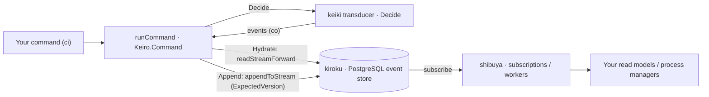

# Keiro overview, getting started, and the jitsurei example spine

This ExecPlan is a living document. The sections Progress, Surprises & Discoveries,
Decision Log, and Outcomes & Retrospective must be kept up to date as work proceeds.


## Purpose / Big Picture

After this change, a reader who lands on `/docs/keiro` in this repository's documentation
site finds a real, accurate **foundation** for the **keiro** documentation set — not the
"in progress" placeholder that is there today. Concretely, after this plan a reader can:

- understand what **keiro** *is* — a Haskell **library you import** (not a server you
  operate) that composes three lower libraries into an event-sourcing and workflow
  framework: **kiroku** (the append-only PostgreSQL event store), **keiki** (the pure
  symbolic-register finite-state transducer that is the decision core), and **shibuya**
  (the supervised subscription/worker substrate) — and grasp keiro's single-formalism
  thesis: that aggregates, process managers, sagas, and (future) durable workflows are all
  the *same* mathematical object, keiki's `SymTransducer phi rs s ci co`;
- read the **core event-sourcing concepts** as keiro uses them (streams, commands, events,
  optimistic concurrency) and how keiro layers them on top of kiroku, keiki, and shibuya;
- meet the **`jitsurei`** worked-example package (the order-fulfillment and
  incident-escalation domains shipped in the keiro repo) and read the canonical
  feature → module → `just` target map that every other keiro doc page will link into;
- follow a hands-on **getting-started tutorial** that opens a store with
  `Kiroku.Store.withStore`, defines a minimal `EventStream` (a keiki transducer married to
  a `Codec` and a `resolveStreamName`), runs a command through keiro's
  Hydrate → Decide → Append cycle with `runCommand defaultRunCommandOptions`, inspects the
  `Either CommandError (CommandResult …)`, and reads the resulting events back with
  `readStreamForward` — all against the **real** keiro API as shipped at the pinned commit;
- and see the example actually run by invoking `just jitsurei-fulfillment` in the keiro
  repo.

You can see the result by running the docs dev server from the repo root
`/Users/shinzui/Keikaku/bokuno/keiro-runtime-docs`: `pnpm dev` (which runs `vite dev`) and
browsing `http://localhost:3000/docs/keiro`. The keiro landing renders without the "coming
soon" callout, shows a `<Cards>` index of the six sections, and renders a `mermaid` diagram
of the stack and the command cycle; the sidebar carries a "What is keiro" essay, a "The
keiro stack" essay, a "The jitsurei example" page, and a getting-started tutorial; and a
new Code Walkthrough hub page links the four (still-empty) source tours.

This is the **foundation** plan (EP-7) of the keiro documentation MasterPlan
(`docs/masterplans/2-keiro-framework-documentation-set.md`). Every other keiro plan
(EP-8 … EP-12) hard-depends on it. Besides authoring its own pages, EP-7 is the **canonical
home of the shared authoring conventions** every downstream plan must obey (the absolute
cross-link rule, the source-over-notes snippet rule, the `walkthrough/` subdirectory
layout, the section-`meta.json` append protocol, the jitsurei module map, and the
`docs/keiro-source-sync.md` source pointer). Those conventions are restated in full in this
plan so EP-8 … EP-12 can cite EP-7 rather than the MasterPlan.

This plan populates `content/docs/keiro/` (a subset of it) and creates one repo-root file
(`docs/keiro-source-sync.md`). It does **not** build the docs app, the highlighter, the
font, the Mermaid component, or the IA/template system — those already exist and are owned
by MasterPlan #1's plans (`docs/plans/1`–`docs/plans/4`, `docs/plans/6`).


## Progress

Use a checklist to summarize granular steps. Every stopping point must be documented here,
even if it requires splitting a partially completed task into two ("done" vs. "remaining").
This section must always reflect the actual current state of the work.

- [x] M0. Preconditions verified — Node 22 + pnpm on PATH, `node_modules` present, the keiro
      stub tree under `content/docs/keiro/` present, baseline `pnpm typecheck` clean,
      `pnpm build` exits 0 on the current tree, and the keiro source is readable at the
      pinned commit `3f5dc9c` (keiro `0.1.0.0`). _(2026-06-01: node v22.22.3, pnpm 11.4.0;
      baseline typecheck clean and build exits 0 with no crawler warnings; keiro `HEAD` =
      `3f5dc9c1…`, `keiro.cabal` version `0.1.0.0`.)_
- [x] M1. Landing overwritten (`content/docs/keiro/index.mdx`, "in progress" callout
      removed, six-section `<Cards>` index, stack/command-cycle `mermaid`) + the two
      explanations authored: `explanation/what-is-keiro.mdx` and
      `explanation/the-keiro-stack.mdx`. _(2026-06-01)_
- [x] M2. jitsurei example page authored (`explanation/the-jitsurei-example.mdx`) with the
      canonical feature → module → `just` target map and the run instructions. _(2026-06-01)_
- [x] M3. Getting-started tutorial authored (`tutorials/getting-started.mdx`): open store →
      define `EventStream` → `runCommand` → inspect `Either CommandError (CommandResult …)`
      → `readStreamForward` → run `keiro-migrate` → anchor on `just jitsurei-fulfillment`.
      _(2026-06-01)_
- [x] M4. Source-sync pointer authored (`docs/keiro-source-sync.md`), walkthrough hub page
      authored (`content/docs/keiro/walkthrough/index.mdx`) + initial
      `walkthrough/meta.json`, and the `explanation/meta.json` / `tutorials/meta.json`
      slugs appended. Shared conventions fixed (restated in this plan). _(2026-06-01: hub
      `<Cards>` ship without `href`s and `walkthrough/meta.json` lists only `index` — see
      Surprises & Discoveries / Decision Log for why the forward-links are deferred to EP-12.)_
- [x] Final. `pnpm typecheck` clean; `pnpm build` exits 0 prerendering all new pages with
      zero crawler warnings; every Haskell name in a snippet cross-checked against the pinned
      source; no relative `./`/`../` cross-links in the keiro tree. _(2026-06-01: typecheck
      clean; build exits 0, no `unhandledRejection`/`Failed to fetch`; `pnpm lint:links` OK,
      80 files, no broken internal links; relative-link grep clean; all Haskell names verified
      against the pinned source.)_


## Surprises & Discoveries

Document unexpected behaviors, bugs, optimizations, or insights discovered during
implementation. Provide concise evidence.

- **The walkthrough hub cannot ship live links to the four tours yet, or the build emits crawler
  warnings.** EP-7's Concrete Steps describe a hub whose `<Cards>` link to
  `/docs/keiro/walkthrough/{command-cycle,read-side,workflow,integration}/00-start-here` and a
  `walkthrough/meta.json` listing those four subdir names — but those pages are authored by
  EP-8 … EP-11 and do not exist yet. Building the hub that way exits 0 **but** the prerender
  crawler follows the `<Card href>`s and emits four `[unhandledRejection] Error: Failed to fetch
  …/00-start-here` lines, which violates EP-7's own Final acceptance ("zero crawler warnings").
  Evidence: `pnpm build` log on 2026-06-01 showed exactly those four `Failed to fetch` lines; after
  dropping the `href`s and trimming `walkthrough/meta.json` to `["index"]`, the rebuild logged
  `OK: no crawler warnings`. Resolution (see Decision Log): EP-7 ships the hub `<Cards>` **without
  `href`s** and `walkthrough/meta.json` as `["index"]`; each Phase-2 plan appends its own subdir
  name when it creates the subdir; **EP-12 finalizes the hub `href`s and the meta ordering** once
  every tour exists. This matches the MasterPlan's Integration Point #2 verbatim and keeps every
  intermediate build link-clean. **Cross-plan bearing:** EP-8 … EP-11 must (a) append their subdir
  folder name to `content/docs/keiro/walkthrough/meta.json` when they create their subdir, and
  (b) author a real `00-start-here.mdx` in their subdir; EP-12 must add the four `href`s back onto
  the hub `<Cards>` (pointing at each tour's `00-start-here`) and order `walkthrough/meta.json`.


## Decision Log

Record every decision made while working on the plan.

- Decision: Mirror the **kiroku foundation plan** (`docs/plans/5-kiroku-foundation-documentation-set.md`)
  for depth, tone, milestone style, and the source-sync-pointer mechanism, and adopt its two
  hard-won lessons verbatim: (1) all cross-page links use **absolute** `/docs/keiro/...`
  paths (never relative `./` or `../`), and (2) every Haskell snippet is authored against the
  **shipped source**, not against design notes.
  Rationale: kiroku's set is the established, accepted precedent in this repo; consistency
  across the runtime libraries is an explicit MasterPlan goal, and the relative-link hazard is
  documented in `docs/plans/5`'s Surprises (relative MDX links resolve wrong in the static SPA
  and trip the prerender crawler).
  Date: 2026-06-01
- Decision: Author MDX **without `import` lines** for `Callout` / `Cards` / `Card` / `Steps` /
  `Step` / `Tabs` / `TypeTable` / `Mermaid`.
  Rationale: confirmed by reading `src/components/mdx.tsx` — `getMDXComponents` spreads all of
  these into the global MDX component map, and every existing keiro/kiroku page uses them bare.
  Date: 2026-06-01
- Decision: Document keiro **as shipped at the pinned commit `3f5dc9c` (keiro `0.1.0.0`)**.
  Treat the keiro repo's own `docs/research/*` and `docs/plans/*` notes as predating the code;
  where they disagree with the source, the source wins. Present the planned v2
  durable-execution workflow engine (`Keiro.Workflow`, named steps) only as a clearly labelled
  roadmap, never as a shipped API.
  Rationale: self-containment and accuracy (MasterPlan Decision Log + Surprises). `Keiro.Workflow`
  and its tables do not exist in the tree; documenting them as real would make examples
  uncompilable.
  Date: 2026-06-01
- Decision: EP-7 is the **canonical home** of the six shared authoring conventions (restated
  from the MasterPlan's Integration Points). EP-8 … EP-12 cite EP-7 rather than re-derive them.
  Rationale: the MasterPlan's Dependency Graph names EP-7 the hard-dependency root precisely
  because it fixes these conventions; keeping one authoritative copy avoids drift.
  Date: 2026-06-01
- Decision: The keiro source path used for cross-checking is resolved with
  `mori registry show shinzui/keiro --full` (the path at authoring time was
  `/Users/shinzui/Keikaku/bokuno/keiro`). The path is treated as read-only; nothing in the
  keiro repo is modified by this plan.
  Rationale: per the repo-wide dependency-lookup convention, resolve dependency source via
  `mori` rather than hard-coding a path that can move.
  Date: 2026-06-01
- Decision: Ship the walkthrough hub `<Cards>` **without `href`s** and set
  `content/docs/keiro/walkthrough/meta.json` to `["index"]` only — deferring both the live
  forward-links and the four subdir entries — instead of linking to the four
  `…/00-start-here` tour pages as EP-7's Concrete Steps literally describe.
  Rationale: those tour pages are authored by EP-8 … EP-11 and do not exist during EP-7, so
  live `<Card href>`s to them make the prerender crawler emit `Failed to fetch` warnings,
  violating EP-7's own "zero crawler warnings" Final acceptance. The MasterPlan's Integration
  Point #2 already assigns the meta-subdir appends to each Phase-2 plan and the hub-`<Cards>`
  finalization to EP-12; the integration contract therefore takes precedence over EP-7's
  over-specified Concrete Steps. The hub still ships as a `<Cards>` structure (titles +
  descriptions) so EP-12's finalization is a minimal diff (add four `href`s). See Surprises &
  Discoveries for the build evidence.
  Date: 2026-06-01
- Decision: Author the "honest downsides" in `explanation/what-is-keiro.mdx` from the
  genuinely-still-true items in the keiro repo's `docs/why-keiro.md` §7 (Haskell-only,
  Postgres-only/single-region, pre-1.0, v2 durable-execution not shipped, no graphical
  authoring, learning curve), but **drop** that doc's stale "there is no production-ready
  library yet / research phase" framing.
  Rationale: `why-keiro.md` predates the implementation; keiro now ships at `0.1.0.0`, so the
  "no library exists" claim is false. Per the source-over-notes rule, document the shipped
  state. Evidence: `keiro/keiro.cabal` `version: 0.1.0.0`; the source modules referenced in
  every snippet are present at commit `3f5dc9c`.
  Date: 2026-06-01


## Outcomes & Retrospective

Summarize outcomes, gaps, and lessons learned at major milestones or at completion.
Compare the result against the original purpose.

**Outcome (2026-06-01): complete and accepted.** The keiro doc set now has a real foundation.
Against the Purpose:

- `/docs/keiro` renders without the "in progress" callout, shows a six-section `<Cards>` index, and
  carries a `mermaid` diagram of the Hydrate → Decide → Append cycle.
- Three Explanation pages ship: `what-is-keiro.mdx` (the single-formalism thesis, library-not-server,
  honest downsides), `the-keiro-stack.mdx` (how keiro composes kiroku + keiki + shibuya, the core
  ES concepts, a layering `mermaid`, absolute cross-links into the existing kiroku pages), and
  `the-jitsurei-example.mdx` (the canonical feature → module → `just`-target map + run instructions).
- A Tutorial ships: `tutorials/getting-started.mdx` walks open-store → define `EventStream` →
  `runCommand` → inspect `Either StoreError (Either CommandError (CommandResult …))` →
  `readStreamForward`, anchored on `just jitsurei-fulfillment`, every name verified against source.
- The Code Walkthrough hub exists; `docs/keiro-source-sync.md` pins commit `3f5dc9c`; the six shared
  authoring conventions are restated in this plan for EP-8 … EP-12 to cite.

**Validation:** `pnpm typecheck` clean; `pnpm build` exits 0 prerendering every new page with zero
`unhandledRejection`/`Failed to fetch` lines; `pnpm lint:links` OK (80 files, no broken internal
links); no relative `./`/`../` cross-links under `content/docs/keiro/`; every `just jitsurei-*`
target named is real in the keiro Justfile; every Haskell signature transcribed in §Context matches
the source at `3f5dc9c`.

**Gaps / handoffs to later plans:**

- The walkthrough hub `<Cards>` ship without `href`s and `walkthrough/meta.json` lists only `index`.
  EP-8 … EP-11 each append their subdir folder name and author a `00-start-here.mdx`; **EP-12** adds
  the four `href`s and finalizes the meta ordering (see Surprises & Discoveries).
- The section "coming soon" `index.mdx` landings under `explanation/`, `tutorials/`, etc. are left
  as-is per scope; EP-12 replaces them with `<Cards>`.

**Lesson:** the prerender crawler follows `<Card href>`s, so a hub that forward-links to
not-yet-authored pages silently breaks the "zero crawler warnings" gate even though the build exits
0. In a phased docs initiative, a hub created early must either omit `href`s to future pages or be
finalized by the last plan — exactly the EP-7-creates / EP-12-finalizes split the MasterPlan
prescribes.


## Context and Orientation

Read this whole section before editing. It is written so that a novice with only this file
and the working tree can complete the work.

### What you are building

You are writing MDX content files under `content/docs/keiro/` in **this** repository
(`/Users/shinzui/Keikaku/bokuno/keiro-runtime-docs`) plus one Markdown file at the repo-root
docs directory (`docs/keiro-source-sync.md`). The site is a **fumadocs** documentation app
(fumadocs-ui + fumadocs-mdx) built on **TanStack Start as a static SPA** (React 19 + MDX,
TypeScript, Tailwind, bundled with **Vite**), built and served with **pnpm** on **Node 22**.
`pnpm dev` runs `vite dev` (port 3000); `pnpm build` runs `vite build` and emits a static SPA
under `.output/public`; `pnpm typecheck` runs `fumadocs-mdx && tsc --noEmit`; `pnpm lint:links`
is the repo's link checker. MDX is compiled by fumadocs-mdx and rendered client-side.

Content lives under `content/docs/`. Each directory has a `meta.json` whose `pages` array lists
child page slugs (and nested directory names) in sidebar display order. A page is an `.mdx`
file with YAML frontmatter (`title`, `description`) followed by an MDX body.

The documented **code samples are Haskell** (the site is TypeScript, the subject is a Haskell
library). Every Haskell snippet must use keiro's real API, transcribed below.

Two terms used throughout, defined once:

- **Diátaxis** is a documentation framework that sorts pages into four modes — Tutorial
  (learning-oriented, do-this-then-that), How-To Guide (task-oriented), Reference
  (information-oriented), and Explanation (understanding-oriented prose). EP-7 authors only
  Explanation pages and one Tutorial; copy-me templates for each mode live under
  `content/docs/_templates/` (`explanation.mdx`, `tutorial.mdx`, …).
- **jitsurei** (実例, "worked example") is the runnable example package shipped inside the keiro
  repo at `jitsurei/`. Its `just jitsurei-*` targets run small end-to-end demos against a local
  Postgres. EP-7 introduces it; every later keiro page links into the same jitsurei modules.

### The current state of the keiro doc tree (what exists, what you change)

The keiro tree has already been scaffolded with placeholder pages. Running
`find content/docs/keiro -type f` today shows:

```text
content/docs/keiro/index.mdx              <- OVERWRITE (remove "in progress" callout)
content/docs/keiro/meta.json              <- leave as-is (already lists the six sections + faq)
content/docs/keiro/faq.mdx                <- leave as-is (EP-12 owns it)
content/docs/keiro/cookbook/index.mdx     <- leave as-is (EP-12)
content/docs/keiro/cookbook/meta.json     <- leave as-is
content/docs/keiro/explanation/index.mdx  <- leave as-is (EP-12 replaces "coming soon")
content/docs/keiro/explanation/meta.json  <- APPEND your slugs (keep "index")
content/docs/keiro/how-to/index.mdx       <- leave as-is
content/docs/keiro/how-to/meta.json       <- leave as-is
content/docs/keiro/reference/index.mdx    <- leave as-is
content/docs/keiro/reference/meta.json    <- leave as-is
content/docs/keiro/tutorials/index.mdx    <- leave as-is (EP-12 replaces "coming soon")
content/docs/keiro/tutorials/meta.json    <- APPEND your slug (keep "index")
content/docs/keiro/walkthrough/index.mdx  <- OVERWRITE (hub linking the four tours)
content/docs/keiro/walkthrough/meta.json  <- OVERWRITE (list the four subdir names)
```

You will additionally **create** three new explanation pages, one new tutorial page, and one
repo-root pointer file:

```text
content/docs/keiro/explanation/what-is-keiro.mdx       <- NEW
content/docs/keiro/explanation/the-keiro-stack.mdx     <- NEW
content/docs/keiro/explanation/the-jitsurei-example.mdx <- NEW
content/docs/keiro/tutorials/getting-started.mdx       <- NEW
docs/keiro-source-sync.md                              <- NEW (repo ROOT docs/, NOT content/)
```

The current `content/docs/keiro/meta.json` already reads (do **not** change it):

```json
{
  "title": "keiro",
  "pages": ["index", "tutorials", "how-to", "reference", "explanation", "cookbook", "walkthrough", "faq"]
}
```

Note the directory is `how-to/` (its sidebar title is "How-To Guides"); the tutorial lives
under `tutorials/`. Do not invent a parallel `how-to-guides/` tree.

### The available MDX components (use them bare, no imports)

`src/components/mdx.tsx` registers these globally via `getMDXComponents`: `Callout`, `Step`,
`Steps`, `Tab`, `Tabs`, `Card`, `Cards`, `Accordion`, `Accordions`, `TypeTable`, and `Mermaid`.
Author MDX that uses them with no `import` line. A ` ```mermaid ` fence renders as an
interactive diagram (the `Mermaid` component). House conventions from the existing pages:
lowercase-kanji product names in prose ("keiro (経路)", "kiroku (記録)"); the task-section nav
label is "How-To Guides"; prefer fumadocs-ui built-ins over custom components.

### Fence/formatting rule (hard requirement)

Every fenced code block MUST carry a language tag: ` ```haskell `, ` ```mdx `, ` ```json `,
` ```mermaid `, ` ```bash `, ` ```text `. Never write a bare ```` ``` ````. The landing and the
stack explanation must each contain at least one ` ```mermaid ` diagram, and Haskell snippets
must contain ligature-bearing operators (`->`, `=>`, `<-`, `::`, `>>=`, `<$>`) so the
highlighter's ligature support is exercised.

### The subject: keiro, transcribed from source (use these REAL names)

Source of truth on disk (read-only; resolve the path with `mori registry show shinzui/keiro
--full`; the path at authoring time was `/Users/shinzui/Keikaku/bokuno/keiro`). The facts below
are transcribed from that tree at commit `3f5dc9c` (keiro `0.1.0.0`). Treat this subsection as
your API cheat-sheet; open the source only to confirm a detail.

**What keiro is.** keiro (経路, "route / path") is a Haskell **library you import**, not a
server you run. Its umbrella module `Keiro` (`keiro/src/Keiro.hs`) re-exports the everyday
command-side surface: the command runner (`Keiro.Command`), event `Codec`s (`Keiro.Codec`), the
`EventStream` definition and its `SnapshotPolicy`/`StateCodec` (`Keiro.EventStream`), the
content-based `Router` (`Keiro.Router`), snapshot helpers (`Keiro.Snapshot`), and typed `Stream`
handles (`Keiro.Stream`). `Keiro.version :: Text` is `"0.1.0.0"`. Specialized subsystems are
imported directly: `Keiro.ReadModel`, `Keiro.Projection`, `Keiro.ProcessManager`, `Keiro.Inbox`,
`Keiro.Outbox`, `Keiro.Timer`, `Keiro.Telemetry`.

**The packages (the family inside the keiro repo):**

```text
keiro               -- the framework library: Command, Router, ProcessManager, Projection,
                    --   ReadModel, Snapshot, Inbox, Outbox, Timer, Telemetry (module Keiro)
keiro-core          -- the pure core: Codec, EventStream, Stream, Integration.Event,
                    --   Snapshot.Policy (no IO / no DB)
keiro-migrations    -- embedded codd migrations + the `keiro-migrate` executable (owns the schema)
keiro-test-support  -- test fixtures / harness for writing keiro tests
jitsurei            -- the runnable worked example (exe `jitsurei-demo`); order-fulfillment +
                    --   incident-escalation domains
```

All five packages are version `0.1.0.0`.

**The single formalism (the thesis).** keiro's claim is that an aggregate, a process manager,
a saga, and (in the planned v2) a durable workflow are all the *same* object: keiki's
**symbolic-register finite-state transducer**, written `SymTransducer phi rs s ci co`, where
`phi` is the predicate algebra over inputs, `rs` the register-file shape, `s` the control state,
`ci` the command/input type, and `co` the event/output type. keiro persists that one object to
*one* substrate (kiroku's Postgres event store). State this prominently in the positioning page;
it shapes the whole set.

**The `EventStream` definition (`Keiro.EventStream`, verbatim).** An `EventStream` marries a
transducer to a codec, an initial state, a name resolver, and a snapshot policy:

```haskell
data EventStream phi rs s ci co = EventStream
  { transducer        :: !(SymTransducer phi rs s ci co)
  , initialState      :: !s
  , initialRegisters  :: !(RegFile rs)
  , eventCodec        :: !(Codec co)
  , resolveStreamName :: !(Stream (EventStream phi rs s ci co) -> StreamName)
  , snapshotPolicy    :: !(SnapshotPolicy (s, RegFile rs))
  , stateCodec        :: !(Maybe (StateCodec (s, RegFile rs)))
  }
```

`SnapshotPolicy state` includes the constructor `Never`. `stateCodec` is `Nothing` unless
snapshotting is enabled. A typed stream name is a `Stream a` (`Keiro.Stream`), a `StreamName`
tagged with a phantom type so a name for one aggregate cannot be used for another:

```haskell
newtype Stream a = Stream { name :: StreamName }   -- Kiroku.Store.Types.StreamName
stream      :: Text -> Stream a                     -- build from raw text
streamName  :: Stream a -> StreamName               -- recover the underlying name
```

`resolveStreamName = Stream.streamName` is the common choice (the stream's own name is its
kiroku stream name).

**The `Codec` (`Keiro.Codec`, verbatim).** A codec is everything a stream needs to (de)serialize
its events, plus a schema-evolution chain:

```haskell
data Codec e = Codec
  { eventTypes    :: !(NonEmpty Text)        -- the complete event-type allow-list
  , eventType     :: !(e -> Text)            -- project a value to its wire tag (must be in eventTypes)
  , schemaVersion :: !Int                    -- current payload version; must be >= 1
  , encode        :: !(e -> Value)           -- current-version JSON serialization
  , decode        :: !(Value -> Either Text e)
  , upcasters     :: ![Upcaster]             -- migrations keyed by source version
  }

data CodecError
  = UnknownEventType !EventType ![Text]
  | InvalidSchemaVersion !Int
  | UnknownVersion !Int
  | UpcasterError !Int !Text
  | DecodeFailed !Text
  | GapInUpcasterChain !Int !Int
```

`encodeForAppend :: Codec e -> e -> Either CodecError EventData` stamps the codec's
`schemaVersion` into fresh metadata. On read, the codec applies upcaster rungs in sequence until
the payload reaches `schemaVersion`. EP-8 owns the full `Codec` reference; EP-7 only needs the
shape so the tutorial can build a minimal one.

**The command cycle (`Keiro.Command`, verbatim).** `runCommand` hydrates the target stream into
state, decides via the transducer, and appends the resulting events under optimistic concurrency,
retrying on conflict:

```haskell
runCommand ::
  ( HasCallStack, IOE :> es, Store :> es, Error StoreError :> es
  , BoolAlg phi (RegFile rs, ci), Eq co ) =>
  RunCommandOptions ->
  EventStream phi rs s ci co ->
  Stream (EventStream phi rs s ci co) ->
  ci ->
  Eff es (Either CommandError (CommandResult (EventStream phi rs s ci co)))
```

The result and error types:

```haskell
data CommandResult target = CommandResult
  { target         :: !(Stream target)
  , streamVersion  :: !StreamVersion
  , globalPosition :: !(Maybe GlobalPosition)
  , eventsAppended :: !Int
  }

data CommandError
  = HydrationDecodeFailed !CodecError      -- a stored event could not be decoded on rehydrate
  | HydrationReplayFailed !StreamVersion   -- replay stalled at this version
  | CommandRejected                        -- the transducer rejected the command in the hydrated state
  | EncodeFailed !CodecError               -- an emitted event could not be encoded
  | StoreFailed !StoreError                -- the store rejected the append
  | RetryExhausted !Int !StoreError        -- optimistic-concurrency retries exhausted (count + last error)
```

`RunCommandOptions` knobs (with `defaultRunCommandOptions`):

```haskell
data RunCommandOptions = RunCommandOptions
  { retryLimit   :: !Int            -- rehydrate-and-replay attempts after a conflict (default 3)
  , pageSize     :: !Int32          -- read batch size during hydration (default 256)
  , eventIds     :: ![EventId]      -- caller-supplied ids for deterministic/idempotent appends (default [])
  , beforeAppend :: !(IO ())        -- pre-append hook, a test seam (default pure ())
  , tracer       :: !(Maybe Tracer) -- optional OpenTelemetry tracer (default Nothing)
  , metadata     :: !(Maybe Value)  -- JSON merged into every event's metadata (default Nothing)
  }

defaultRunCommandOptions :: RunCommandOptions   -- 3 retries, 256-event pages, no ids, no hook, no tracer, no metadata
```

Two richer runners exist (EP-8/EP-9 territory; mention only by name in EP-7):
`runCommandWithSql` runs an `afterAppend` action in the *same* transaction as the append; the
read-side variant `runCommandWithProjections` (from `Keiro.Projection`) updates inline
projections transactionally. The Hydrate → Decide → Append cycle is the spine of EP-7.

**Opening a store (kiroku, from `jitsurei/app/Main.hs`, verbatim).** keiro reads and writes
through kiroku. The example opens the store and runs effects with:

```haskell
import Kiroku.Store qualified as Store
import Kiroku.Store.Types (StreamName (..), StreamVersion (..), RecordedEvent (..))

-- open the pool (after migrations have been applied)
Store.withStore (Store.defaultConnectionSettings connString) $ \store -> do
  result <- Store.runStoreIO store (runCommand defaultRunCommandOptions eventStream target command)
  -- result :: Either StoreError (Either CommandError (CommandResult ...))
  ...
```

`Store.runStoreIO :: KirokuStore -> Eff (Store : Error StoreError : IOE : '[]) a -> IO (Either
StoreError a)` runs an effectful program and surfaces a `Left StoreError` for store-level
failures. Reading a stream back uses kiroku's read API directly:

```haskell
Store.readStreamForward (StreamName name) (StreamVersion 0) 100   -- exclusive cursor; 0 = from the start
  :: Eff es (Vector RecordedEvent)
```

The connection string comes from the environment variable `PG_CONNECTION_STRING` in jitsurei
(falling back to `host=db dbname=jitsurei`).

**Running the schema (`keiro-migrate`).** The store never runs DDL on open; migrate first. The
`keiro-migrate` executable (package `keiro-migrations`) runs the embedded codd migrations and is
driven by `CODD_*` environment variables. From jitsurei's Justfile, the invocation is:

```bash
KEIRO_MIGRATE_NO_CHECK=1 \
  CODD_CONNECTION="host=$PGHOST dbname=jitsurei user=$PGUSER" \
  CODD_MIGRATION_DIRS=unused-for-embedded-migrations \
  CODD_EXPECTED_SCHEMA_DIR=.dev/codd-expected-schema \
  CODD_SCHEMAS=kiroku \
  cabal run keiro-migrate
```

(`KEIRO_MIGRATE_NO_CHECK=1` skips the schema-equality verification; omit it to verify against
the expected-schema dir.)

**The jitsurei worked example (verbatim from the keiro repo's Justfile + modules).** The
executable is `jitsurei-demo` (`cabal run jitsurei-demo -- <subcommand>`), wrapped by `just`
targets that first apply migrations and create the read-model table. The runnable targets are:

```text
just jitsurei                 # = jitsurei-all
just jitsurei-all             # run every demo (fulfillment, snapshots, paging, escalation, agent-qual)
just jitsurei-fulfillment     # order-fulfillment command cycle  (the EP-7 / EP-8 anchor)
just jitsurei-snapshots       # snapshot-backed order stream
just jitsurei-paging          # content-based / effectful router fan-out (paging)
just jitsurei-escalation      # incident-escalation process manager + durable timers
just jitsurei-agent-qual      # agent-qualification routing
just jitsurei-migrate         # apply migrations + create jitsurei_order_summary (a dependency of the above)
```

The demos use a local Postgres started by `process-compose.yaml` (run `just jitsurei` after the
db is up). The connection string is `PG_CONNECTION_STRING` (e.g.
`host=db dbname=jitsurei user=$PGUSER`). The jitsurei source modules and the features they
demonstrate are mapped in the **jitsurei module map** below (EP-7 publishes it; every later plan
links into the same modules).

**The jitsurei module map (canonical — copied verbatim from the MasterPlan Integration Point #3,
then expanded with file paths and run targets).** This is the single source of truth for
feature → module → target; EP-8 … EP-11 link into the *same* modules so the example reads as one
coherent story:

```text
Order aggregate + command cycle + codec upcasting
  -> jitsurei/src/Jitsurei/Domain.hs, jitsurei/src/Jitsurei/OrderStream.hs
  -> just jitsurei-fulfillment        (EP-8 command-cycle anchor; the EP-7 "see it working" payoff)

Inline projection + read model + consistency
  -> jitsurei/src/Jitsurei/ReadModels.hs
  -> (driven by jitsurei-fulfillment / jitsurei-all)   (EP-9 anchor)

Snapshots
  -> jitsurei/src/Jitsurei/Snapshots.hs (snapshotOrderEventStream)
  -> just jitsurei-snapshots           (EP-9)

Process manager + dispatch; durable timers
  -> jitsurei/src/Jitsurei/FulfillmentProcess.hs, jitsurei/src/Jitsurei/EscalationProcess.hs;
     timers in jitsurei/src/Jitsurei/Timers.hs
  -> just jitsurei-escalation          (EP-10 anchor)

Content-based / effectful fan-out routers
  -> jitsurei/src/Jitsurei/Paging.hs, jitsurei/src/Jitsurei/AgentQualRouter.hs,
     with jitsurei/src/Jitsurei/Incident.hs, jitsurei/src/Jitsurei/OncallRoster.hs
  -> just jitsurei-paging, just jitsurei-agent-qual   (EP-8 router page + EP-10)

Integration events (inbox / outbox)
  -> keiro/src/Keiro/Inbox.hs, keiro/src/Keiro/Outbox.hs, and the keiro repo's
     docs/guides/integration-events-with-kafka.md
  -> NO jitsurei target (jitsurei ships no Kafka demo; EP-11 documents the API + the keiro guide)
```

### The shared conventions EP-7 fixes for all downstream plans

These are the MasterPlan Integration Points, restated here so EP-7 is their canonical home.
Every keiro plan (EP-8 … EP-12) must obey them.

1. **Absolute cross-links only.** Cross-page links use absolute doc paths
   (`/docs/keiro/...`), never relative `./sibling` or `../section/page`. Reason (the kiroku
   lesson, recorded in `docs/plans/5`'s Surprises): in the static SPA the browser/prerender
   crawler resolves a relative link against the *current path as a directory*, producing a
   nonexistent nested route — the build still exits 0 but emits `[unhandledRejection] Failed to
   fetch …` for every such link and the link 404s for users. Always write the full
   `/docs/keiro/...` path.
2. **Source-over-notes snippet accuracy.** Author every Haskell snippet against the **shipped**
   keiro source at the pinned commit. The keiro repo's in-repo `docs/research/*` and
   `docs/plans/*` notes **predate the implementation and diverge** (renamed types, different SQL
   columns, unimplemented features). Trust the source; cross-check every name.
3. **The `walkthrough/` subdirectory layout.** Each Phase-2 plan owns a disjoint subdirectory
   under `content/docs/keiro/walkthrough/`, each with its own `meta.json`, a `00-start-here.mdx`,
   and numbered chapter files: EP-8 → `walkthrough/command-cycle/`, EP-9 →
   `walkthrough/read-side/`, EP-10 → `walkthrough/workflow/`, EP-11 → `walkthrough/integration/`.
   Disjoint subdirs mean parallel plans never collide on a shared numbered sequence. EP-7 creates
   only the hub page and the initial `walkthrough/meta.json` listing the four subdir names.
4. **The section-`meta.json` append protocol.** Inside each section, the per-section `meta.json`
   `pages` array is appended to by several plans. Each plan appends **only its own** page slugs
   and never reorders or removes another plan's entries; never remove the existing `"index"`
   entry. **EP-12 owns the final ordering pass** of every section `meta.json` and replaces each
   section's "coming soon" `index.mdx` landing with a `<Cards>` index.
5. **The jitsurei module map** (above) is the canonical feature → module → target table; all
   plans link into the same `jitsurei/src/Jitsurei/*.hs` modules and `just jitsurei-*` targets.
6. **The source-sync pointer** `docs/keiro-source-sync.md` (created by this plan) pins the
   reviewed upstream commit; all plans cross-check against it, and EP-12 finalizes its
   "most-coupled pages" list once every page exists.


## Plan of Work

The work is four milestones plus a final acceptance pass. Each milestone is independently
verifiable by building the site and viewing the affected pages. Author the pages in reading
order; the final pass wires the sidebar slugs, the walkthrough hub, and the source pointer, and
runs the full acceptance checks.

**M0 — Preconditions.** Confirm the toolchain and that the keiro stub tree is present, that the
baseline builds, and that the keiro source is readable at the pinned commit. At the end you can
run `pnpm dev` and browse the (placeholder) `/docs/keiro`. Acceptance: `pnpm typecheck` clean and
`pnpm build` exits 0 *before* you add any content; `git -C <keiro> rev-parse HEAD` shows
`3f5dc9c…`.

**M1 — Landing + the two stack/positioning explanations.** Overwrite
`content/docs/keiro/index.mdx` (remove the "in progress" callout; add the positioning paragraph,
a six-section `<Cards>` index, and a `mermaid` diagram of the stack and/or the
Hydrate → Decide → Append cycle). Author `explanation/what-is-keiro.mdx` (the single-formalism
thesis; library-not-server; when to choose / when not, with honest downsides) and
`explanation/the-keiro-stack.mdx` (how keiro composes kiroku + keiki + shibuya; the core
event-sourcing concepts; a link to kiroku's docs for the store details). At the end:
`/docs/keiro` renders without the placeholder and both essays render. Acceptance: pages build;
the landing shows the `<Cards>` index and at least one `mermaid` diagram.

**M2 — The jitsurei example page.** Author `explanation/the-jitsurei-example.mdx`: introduce the
`jitsurei` package and publish the canonical feature → module → target map (the block above),
and explain how to run it (`just jitsurei`, the sub-targets, `process-compose.yaml`,
`PG_CONNECTION_STRING`). At the end: a reader can find which jitsurei module and `just` target
demonstrates each feature. Acceptance: page builds; the module map and run instructions are
present; every `just jitsurei-*` target named is a real target in the keiro Justfile.

**M3 — The getting-started tutorial.** Author `tutorials/getting-started.mdx` following the
`content/docs/_templates/tutorial.mdx` shape (wrap the walkthrough in `<Steps>`): apply the
schema with `keiro-migrate`; open a store with
`Store.withStore (Store.defaultConnectionSettings connString)` + `Store.runStoreIO`; define a
minimal `EventStream` (a keiki transducer + a `Codec` + `resolveStreamName`); call
`runCommand defaultRunCommandOptions …`; inspect the `Either CommandError (CommandResult …)`;
read the stream back with `readStreamForward`; and anchor on `just jitsurei-fulfillment` as the
"see it working" payoff. At the end: a reader has a copy-pasteable, real-API command-cycle
walkthrough. Acceptance: page builds; every `runCommand`/`withStore`/`runStoreIO`/
`readStreamForward`/`EventStream`/`Codec` name matches the §Context signatures and is present in
the keiro source.

**M4 — Source-sync pointer, walkthrough hub, meta.json, conventions.** Create
`docs/keiro-source-sync.md` (mirroring `docs/kiroku-source-sync.md`). Overwrite
`content/docs/keiro/walkthrough/index.mdx` as a hub linking the four tours with `<Cards>` and
overwrite `content/docs/keiro/walkthrough/meta.json` to list the four subdir names. Append your
slugs to `explanation/meta.json` and `tutorials/meta.json` (keeping `"index"`). At the end: the
sidebar shows the new pages in the right sections, the walkthrough hub explains the ordered tours,
and the source pointer exists. Acceptance: see Validation.

**Final — Whole-set acceptance.** `pnpm typecheck` clean; `pnpm build` exits 0 prerendering the
new pages with **zero** crawler warnings; `pnpm lint:links` passes; no relative `./`/`../`
cross-link anywhere in `content/docs/keiro/`; every Haskell name used appears in the keiro
source at the pinned commit.


## Concrete Steps

Run all commands from the repo root `/Users/shinzui/Keikaku/bokuno/keiro-runtime-docs` unless
stated otherwise. The docs toolchain is **pnpm** on **Node 22**.

### M0 — Preconditions

```bash
node --version    # expect v22.x
pnpm --version    # expect a pnpm 9/10/11 line
test -d node_modules || pnpm install

# the keiro stub tree must already exist (scaffolded by an earlier plan)
test -f content/docs/keiro/index.mdx && test -f content/docs/keiro/meta.json && echo "keiro stubs present"

# baseline must be green BEFORE you add content
pnpm typecheck
pnpm build
```

Expected (abridged):

```text
keiro stubs present
✓ built in <N>s
```

Confirm the keiro source is readable at the pinned commit:

```bash
KEIRO=$(mori registry show shinzui/keiro --full | sed -n 's/.*[Pp]ath: *//p' | head -1)
git -C "$KEIRO" rev-parse HEAD          # expect 3f5dc9c1fa90f6358cebb9e85d92dde4c325db48
grep -h '^version' "$KEIRO"/keiro/keiro.cabal   # expect: version: 0.1.0.0
```

If the keiro tree is not at `3f5dc9c`, check it out read-only for cross-checking
(`git -C "$KEIRO" stash` / coordinate with the owner); do not modify it.

### M1 — Landing + the two stack/positioning explanations

**Overwrite `content/docs/keiro/index.mdx`.** Remove the "Documentation for keiro is in progress"
callout entirely. Keep the frontmatter title `keiro`. The body (shown inside a four-backtick
fence so the inner ` ```mermaid ` survives verbatim):

````mdx
---
title: keiro
description: "An event-sourcing framework and workflow engine — the top of the keiro runtime stack."
---

**keiro** (経路, "route / path") is a Haskell **library you import** — not a server you operate —
that composes three lower libraries into one event-sourcing and workflow framework:
**kiroku** (the append-only PostgreSQL event store), **keiki** (the pure symbolic-register
finite-state transducer that is the decision core), and **shibuya** (the supervised
subscription/worker substrate). Its thesis: aggregates, process managers, sagas, and the planned
durable workflows are all the *same* mathematical object — keiki's `SymTransducer phi rs s ci co`
— persisted to *one* substrate, your Postgres.

<Callout type="warn">
  keiro is in **active development** (`0.1.0.0`). APIs may change; pin a version. The v2
  durable-execution workflow engine is a roadmap item and is not documented here as if it shipped.
</Callout>

## How it fits together

A command runs through keiro's **Hydrate → Decide → Append** cycle: `runCommand` reads the
target stream into state (Hydrate), runs the keiki transducer to turn the command into events
(Decide), and appends them to kiroku under optimistic concurrency (Append), retrying on conflict.



## Where to go next

<Cards>
  <Card title="Tutorials" href="/docs/keiro/tutorials" description="Run your first command through the Hydrate → Decide → Append cycle." />
  <Card title="How-To Guides" href="/docs/keiro/how-to" description="Task-oriented recipes for the command cycle, read side, workflows, and integration events." />
  <Card title="Reference" href="/docs/keiro/reference" description="Exact Haskell signatures and PostgreSQL schema for each subsystem." />
  <Card title="Explanation" href="/docs/keiro/explanation" description="What keiro is, the stack it composes, and the jitsurei worked example." />
  <Card title="Cookbook" href="/docs/keiro/cookbook" description="Short, copy-paste recipes for common problems." />
  <Card title="Code Walkthrough" href="/docs/keiro/walkthrough" description="Ordered tours through keiro's real source." />
</Cards>
````

**Create `content/docs/keiro/explanation/what-is-keiro.mdx`** (use the `explanation.mdx`
template — prose, no steps; ports from the keiro repo's `docs/why-keiro.md`). Frontmatter and
required content:

```text
title:       "What is keiro?"
description: "keiro is a library — not a server — that unifies aggregates, process managers, and sagas under one formalism."
```

Sections to write (prose first; define every term on first use):

- *The single formalism (the thesis).* Explain `SymTransducer phi rs s ci co` in plain language
  (a finite-state machine with typed registers; `phi` is the predicate algebra over inputs, `rs`
  the registers, `s` the control state, `ci` the command input, `co` the event output) and state
  that an aggregate, a process manager, and a saga are the *same* object — keiro persists it to
  kiroku. Include a one-line `haskell` snippet showing the `EventStream` record so the reader sees
  the transducer + codec marriage (copy from §Context, ligature-bearing).
- *A library, not a server.* You `import Keiro`; there is no daemon to deploy. keiro runs inside
  your process against your Postgres.
- *When to choose keiro / when not (honest downsides).* Draw from `docs/why-keiro.md` §7: it is
  pre-1.0; it is Haskell-only; the v2 durable-execution engine is not shipped; if you need a
  language-agnostic workflow server (Temporal/Camunda) or you do not already use event sourcing,
  one of those may fit better. Be honest, not promotional.
- A `<Callout type="info">` pointing to `/docs/keiro/explanation/the-keiro-stack` for the
  composition details and `/docs/keiro/tutorials/getting-started` to try it.

**Create `content/docs/keiro/explanation/the-keiro-stack.mdx`** (explanation template; ports the
composition from `docs/why-keiro.md` + `README.md`). Frontmatter:

```text
title:       "The keiro stack"
description: "How keiro composes kiroku, keiki, and shibuya, and the event-sourcing concepts it uses."
```

Sections:

- *Three libraries, one framework.* kiroku = the append-only Postgres event **store** (durable,
  ordered, immutable events + optimistic concurrency + subscriptions); keiki = the **pure** core
  (the `SymTransducer`, no IO, no DB); shibuya = the supervised **subscription/worker** substrate
  that drives projections, process managers, and the outbox. Include a `mermaid` layering diagram
  (keiro on top of kiroku + keiki + shibuya).
- *The core event-sourcing concepts as keiro uses them.* Define: **stream** (a typed `Stream a`
  over a kiroku `StreamName`); **command** (`ci`, the input you feed `runCommand`); **event**
  (`co`, the output the transducer emits, serialized by the `Codec`); **optimistic concurrency**
  (`runCommand` appends under an `ExpectedVersion` derived from the hydrated `streamVersion` and
  retries on conflict up to `retryLimit`). Cross-link to kiroku's docs for the store-level details
  with absolute links: `/docs/kiroku/explanation/streams-and-categories`,
  `/docs/kiroku/explanation/optimistic-concurrency`, `/docs/kiroku/explanation/all-stream-and-global-order`.
- A `mermaid` diagram of the Hydrate → Decide → Append cycle (you may reuse the landing's).

### M2 — `content/docs/keiro/explanation/the-jitsurei-example.mdx`

Use the explanation template. Frontmatter:

```text
title:       "The jitsurei example"
description: "The worked-example package that threads through every keiro doc — its domains, module map, and how to run it."
```

Content:

- *What jitsurei is.* The runnable worked-example package in the keiro repo (`jitsurei/`,
  executable `jitsurei-demo`), covering two domains: **order fulfillment** (the order aggregate +
  command cycle + read model + snapshots + fulfillment process manager) and **incident
  escalation** (the escalation process manager, durable timers, and content-based routing for
  paging / agent-qualification).
- *The module map.* Reproduce the canonical feature → module → target map from §Context verbatim
  inside a ` ```text ` block, then add a short prose line per row. State explicitly that this is
  the canonical map every keiro page links into.
- *How to run it.* Explain: start the local Postgres (the keiro repo's `process-compose.yaml`;
  `just jitsurei` brings it up via process-compose), the `PG_CONNECTION_STRING` env var (e.g.
  `host=db dbname=jitsurei user=$PGUSER`), `just jitsurei-migrate` to apply the schema and create
  the `jitsurei_order_summary` read-model table, then `just jitsurei` (= `just jitsurei-all`) or a
  single sub-target like `just jitsurei-fulfillment`. Put the target list in a ` ```bash ` block.
- A `<Callout type="info">` noting the run targets and that jitsurei ships no Kafka demo (the
  inbox/outbox pages document the API + the keiro guide instead).

### M3 — `content/docs/keiro/tutorials/getting-started.mdx`

Use the `tutorial.mdx` template; wrap the walkthrough in `<Steps>`. Frontmatter:

```text
title:       "Get started with keiro"
description: "Open a store, define an event stream, run a command, and read the events back."
```

Outline: **What you will build** (a one-stream order aggregate whose command appends events via
the Hydrate → Decide → Append cycle) → **Before you begin** (PostgreSQL 17+, GHC 9.12, the keiro
packages; a clone of the keiro repo for the jitsurei payoff) → the `<Steps>`:

- **Step 1 — Apply the schema.** Run `keiro-migrate` with the `CODD_*` env (copy the invocation
  from §Context). Explain the store never runs DDL on open. ` ```bash ` block.
- **Step 2 — Open a store.** `Store.withStore (Store.defaultConnectionSettings connString)` +
  `Store.runStoreIO`. Explain `runStoreIO` returns `Either StoreError a`.
- **Step 3 — Define a minimal `EventStream`.** Show the `EventStream { transducer, initialState,
  initialRegisters, eventCodec, resolveStreamName, snapshotPolicy, stateCodec }` record with
  `resolveStreamName = Stream.streamName`, `snapshotPolicy = Never`, `stateCodec = Nothing`, and a
  tiny `Codec` (`eventTypes`, `eventType`, `schemaVersion = 1`, `encode`, `decode`,
  `upcasters = []`). Point at `jitsurei/src/Jitsurei/OrderStream.hs` as the real example to copy.
- **Step 4 — Run a command.** `runCommand defaultRunCommandOptions eventStream target command`
  inside `Store.runStoreIO`. Explain Hydrate → Decide → Append.
- **Step 5 — Inspect the result.** Pattern-match the
  `Either StoreError (Either CommandError (CommandResult …))`: outer `Left` = store failure; inner
  `Left CommandError` (e.g. `CommandRejected`, `RetryExhausted`); `Right CommandResult` carries
  `streamVersion`, `globalPosition`, `eventsAppended`.
- **Step 6 — Read the stream back.** `Store.readStreamForward (StreamName name) (StreamVersion 0)
  100`; note the cursor is exclusive (`0` reads from the start).
- **What you built / next steps.** Anchor on running `just jitsurei-fulfillment` in the keiro repo
  as the "see it working" payoff, and link (absolute) to
  `/docs/keiro/explanation/the-jitsurei-example` and `/docs/keiro/explanation/the-keiro-stack`.

The load-bearing snippet (real API — every name verified against the keiro source):

```haskell
{-# LANGUAGE OverloadedStrings #-}
{-# LANGUAGE OverloadedLabels  #-}
import Keiro                                   -- runCommand, defaultRunCommandOptions, EventStream(..), Codec(..), Stream
import qualified Keiro.Stream as Stream
import Keiro.EventStream (SnapshotPolicy (Never))
import qualified Kiroku.Store as Store
import Kiroku.Store.Types (StreamName (..), StreamVersion (..), RecordedEvent (..))
import Control.Lens ((^.))

main :: IO ()
main =
  Store.withStore (Store.defaultConnectionSettings "host=localhost dbname=keiro") $ \store -> do
    -- Step 4 + 6: run a command, then read the stream back
    outcome <- Store.runStoreIO store $ do
      result <- runCommand defaultRunCommandOptions orderEventStream (orderStream "orders-1") placeOrder
      recorded <- Store.readStreamForward (StreamName "orders-1") (StreamVersion 0) 100
      pure (result, recorded)
    case outcome of
      Left storeErr               -> putStrLn ("store error: " <> show storeErr)
      Right (Left cmdErr, _)      -> putStrLn ("command rejected: " <> show cmdErr)
      Right (Right res, recorded) -> do
        putStrLn ("appended " <> show (res ^. #eventsAppended) <> " event(s)")
        putStrLn ("stream version now " <> show (res ^. #streamVersion))
        mapM_ (\e -> putStrLn (show (e ^. #eventType))) recorded
```

```haskell
-- the EventStream + Codec the command runs against (sketch; see jitsurei/src/Jitsurei/OrderStream.hs)
orderEventStream :: EventStream phi rs OrderState OrderCommand OrderEvent
orderEventStream = EventStream
  { transducer        = orderTransducer        -- a keiki SymTransducer phi rs s ci co
  , initialState      = NotStarted
  , initialRegisters  = RNil
  , eventCodec        = orderCodec
  , resolveStreamName = Stream.streamName       -- the stream's own name is its kiroku StreamName
  , snapshotPolicy    = Never
  , stateCodec        = Nothing
  }

orderStream :: Text -> Stream (EventStream phi rs OrderState OrderCommand OrderEvent)
orderStream = Stream.stream
```

Add a `<Callout type="warn">` that the read cursor is exclusive and that `runCommand` retries on
optimistic-concurrency conflict up to `retryLimit` (default 3), surfacing `RetryExhausted` when
exhausted.

### M4 — Source pointer, walkthrough hub, meta.json, conventions

**Create `docs/keiro-source-sync.md`** (repo ROOT `docs/`, NOT `content/`), mirroring
`docs/kiroku-source-sync.md` structure exactly:

```text
# Keiro docs ↔ source sync pointer

(intro paragraph: the content/docs/keiro/ tree is ported and cross-checked against the keiro
source repo, not generated; we pin the exact upstream commit last reviewed; diff from the pinned
commit to HEAD on change, update affected pages, bump the pointer.)

## Upstream source
- Qualified name (mori): shinzui/keiro — resolve the path with `mori registry show shinzui/keiro --full`.
- Path at last sync: /Users/shinzui/Keikaku/bokuno/keiro
- Relevant packages: keiro, keiro-core, keiro-migrations, keiro-test-support; jitsurei (example).

## Last reviewed commit
```
3f5dc9c1fa90f6358cebb9e85d92dde4c325db48  (3f5dc9c)
2026-05-31 17:46:39 -0700
keiro 0.1.0.0
```

## Update procedure
1. List what changed since the pointer (KEIRO=$(mori registry show shinzui/keiro --full | sed -n
   's/.*[Pp]ath: *//p' | head -1); git -C "$KEIRO" log --oneline 3f5dc9c..HEAD; git -C "$KEIRO"
   diff --stat 3f5dc9c..HEAD). keiro also keeps its own docs/, docs/plans|masterplans, CHANGELOG.
2. Update the affected pages under content/docs/keiro/. Most-coupled pages (EP-12 finalizes this
   list once all pages exist): explanation/what-is-keiro.mdx, explanation/the-keiro-stack.mdx,
   explanation/the-jitsurei-example.mdx, tutorials/getting-started.mdx.
3. Replace the Last reviewed commit block with the new HEAD; move the old SHA into a Previous
   pointers section with a one-line summary.
```

Author it as real Markdown (the inner fences must be triple-backtick ` ```text `-tagged blocks;
the SHA block in `kiroku-source-sync.md` uses a bare-fence style — match the *structure* but keep
every fence language-tagged per this repo's rule, e.g. ` ```text `). Include the "most-coupled
pages" list and note EP-12 finalizes it.

**Overwrite `content/docs/keiro/walkthrough/index.mdx`** as a hub. Frontmatter title
`Code Walkthrough`. Body: one paragraph explaining these are **ordered source tours** that read
the real keiro source to teach how each subsystem is built, then a `<Cards>` block (absolute
links) to the four tours' start pages (each tour's `00-start-here` is authored by its owning
plan; link to the subdir start path):

````mdx
---
title: Code Walkthrough
description: "Ordered tours through keiro's real source — one per subsystem."
---

These are **ordered source tours**: numbered chapters that read keiro's real Haskell source to
teach how each subsystem is built. Read each tour in order. There is one tour per subsystem; the
chapters for each tour are authored by that subsystem's documentation plan.

<Cards>
  <Card title="The command cycle" href="/docs/keiro/walkthrough/command-cycle/00-start-here" description="Hydrate → Decide → Append: Keiro.Command, the codec, and the typed event stream." />
  <Card title="The read side" href="/docs/keiro/walkthrough/read-side/00-start-here" description="Projections, read models, and snapshots." />
  <Card title="The workflow engine" href="/docs/keiro/walkthrough/workflow/00-start-here" description="Process managers and durable timers." />
  <Card title="Integration events" href="/docs/keiro/walkthrough/integration/00-start-here" description="The inbox, the outbox, and the Kafka bridge." />
</Cards>
````

**Overwrite `content/docs/keiro/walkthrough/meta.json`** to list the four subdir names (the
subdirs themselves are created by EP-8/9/10/11):

```json
{
  "title": "Code Walkthrough",
  "pages": ["index", "command-cycle", "read-side", "workflow", "integration"]
}
```

**Append slugs to `content/docs/keiro/explanation/meta.json`** (keep `"index"` first; do not
reorder existing entries — EP-12 finalizes ordering):

```json
{
  "title": "Explanation",
  "pages": ["index", "what-is-keiro", "the-keiro-stack", "the-jitsurei-example"]
}
```

**Append your slug to `content/docs/keiro/tutorials/meta.json`** (keep `"index"`):

```json
{
  "title": "Tutorials",
  "pages": ["index", "getting-started"]
}
```

Then build and preview:

```bash
pnpm typecheck
pnpm build
pnpm dev    # browse http://localhost:3000/docs/keiro
```


## Validation and Acceptance

Exercise the system and observe specific behaviors:

1. **The set builds and typechecks.** From the repo root, `pnpm typecheck` exits 0 (so the
   generated `.source/` collection picks up the new pages) and `pnpm build` exits 0, emitting the
   static SPA under `.output/public`. Expected tail (abridged):

   ```text
   ✓ built in <N>s
   .output/public/...
   ```

2. **No crawler warnings.** The build log contains **no** `unhandledRejection` or `Failed to
   fetch` lines (those indicate a broken/relative cross-link):

   ```bash
   pnpm build 2>&1 | grep -iE "unhandledRejection|Failed to fetch" && echo "FAIL: broken links" || echo "OK: no crawler warnings"
   ```

3. **No relative cross-links in the keiro tree.** Every cross-page link is absolute:

   ```bash
   grep -rnE "\]\(\.\.?/" content/docs/keiro && echo "FAIL: relative link present" || echo "OK: links absolute"
   ```

4. **Renders in the sidebar.** Run `pnpm dev`, open `http://localhost:3000/docs/keiro`. The
   landing renders with **no** "in progress" callout, shows the six-section `<Cards>` index, and
   renders at least one `mermaid` diagram. The sidebar shows, under Explanation:
   "What is keiro?", "The keiro stack", "The jitsurei example"; under Tutorials: "Get started with
   keiro"; and a Code Walkthrough hub whose `<Cards>` link to the four tours. Every page opens
   without a 404 and shows its frontmatter title.

5. **Snippets match the real API.** Cross-check every Haskell name used in a snippet against the
   keiro source at the pinned commit:

   ```bash
   KEIRO=$(mori registry show shinzui/keiro --full | sed -n 's/.*[Pp]ath: *//p' | head -1)
   grep -rn "runCommand ::"            "$KEIRO"/keiro/src/Keiro/Command.hs
   grep -rn "defaultRunCommandOptions" "$KEIRO"/keiro/src/Keiro/Command.hs
   grep -rn "data CommandError"        "$KEIRO"/keiro/src/Keiro/Command.hs
   grep -rn "data EventStream"         "$KEIRO"/keiro-core/src/Keiro/EventStream.hs
   grep -rn "data Codec"               "$KEIRO"/keiro-core/src/Keiro/Codec.hs
   grep -rn "withStore"                "$KEIRO"/jitsurei/app/Main.hs
   ```

   Acceptance: every function/type/constructor named in a snippet appears in the keiro source with
   the signature transcribed in §Context.

6. **The jitsurei targets are real.** Every `just jitsurei-*` target named in the example page
   exists in the keiro Justfile:

   ```bash
   KEIRO=$(mori registry show shinzui/keiro --full | sed -n 's/.*[Pp]ath: *//p' | head -1)
   grep -nE "^jitsurei(-[a-z-]+)?:" "$KEIRO"/Justfile
   ```

   Expected: lines for `jitsurei`, `jitsurei-all`, `jitsurei-fulfillment`, `jitsurei-snapshots`,
   `jitsurei-paging`, `jitsurei-escalation`, `jitsurei-agent-qual`, `jitsurei-migrate`.

7. **The source pointer exists and pins the right commit.**

   ```bash
   grep -n "3f5dc9c" docs/keiro-source-sync.md && echo "OK: pinned"
   ```


## Idempotence and Recovery

All steps are file authoring and are safe to repeat: re-running `pnpm typecheck`/`pnpm build`/
`pnpm dev` is idempotent; editing or recreating an `.mdx`/`meta.json`/`.md` file simply overwrites
it. No database, no app code, and no keiro source is modified by this plan (the keiro tree is
opened read-only for cross-checking only).

Recovery:

- If a page breaks the build, the error names the offending `.mdx` file and line; fix the MDX
  (most often an untagged fence, an unexpected `<` in prose, or a relative link) and rebuild.
- If the sidebar order or a group is wrong, edit the relevant `meta.json` `pages` array; no
  rebuild of other pages is needed. Never remove the existing `"index"` entry; only append.
- If a snippet diverges from the real API, fix the snippet to match the keiro source (the source
  is authoritative over this plan's transcription) and record the divergence in Surprises &
  Discoveries.
- To start a page over, delete the `.mdx` and re-author it from its outline in Concrete Steps.


## Interfaces and Dependencies

**Libraries / systems referenced by the content (Haskell, the documented subject), all at keiro
`0.1.0.0`, commit `3f5dc9c`:**

- `keiro` (modules `Keiro`, `Keiro.Command`, `Keiro.Router`, `Keiro.Snapshot`) — the framework
  library; supplies `runCommand`, `defaultRunCommandOptions`, `RunCommandOptions`, `CommandResult`,
  `CommandError`.
- `keiro-core` (modules `Keiro.EventStream`, `Keiro.Codec`, `Keiro.Stream`) — the pure core;
  supplies `EventStream`, `Codec`, `CodecError`, `Stream`, `stream`, `streamName`, `SnapshotPolicy`,
  `StateCodec`.
- `keiro-migrations` (exe `keiro-migrate`) — schema install/upgrade; referenced by the tutorial
  and the jitsurei page.
- `jitsurei` (exe `jitsurei-demo`; modules under `Jitsurei.*`) — the worked example; the module
  map and `just jitsurei-*` targets.
- `kiroku` (modules `Kiroku.Store`, `Kiroku.Store.Types`) — the store keiro writes through;
  supplies `withStore`, `defaultConnectionSettings`, `runStoreIO`, `readStreamForward`, `StreamName`,
  `StreamVersion`, `RecordedEvent`. Cross-linked to the existing `/docs/kiroku/...` pages.

**Tooling / app (TypeScript, the docs site — TanStack Start static SPA):** fumadocs
(`fumadocs-core`, `fumadocs-ui`, `fumadocs-mdx`) — MDX content + sidebar from `meta.json`;
built-in components `Callout`, `Steps`, `Step`, `Cards`, `Card`, `Tabs`, `TypeTable`, `Mermaid`
registered in `src/components/mdx.tsx`. TanStack Start + Vite — `pnpm dev` = `vite dev`;
`pnpm build` = `vite build`; `pnpm typecheck` = `fumadocs-mdx && tsc --noEmit`; `pnpm lint:links`
= the link checker. pnpm + Node 22.

**Files this plan creates:**

```text
content/docs/keiro/explanation/what-is-keiro.mdx        title "What is keiro?"        (Explanation)
content/docs/keiro/explanation/the-keiro-stack.mdx      title "The keiro stack"       (Explanation)
content/docs/keiro/explanation/the-jitsurei-example.mdx title "The jitsurei example"  (Explanation)
content/docs/keiro/tutorials/getting-started.mdx        title "Get started with keiro" (Tutorial)
docs/keiro-source-sync.md                               (repo-root pointer; not a doc page)
```

**Files this plan overwrites:**

```text
content/docs/keiro/index.mdx                title "keiro"             (landing; remove "in progress" callout)
content/docs/keiro/walkthrough/index.mdx    title "Code Walkthrough"  (hub with four-tour <Cards>)
content/docs/keiro/walkthrough/meta.json    {"title":"Code Walkthrough","pages":["index","command-cycle","read-side","workflow","integration"]}
content/docs/keiro/explanation/meta.json    append "what-is-keiro","the-keiro-stack","the-jitsurei-example" (keep "index")
content/docs/keiro/tutorials/meta.json      append "getting-started" (keep "index")
```

**Section `meta.json` slugs EP-7 adds** (the append protocol; never remove `"index"`):

- `explanation/meta.json`: append `what-is-keiro`, `the-keiro-stack`, `the-jitsurei-example`.
- `tutorials/meta.json`: append `getting-started`.
- `walkthrough/meta.json`: set to `index`, `command-cycle`, `read-side`, `workflow`, `integration`
  (the four subdir folder names; subdirs created by EP-8/9/10/11).

**Files this plan does NOT touch** (owned by other plans): `content/docs/keiro/meta.json` (already
lists the six sections + faq — leave it), `content/docs/keiro/{how-to,reference,cookbook}/**`,
`content/docs/keiro/faq.mdx`, and the section `index.mdx` "coming soon" landings under
`explanation/`, `tutorials/`, etc. (EP-12 replaces those with `<Cards>`).

**Postconditions / interfaces that must exist at the end:**

- All five created files and all five overwritten files exist; the site builds (`pnpm build` exits
  0) and typechecks (`pnpm typecheck` exits 0).
- The keiro subtree renders in the sidebar with the new Explanation pages, the getting-started
  tutorial, and the Code Walkthrough hub.
- Every Haskell name in a snippet is present in the keiro source at `3f5dc9c` (verified per
  Validation step 5).
- No relative `./`/`../` cross-link exists anywhere under `content/docs/keiro/` (Validation step
  3); the build emits no crawler warnings (step 2).
- `docs/keiro-source-sync.md` exists and pins `3f5dc9c` (step 7).
- The six shared conventions (Context → "The shared conventions EP-7 fixes") are stated in this
  plan so EP-8 … EP-12 can cite EP-7.
