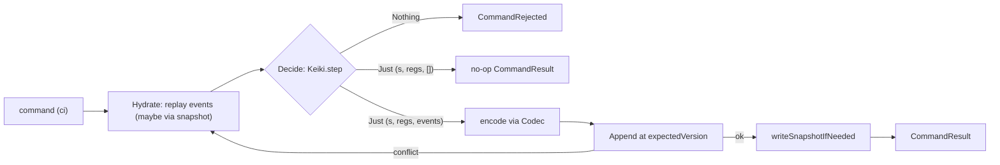
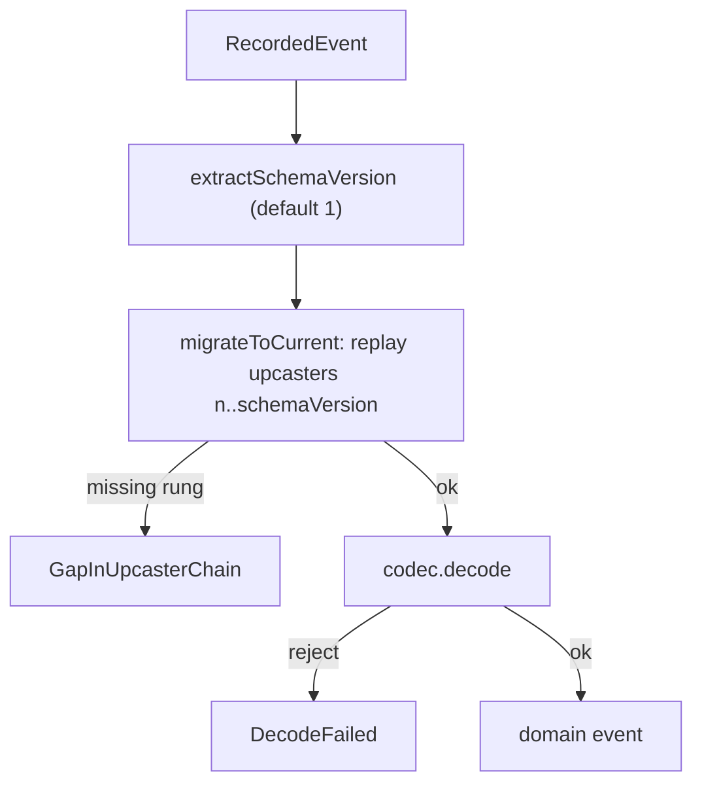

# Keiro command cycle and write-path documentation

This ExecPlan is a living document. The sections Progress, Surprises & Discoveries,
Decision Log, and Outcomes & Retrospective must be kept up to date as work proceeds.


## Purpose / Big Picture

After this change, the keiro documentation set under `content/docs/keiro/` in this repository
gains a complete, accurate, navigable **write-path** documentation slice. The "write path" — what
keiro's own source calls the **command cycle** — is the half of an event-sourcing system that
*changes* state: it takes a command (an instruction like "place this order"), rebuilds the target
aggregate's current state from its stored events, decides which new events the command produces,
and appends those events to the log. Today a reader who lands on `/docs/keiro` can read the
overview and the getting-started tutorial (both owned by sibling plan EP-7), and can read about the
*read* side (owned by sibling plan EP-9), but finds no dedicated, accurate documentation of *how a
command becomes durable events*. This plan fills that gap.

"Event sourcing" means the system stores an append-only log of **events** (facts that happened,
like `OrderPlaced`) rather than a mutable row of current state; current state is *derived* by
folding the events. An "aggregate" is one consistency boundary — one entity whose events live in a
single ordered **stream** (e.g. all events for `order-42`). keiro builds aggregates on top of three
lower libraries: **kiroku** (the append-only PostgreSQL event store), **keiki** (a pure
symbolic-register finite-state transducer — the decision core that, given current state and a
command, yields the events to emit), and **shibuya** (the subscription/worker substrate). This
plan documents the keiro layer that ties keiki's decision logic to kiroku's storage: the modules
`Keiro.Command`, `Keiro.Codec`, `Keiro.EventStream`, `Keiro.Stream`, and `Keiro.Router`.

A reader who finishes this slice can:

- **Trace a command through its three phases.** keiro runs every command as a pipeline: **Hydrate**
  (replay the stream's stored events — optionally fast-forwarding from a snapshot — through the
  keiki transducer to recover the current `(state, registers, StreamVersion)`), **Decide** (step the
  transducer with the command; a rejected transition yields `CommandRejected`, a transition that
  emits no events yields a no-op result), and **Append** (encode the emitted events via the stream's
  `Codec` and append them at the expected version). The docs name each phase, show the real types
  it produces, and anchor the whole pipeline to the `jitsurei` order aggregate.
- **Understand optimistic concurrency and the retry-on-conflict loop.** keiro appends at an
  `ExpectedVersion` derived from the hydrated version (`StreamVersion 0` becomes `NoStream`,
  otherwise `ExactVersion v`). When a concurrent writer got there first, the store rejects the
  append; keiro retries by re-hydrating and re-deciding, up to `retryLimit` times, before giving up
  with `RetryExhausted`. The docs teach a sharp, easily-missed property of the shipped source:
  **both** `WrongExpectedVersion` **and** `StreamAlreadyExists` are treated as retryable conflicts,
  so a lost new-stream race is silently retried rather than surfaced.
- **Distinguish a no-op from a rejection from a failure.** The docs draw three outcomes that are
  easy to conflate: a command that the transducer *rejects* (`CommandRejected`), a command that is
  *accepted but emits no events* (a no-op `CommandResult` with `eventsAppended = 0`), and a command
  that *fails to persist* (`StoreFailed`/`RetryExhausted`). These mean different things to a caller.
- **Use the three command runners and pick the right one.** keiro ships `runCommand` (append only),
  `runCommandWithSql` (run a callback in the *same* transaction as the append, e.g. to write a
  read-model row atomically), and `runCommandWithSqlEvents` (the most general — the in-transaction
  callback also receives each emitted event paired with its persisted `RecordedEvent`; this is the
  primitive that projections, process managers, and routers build on). The docs document all three
  verbatim and a how-to shows the transactional pattern.
- **Evolve an event schema safely.** keiro's `Codec` is a **value-level record** (not a typeclass)
  carrying a current `schemaVersion` and a chain of `Upcaster`s. The docs teach that the schema
  version is stamped into event metadata on write, read back on decode, and used to replay the
  upcaster chain up to the current version — and that an unknown event type on read is **fatal**
  (`UnknownEventType`), while a missing rung in the upcaster chain is a `GapInUpcasterChain`. The
  worked example is the `jitsurei` order codec's real v1→v2 `OrderPlaced` upcaster.
- **Make commands idempotent and route events to commands.** The docs show supplying caller-assigned
  `eventIds` (positionally assigned to emitted events) for deterministic, replay-safe appends, and
  document `Keiro.Router` — keiro's stateless content-based router — which dispatches one command
  per resolved target under a deterministic id and folds a store-level duplicate into a benign
  result. The worked example is the `jitsurei` `pagingRouter`.

You can see it working by running the docs dev server from the repo root
(`/Users/shinzui/Keikaku/bokuno/keiro-runtime-docs`) with `pnpm dev` (which runs `vite dev`), or a
production build with `pnpm build` (which runs `vite build` and emits a static single-page app
under `.output/public`). Browsing `http://localhost:3000/docs/keiro` shows the new write-path pages
in the sidebar: three explanation essays, four reference pages, five how-to guides, and a five-part
code walkthrough under `walkthrough/command-cycle/`. Haskell snippets render (with ligatures once
the font/highlighter plan has landed) and at least two `mermaid` diagrams render as diagrams.

This is a **content** plan. It populates `content/docs/keiro/` only. It does **not** build the app,
the highlighter, the font, the Mermaid component, or the IA/template system — those are owned by
MasterPlan #1's plans and are already complete. Every Haskell snippet documents keiro **as shipped
at the pinned upstream commit `3f5dc9c` (keiro 0.1.0.0)**; where the keiro repo's own
`docs/research/*` design notes diverge from the shipped code, this plan follows the source.


## Progress

Use a checklist to summarize granular steps. Every stopping point must be documented here, even if
it requires splitting a partially completed task into two ("done" vs. "remaining"). This section
must always reflect the actual current state of the work.

- [ ] M0. Preconditions verified — EP-7 Complete (overview/getting-started/jitsurei map +
      `docs/keiro-source-sync.md` exist); toolchain present; `content/docs/keiro/` + its section
      subdirs exist; baseline `pnpm build` clean; keiro source readable at the pinned commit
      `3f5dc9c`; the `walkthrough/command-cycle/` subdir created.
- [ ] M1. Explanation pages authored (`explanation/the-command-cycle.mdx`,
      `explanation/codec-and-schema-evolution.mdx`, `explanation/why-symtransducer-not-decider.mdx`),
      with at least one `mermaid` diagram (the Hydrate→Decide→Append pipeline).
- [ ] M2. Reference pages authored (`reference/command.mdx`, `reference/event-stream-and-stream.mdx`,
      `reference/codec.mdx`, `reference/router.mdx`).
- [ ] M3. How-to guides authored (`how-to/run-a-command-in-a-transaction.mdx`,
      `how-to/configure-concurrency-retries.mdx`, `how-to/evolve-an-event-schema.mdx`,
      `how-to/make-commands-idempotent.mdx`, `how-to/route-events-to-commands.mdx`).
- [ ] M4. Walkthrough authored (`walkthrough/command-cycle/` subdir + its `meta.json`:
      `00-start-here.mdx`, `01-the-command-processor.mdx`, `02-the-transactional-write-path.mdx`,
      `03-the-codec-on-the-boundary.mdx`, `04-the-router.mdx`).
- [ ] M5. meta.json appends done (section `meta.json`s + `walkthrough/command-cycle/meta.json` +
      "command-cycle" present in `walkthrough/meta.json`); full `pnpm build` prerenders new pages
      with zero crawler warnings; Haskell-name and link audits pass.


## Surprises & Discoveries

Document unexpected behaviors, bugs, optimizations, or insights discovered during implementation.
Provide concise evidence.

(None yet.)


## Decision Log

Record every decision made while working on the plan.

- Decision: Document the command cycle **as shipped at the pinned commit `3f5dc9c` (keiro 0.1.0.0)**,
  not as the keiro repo's `docs/research/*` design notes describe it. The notes diverge from the
  code in several concrete, load-bearing ways that this plan documents the *shipped* version of:
  `tick` and `runCommandMulti` named in `docs/research/06-command-cycle-design.md` are **not** in
  the shipped `Keiro.Command`; the design's `AggregateId a` was renamed to `Stream a`
  (`Keiro.Stream`); the snapshot write is **synchronous** (inline in the command path), not the
  fire-and-forget post-commit task the notes describe.
  Rationale: self-containment and accuracy — documenting unshipped behavior would make every example
  wrong and uncompilable. Verified by reading the source modules listed in Context.
  Date: 2026-06-01
- Decision: Treat the **retryable-conflict set as `{WrongExpectedVersion, StreamAlreadyExists}`** and
  document plainly that a lost new-stream race is *retried, not surfaced*. Rationale: it is a sharp,
  easily-missed property of `isRetryableConflict` in `Keiro/Command.hs`; a reader expecting
  `StreamAlreadyExists` to bubble up would mis-handle a first-write race. Evidence:
  `isRetryableConflict` returns `True` for both constructors.
  Date: 2026-06-01
- Decision: Document the **three distinct command outcomes** (rejected vs. no-op vs. store-failure)
  as a first-class topic on the command-cycle explanation and the `reference/command.mdx` page.
  Rationale: `CommandRejected`, a no-op `CommandResult` with `eventsAppended = 0`, and
  `StoreFailed`/`RetryExhausted` are returned through the *same* `Either CommandError CommandResult`
  and are trivially conflated; the source's own Haddock distinguishes them.
  Date: 2026-06-01
- Decision: Document the **`Codec` as a value-level record**, and present "schema evolution" through
  the real `jitsurei` order codec (`schemaVersion = 2`, `upcasters = [(1, upcastOrderPlacedV1)]`).
  Rationale: a reader coming from typeclass-based serialization libraries will expect a class; the
  value-level design is a deliberate, documentable choice (it lets one event type carry several
  codecs and keeps upcasters first-class data). Evidence: `data Codec e = Codec { … }` in
  `keiro-core/src/Keiro/Codec.hs`; `orderCodec :: Codec OrderEvent` in `Jitsurei/OrderStream.hs`.
  Date: 2026-06-01
- Decision: The **router page lives in this plan (EP-8)**, but the `IntegrationEvent` reference page
  is **owned by EP-11**. EP-8's pages link to `/docs/keiro/reference/integration-event` rather than
  re-documenting it. Rationale: MasterPlan Integration Point #5 fixes that ownership; the router and
  codec touch event *metadata*, not the integration-event envelope itself.
  Date: 2026-06-01
- Decision: Author a dedicated explanation, `why-symtransducer-not-decider.mdx`, on why keiro builds
  the command cycle directly on keiki's native `SymTransducer` (register file + ε-edges + guard
  alphabet `phi`) rather than wrapping it in a decide/evolve façade. Rationale: the MasterPlan's
  thesis is that aggregates, process managers, and sagas are all the *same* `SymTransducer`; readers
  arriving from `decider`/`evolve`-style frameworks (including kiroku's own decider-and-evolve
  tutorial) need this bridge explicitly. Evidence: `EventStream` carries a
  `SymTransducer phi rs s ci co` directly; `Keiro.Command.evaluateCommand` calls `Keiki.step`.
  Date: 2026-06-01


## Outcomes & Retrospective

Summarize outcomes, gaps, and lessons learned at major milestones or at completion. Compare the
result against the original purpose.

(To be filled during and after implementation.)


## Context and Orientation

Read this whole section before editing. It is written so a novice with only this file and the
working tree can complete the work. You will write MDX content files; you will not write or compile
Haskell. The Haskell appears only as *quoted snippets* inside the docs, and every snippet must match
the real source transcribed below.

### What you are building, and where

This repository (`/Users/shinzui/Keikaku/bokuno/keiro-runtime-docs`) is a **fumadocs** documentation
site (fumadocs-ui + fumadocs-mdx) built on **TanStack Start as a static single-page app** (React +
MDX + TypeScript, bundled with **Vite**), built and served with **pnpm** on **Node 22**. `pnpm dev`
runs `vite dev`; `pnpm build` runs `vite build` and emits a static SPA under `.output/public`.
Content lives under `content/docs/`. Each directory has a `meta.json` whose `pages` array lists
child page slugs (and nested directory names) in sidebar order. A "page" is an `.mdx` file: YAML
frontmatter (`title`, `description`) followed by an MDX body.

The documented **code samples are Haskell** (the site is TypeScript; the subject, keiro, is a
Haskell library). MDX components (`Callout`, `Cards`, `Card`, `Steps`, `Step`, `Tabs`, `Tab`,
`TypeTable`, `Accordion`, `Accordions`, and `Mermaid`) are **registered globally** in
`src/components/mdx.tsx` — so in page bodies you use them **bare, with no `import` lines**. This
matches every existing kiroku page. Do not add `import` statements for these.

### Where this plan sits in the larger effort (reference by path)

This is **EP-8** in the MasterPlan `docs/masterplans/2-keiro-framework-documentation-set.md`. It is
**Phase 2**.

- **HARD DEP — EP-7** (`docs/plans/7-keiro-overview-getting-started-and-the-jitsurei-example-spine.md`):
  EP-7 must be **Complete** before you start. EP-7 creates the `/docs/keiro` overview and
  getting-started pages your pages link back to, the core-concepts explanation, the introduction of
  the jitsurei worked example and its module map, the `docs/keiro-source-sync.md` source-of-truth
  pointer, the `walkthrough/index.mdx` hub and `walkthrough/meta.json`, and the shared authoring
  conventions. Verify EP-7 is done in M0; if `content/docs/keiro/index.mdx` or
  `docs/keiro-source-sync.md` is missing, stop and finish EP-7 first.
- **SOFT/INTEGRATION — EP-9, EP-10, EP-11.** Other Phase-2 plans link *into* EP-8's pages (EP-9's
  `runCommandWithProjections` is a thin wrapper over this plan's `runCommandWithSqlEvents`; EP-10's
  process managers dispatch through the command cycle; EP-11 mints integration events from recorded
  domain events). You author absolute links to those plans' pages where the narrative needs them
  (for example `/docs/keiro/reference/integration-event`, owned by EP-11, and
  `/docs/keiro/reference/projection`, owned by EP-9); they resolve once those plans land. Soft means
  non-blocking: if you cannot confirm a target page's exact slug, link to the section landing
  (`/docs/keiro/reference` or `/docs/keiro/explanation`) and note the intended target in prose.

### Hard-won house rules (apply to every page you write)

1. **Absolute doc links only.** Cross-page links use absolute doc paths
   (`/docs/keiro/reference/command`), never relative `./sibling` or `../section/page`. Relative MDX
   links resolve *wrong* in the static SPA and trip the prerender crawler (a kiroku lesson recorded
   in `docs/plans/5`'s Surprises: a `./01-…` link from `…/walkthrough/00-start-here` resolved to a
   nonexistent nested route and emitted `[unhandledRejection] Failed to fetch`). This applies even to
   the code-walkthrough template's `[00 — Start here](./00-start-here)` line — when you copy that
   template, **rewrite the link to an absolute path** (`/docs/keiro/walkthrough/command-cycle/00-start-here`).
2. **Every fenced code block carries a language tag.** Use ` ```haskell `, ` ```sql `, ` ```json `,
   ` ```mermaid `, ` ```bash `, ` ```text `. Never a bare ```` ``` ````.
3. **Snippet accuracy is an acceptance criterion.** Every Haskell type, field, and function name you
   quote must appear in the pinned source. The verified transcription is below; cross-check against
   the files named before declaring a snippet done.
4. **No `import` lines for the MDX components** (see above).

### The subject, transcribed from source (use these REAL names)

Source of truth on disk (read-only — do **not** edit it): `/Users/shinzui/Keikaku/bokuno/keiro`,
pinned commit `3f5dc9c`. The facts below are transcribed verbatim from that tree. Treat this as your
API cheat-sheet. The files to cross-check are named inline. The umbrella module `Keiro`
(`keiro/src/Keiro.hs`) re-exports `Keiro.Command`, `Keiro.Codec`, `Keiro.EventStream`
(`EventStream`, `SnapshotPolicy`, `StateCodec`), `Keiro.Stream`, `Keiro.Router`, and `Keiro.Snapshot`,
and exposes `version :: Text = "0.1.0.0"`. Read models, projections, process managers, timers, and
the inbox/outbox are **not** re-exported here (they are imported directly; EP-9/EP-10/EP-11 own them).

**(A) THE COMMAND RUNNERS** (`keiro/src/Keiro/Command.hs`). The module's own Haddock describes the
three-phase pipeline (Hydrate → Decide → Append) and the three runners. The public surface:

```haskell
-- The outcome of a successfully handled command.
data CommandResult target = CommandResult
  { target         :: !(Stream target)
  , streamVersion  :: !StreamVersion
  , globalPosition :: !(Maybe GlobalPosition)
  , eventsAppended :: !Int            -- 0 for a no-op command that emitted nothing
  }
  deriving stock (Generic, Eq, Show)

-- Why a command did not complete.
data CommandError
  = HydrationDecodeFailed !CodecError       -- a stored event could not be decoded while rehydrating
  | HydrationReplayFailed !StreamVersion    -- replay stalled: the machine rejected a committed event
  | CommandRejected                         -- the transducer rejected the command in the hydrated state
  | EncodeFailed !CodecError                -- an emitted event could not be encoded for append
  | StoreFailed !StoreError                 -- the store rejected the append (non-retryable)
  | RetryExhausted !Int !StoreError         -- optimistic-concurrency retries ran out (limit, last error)
  deriving stock (Generic, Eq, Show)

-- Knobs for a single command invocation.
data RunCommandOptions = RunCommandOptions
  { retryLimit   :: !Int            -- rehydrate-and-replay attempts after a conflict
  , pageSize     :: !Int32          -- read-batch size during hydration
  , eventIds     :: ![EventId]      -- caller-supplied ids assigned to emitted events, in order
  , beforeAppend :: !(IO ())        -- hook run immediately before each append attempt (test seam)
  , tracer       :: !(Maybe Tracer) -- optional OpenTelemetry tracer; Nothing emits no spans
  , metadata     :: !(Maybe Value)  -- optional JSON merged into every event's metadata
  }
  deriving stock (Generic)

-- Defaults: 3 retries, 256-event read pages, no caller ids, no-op hook, no tracer, no metadata.
defaultRunCommandOptions :: RunCommandOptions

-- Append only.
runCommand ::
  forall phi rs s ci co es.
  (HasCallStack, IOE :> es, Store :> es, Error StoreError :> es, BoolAlg phi (RegFile rs, ci), Eq co) =>
  RunCommandOptions ->
  EventStream phi rs s ci co ->
  Stream (EventStream phi rs s ci co) ->
  ci ->
  Eff es (Either CommandError (CommandResult (EventStream phi rs s ci co)))

-- Run @afterAppend@ in the SAME transaction as the append (e.g. update an inline read model).
runCommandWithSql ::
  forall phi rs s ci co a es.
  (HasCallStack, IOE :> es, Store :> es, Error StoreError :> es, BoolAlg phi (RegFile rs, ci), Eq co) =>
  RunCommandOptions ->
  EventStream phi rs s ci co ->
  Stream (EventStream phi rs s ci co) ->
  ci ->
  (AppendResult -> Tx.Transaction a) ->
  Eff es (Either CommandError (CommandResult (EventStream phi rs s ci co), Maybe a))

-- The most general: the in-tx callback also gets each emitted event paired with its RecordedEvent.
-- Inline projections, process managers, and routers are all built on this.
runCommandWithSqlEvents ::
  forall phi rs s ci co a es.
  (HasCallStack, IOE :> es, Store :> es, Error StoreError :> es, BoolAlg phi (RegFile rs, ci), Eq co) =>
  RunCommandOptions ->
  EventStream phi rs s ci co ->
  Stream (EventStream phi rs s ci co) ->
  ci ->
  ([(co, RecordedEvent)] -> AppendResult -> Tx.Transaction a) ->
  Eff es (Either CommandError (CommandResult (EventStream phi rs s ci co), Maybe a))
```

**Internals you quote in the walkthrough** (still `Keiro/Command.hs`, all verified verbatim):

- `hydrate` consults a snapshot seed first: if `eventStream ^. #stateCodec` is `Nothing` it calls
  `hydrateFull` (replay from `StreamVersion 0`); if `Just codec`, it calls
  `hydrateWithSnapshot … codec`; on a seed it `replayFrom` the seed, and **on any replay error it
  silently falls back to `hydrateFull`**.
- `hydrateFull` folds `readStreamForwardStream … (StreamVersion 0) (pageSize)` via Streamly,
  decoding each `RecordedEvent` with `decodeRecorded` and stepping the transducer with
  `Keiki.applyEventStreaming`. A `Nothing` from the transducer is `HydrationReplayFailed`; a decode
  failure is `HydrationDecodeFailed`.
- `evaluateCommand` calls `Keiki.step (transducer) (state, registers) command`; `Nothing` →
  `CommandRejected`; `Just (_, _, events)` → `Right events`. (Note the shape:
  `Keiki.step` returns `Maybe (s, RegFile rs, [co])`.)
- `prepareCommandPlan` turns `[]` emitted events into `CommandNoOp` (a `CommandResult` with
  `eventsAppended = 0`), and a non-empty list into `CommandAppend`, after `assignEventIds` and
  `encodeEvents`.
- `expectedVersion :: StreamVersion -> ExpectedVersion` is `expectedVersion (StreamVersion 0) =
  NoStream` else `ExactVersion version`.
- `assignEventIds :: [EventId] -> [EventData] -> [EventData]` assigns caller ids **positionally**
  (zip-style): with `[]` it is identity; otherwise it sets `#eventId` on each event in order.
- `isRetryableConflict` returns `True` for `WrongExpectedVersion{}` **and** `StreamAlreadyExists{}`,
  `False` otherwise. `retryOrFail` retries while retryable and `remaining > 0`, returns
  `RetryExhausted (retryLimit) storeError` when retryable but exhausted, else `StoreFailed`.
  `StoreError` is handled with `tryError` (not thrown).
- `reconstructRecorded :: AppendResult -> UTCTime -> [PreparedEvent] -> [RecordedEvent]` rebuilds
  each `RecordedEvent` *arithmetically* from the `AppendResult` (event `i` gets `last - count + i`
  for both stream version and global position) rather than re-reading the batch — tight coupling to
  kiroku's `WITH ORDINALITY` numbering. It is used by `runCommandWithSqlEvents` so the in-tx callback
  sees each event's persisted identity without a round-trip.
- `writeSnapshotIfNeeded` runs **after** the append, inside the command-run effect: if
  `stateCodec = Nothing` it is a no-op; otherwise it re-folds the emitted events via
  `Keiki.applyEvents`, computes terminality via `Keiki.isFinal`, and writes a snapshot via
  `writeSnapshot` only when `shouldSnapshot (snapshotPolicy) terminal finalState finalVersion`. The
  `SnapshotPolicy`/`StateCodec`/`writeSnapshot` surface is owned by EP-9's `reference/snapshot.mdx`;
  EP-8 mentions the *call site* and links there.

In the transactional runner the in-tx body calls `appendToStreamTx`; **on conflict it calls
`Tx.condemn`** (marking the Hasql transaction for rollback) and returns the
`appendConflictToStoreError conflict` to the retry logic.

**(B) THE CODEC — value-level, fatal-on-unknown** (`keiro-core/src/Keiro/Codec.hs`).

```haskell
-- One rung of an upcaster chain: the source version it upgrades FROM, and a pure migration.
type Upcaster = (Int, Value -> Either Text Value)

-- Everything a stream needs to serialize/deserialize/migrate its events. NOT a typeclass.
data Codec e = Codec
  { eventTypes    :: !(NonEmpty Text)         -- the complete event-type allow-list this codec owns
  , eventType     :: !(e -> Text)             -- project a domain value to its wire tag
  , schemaVersion :: !Int                     -- current payload version; must be >= 1
  , encode        :: !(e -> Value)            -- current-version JSON serialization
  , decode        :: !(Value -> Either Text e)-- only ever sees payloads migrated to schemaVersion
  , upcasters     :: ![Upcaster]              -- migrations keyed by source version
  }
  deriving stock (Generic)

data CodecError
  = UnknownEventType !EventType ![Text]       -- tag not in eventTypes (offending tag, allowed set)
  | InvalidSchemaVersion !Int                 -- schemaVersion is not >= 1
  | UnknownVersion !Int                       -- stored version is < 1 or beyond the chain
  | UpcasterError !Int !Text                  -- an upcaster rejected its input (source version, msg)
  | DecodeFailed !Text                        -- the current decode rejected a migrated payload
  | GapInUpcasterChain !Int !Int              -- reached version n, next rung starts later
  deriving stock (Generic, Eq, Show)

encodeForAppend             :: Codec e -> e -> Either CodecError EventData
encodeForAppendWithMetadata :: Codec e -> Maybe Value -> e -> Either CodecError EventData
decodeRecorded              :: Codec e -> RecordedEvent -> Either CodecError e
decodeRaw                   :: Codec e -> Int -> Value -> Either CodecError e
migrateToCurrent            :: Codec e -> Int -> Value -> Either CodecError Value
extractSchemaVersion        :: RecordedEvent -> Int            -- defaults to 1 when absent/invalid
metadataFor                 :: Int -> Maybe Value -> Value     -- inserts the @schemaVersion@ key
```

Behavior to teach: `encodeForAppendWithMetadata` stamps `schemaVersion` into fresh or supplied
metadata, and **the schema-version key always wins over any clashing caller key** so the stamp on
disk is authoritative. `decodeRecorded` reads the stamped version (via `extractSchemaVersion`,
defaulting to `1`), runs `migrateToCurrent` (replay upcasters `n, n+1, …` up to `schemaVersion`),
then the current `decode`. **An unknown `eventType` on read is fatal** (`UnknownEventType`). The
upcaster chain must be ascending and contiguous: reaching version `n` with the next available
upcaster starting later yields `GapInUpcasterChain n nextVersion`.

The **worked example** is the `jitsurei` order codec (`jitsurei/src/Jitsurei/OrderStream.hs`):
`orderCodec :: Codec OrderEvent` has `schemaVersion = 2`, `upcasters = [(1, upcastOrderPlacedV1)]`,
`eventTypes = "OrderPlaced" :| ["PaymentApproved", "OrderPacked", "OrderShipped", "OrderCancelled"]`.
`upcastOrderPlacedV1 :: Value -> Either Text Value` migrates a v1 `OrderPlaced` (which used a `"qty"`
key and an optional `"sku"`) into the v2 shape (a required `"quantity"` and an `"sku"` defaulted to
`"UNKNOWN"`). This is the v1→v2 example used by the codec explanation and the evolve-an-event-schema
how-to. (The contrasting `pageCodec` in `Jitsurei/Paging.hs` is `schemaVersion = 1`, `upcasters = []`
— a codec with no migration history.)

**(C) THE EVENT STREAM + SNAPSHOT POLICY + STATE CODEC** (`keiro-core/src/Keiro/EventStream.hs`).

```haskell
-- The complete description of one persistent event stream: a keiki transducer plus everything
-- keiro needs to run it against a durable store. Type params thread through from the transducer:
-- phi = guard alphabet, rs = register set, s = control state, ci = command input, co = event output.
data EventStream phi rs s ci co = EventStream
  { transducer        :: !(SymTransducer phi rs s ci co)
  , initialState      :: !s
  , initialRegisters  :: !(RegFile rs)
  , eventCodec        :: !(Codec co)
  , resolveStreamName :: !(Stream (EventStream phi rs s ci co) -> StreamName)
  , snapshotPolicy    :: !(SnapshotPolicy (s, RegFile rs))
  , stateCodec        :: !(Maybe (StateCodec (s, RegFile rs)))  -- Nothing disables snapshotting
  }
  deriving stock (Generic)

data SnapshotPolicy state
  = Never                                  -- never snapshot; always replay the full log
  | Every !Int                             -- snapshot when version is a positive multiple of n
  | OnTerminal                             -- snapshot only at a final state
  | Custom !(state -> StreamVersion -> Bool)
  deriving stock (Generic)

data StateCodec state = StateCodec
  { stateCodecVersion :: !Int     -- bumped when the snapshot encoding changes incompatibly
  , shapeHash         :: !Text    -- digest of the folded-state shape; guards reuse
  , encode            :: !(state -> Value)
  , decode            :: !(Value -> Either Text state)
  }
  deriving stock (Generic)
```

`EventStream` is `Keiro`-re-exported. `StateCodec` and `SnapshotPolicy` are *defined* here (so EP-8
documents them on `reference/event-stream-and-stream.mdx`), but the *runtime* snapshot reference
(`writeSnapshot`, `hydrateWithSnapshot`, `defaultStateCodec`, `shouldSnapshot`, the
`keiro_snapshots` table) is owned by EP-9's `reference/snapshot.mdx`; link there for the read/write
mechanics. The `jitsurei` order stream shows both ends: `orderEventStream` uses
`snapshotPolicy = Never`, `stateCodec = Nothing` (no snapshotting), while `snapshotOrderEventStream`
sets `snapshotPolicy = Every 2`, `stateCodec = Just (defaultStateCodec @OrderRegs @OrderState 1)`.

**(D) THE STREAM HANDLE — phantom-typed** (`keiro-core/src/Keiro/Stream.hs`).

```haskell
-- A StreamName tagged with a phantom type @a@ identifying which aggregate it names.
newtype Stream a = Stream { name :: StreamName }
  deriving stock (Generic, Eq, Ord, Show)

stream        :: Text -> Stream a               -- build a handle from a raw stream-name Text
streamName    :: Stream a -> StreamName          -- recover the underlying StreamName
mapStreamName :: (StreamName -> StreamName) -> Stream a -> Stream a  -- transform name, keep the tag
```

The phantom type lets the framework demand a `Stream Order` rather than a bare `StreamName`, so a
name for one aggregate cannot be passed where another is expected. The `jitsurei` order stream's
`orderStream :: OrderId -> Stream OrderEventStream` builds `stream ("order-" <> orderIdText orderId)`.
**The design notes' old name for this was `AggregateId a`; the shipped type is `Stream a` — trust the
source.**

**(E) THE ROUTER — stateless content-based dispatch** (`keiro/src/Keiro/Router.hs`).

```haskell
-- A stateless, content-based router (Enterprise Integration Patterns): for each incoming event it
-- resolves a data-dependent set of target streams EFFECTFULLY and dispatches one command to each.
data Router input targetPhi targetRs targetState targetCi targetCo es = Router
  { name              :: !Text                              -- part of every command's deterministic id
  , key               :: !(input -> Text)                   -- correlation string for the source event
  , resolve           :: !(input -> Eff es [PMCommand targetCi])  -- effectful target set (e.g. runQuery)
  , targetEventStream :: !(EventStream targetPhi targetRs targetState targetCi targetCo)
  , targetProjections :: !(Stream targetCi -> [InlineProjection targetCo])
  }
  deriving stock (Generic)

newtype RouterResult target = RouterResult { commandResults :: [PMCommandResult target] }
  deriving stock (Generic, Eq, Show)

runRouterOnce ::
  forall input targetPhi targetRs targetState targetCi targetCo es.
  (HasCallStack, IOE :> es, Store :> es, Error StoreError :> es,
   BoolAlg targetPhi (RegFile targetRs, targetCi), Eq targetCo) =>
  RunCommandOptions ->
  Router input targetPhi targetRs targetState targetCi targetCo es ->
  RecordedEvent ->
  input ->
  Eff es (RouterResult (EventStream targetPhi targetRs targetState targetCi targetCo))

runRouterWorker ::
  forall msg input targetPhi targetRs targetState targetCi targetCo es.
  (HasCallStack, IOE :> es, Store :> es, Error StoreError :> es,
   BoolAlg targetPhi (RegFile targetRs, targetCi), Eq targetCo) =>
  RunCommandOptions ->
  Router input targetPhi targetRs targetState targetCi targetCo es ->
  Adapter es msg ->
  (msg -> Maybe (RecordedEvent, input)) ->
  Eff es ()
```

Behavior to teach: dispatch is **exactly-once-per-target by construction**. For each resolved
target, `runRouterOnce` derives a `deterministicCommandId (name) correlationId sourceEventId
emitIndex`, pre-checks with `eventAlreadyIn` (skip → `PMCommandDuplicate`), otherwise calls
`runCommandWithProjections` (owned by EP-9) and folds a store-level `DuplicateEvent` rejection into a
benign `PMCommandDuplicate`. A failed dispatch surfaces as a `PMCommandFailed` element of the
`RouterResult` (not an outer `Either`). `runRouterWorker` drains a shibuya `Adapter`, decodes each
message to `(RecordedEvent, input)` (an undecodable message finalizes `AckHalt (HaltFatal …)`), runs
`runRouterOnce`, and **invokes the ingested message's `AckHandle` `finalize`** with the decision:
`AckOk` when every result is `PMCommandAppended`/`PMCommandDuplicate`, else `AckHalt (HaltFatal …)`
so the source event is retried (deterministic ids make retry safe). `PMCommand`,
`PMCommandResult`, `deterministicCommandId`, and `eventAlreadyIn` come from `Keiro.ProcessManager`
(documented by EP-10); `InlineProjection`/`runCommandWithProjections` from `Keiro.Projection`
(EP-9); the shibuya `Adapter`/`AckHandle`/`AckDecision` types from the shibuya layer.

The **worked example** is `jitsurei` `pagingRouter` (`jitsurei/src/Jitsurei/Paging.hs`): for each
`IncidentRaisedData` it `runQuery`s the on-call read model (`serviceOncallReadModel`) and dispatches
one `SendPage` `PMCommand` per responder, with `targetProjections = const []`.

### The jitsurei worked example (your anchor for explanations + how-tos)

`jitsurei` (実例, "worked example") is a runnable package shipped in the keiro repo. EP-8 anchors to:

- **Order aggregate, command cycle, codec upcasting** — `jitsurei/src/Jitsurei/Domain.hs` (the
  `OrderCommand`/`OrderEvent`/`OrderState` types, e.g. `PlaceOrder`, `OrderPlaced`, states
  `NotStarted`/`Placed`/`Paid`/`Packed`/`Shipped`/`Cancelled`) and
  `jitsurei/src/Jitsurei/OrderStream.hs` (`orderEventStream`, `orderTransducer`, `orderCodec`,
  `upcastOrderPlacedV1`, `orderStream`). Run target: `just jitsurei-fulfillment`.
- **Content-based router** — `jitsurei/src/Jitsurei/Paging.hs` (`pagingRouter`), with
  `jitsurei/src/Jitsurei/Incident.hs` and `jitsurei/src/Jitsurei/OncallRoster.hs` for the incident
  input and the on-call read model it queries. Run target: `just jitsurei-paging`.

Both targets depend on `just jitsurei-migrate`.

### The pages this plan authors (all under `content/docs/keiro/`)

Explanations: `explanation/the-command-cycle.mdx`, `explanation/codec-and-schema-evolution.mdx`,
`explanation/why-symtransducer-not-decider.mdx`. References: `reference/command.mdx`,
`reference/event-stream-and-stream.mdx`, `reference/codec.mdx`, `reference/router.mdx`. How-tos:
`how-to/run-a-command-in-a-transaction.mdx`, `how-to/configure-concurrency-retries.mdx`,
`how-to/evolve-an-event-schema.mdx`, `how-to/make-commands-idempotent.mdx`,
`how-to/route-events-to-commands.mdx`. Walkthrough (new subdir):
`walkthrough/command-cycle/00-start-here.mdx`, `walkthrough/command-cycle/01-the-command-processor.mdx`,
`walkthrough/command-cycle/02-the-transactional-write-path.mdx`,
`walkthrough/command-cycle/03-the-codec-on-the-boundary.mdx`, `walkthrough/command-cycle/04-the-router.mdx`,
plus `walkthrough/command-cycle/meta.json`.

### Templates to copy from

Per Diátaxis type, copy the matching template's frontmatter + skeleton from
`content/docs/_templates/`: `explanation.mdx`, `reference.mdx`, `how-to.mdx`, `code-walkthrough.mdx`
(this plan authors no tutorial — the getting-started tutorial is EP-7's). Good in-repo exemplars to
imitate for tone and component usage: `content/docs/kiroku/explanation/optimistic-concurrency.mdx`
(the optimistic-concurrency essay this plan parallels for keiro), `content/docs/kiroku/reference/core-types.mdx`
(for `<TypeTable>`), `content/docs/kiroku/reference/store-effect.mdx`, and
`content/docs/kiroku/walkthrough/01-the-state-machine.mdx` (walkthrough tone).


## Plan of Work

The work is six milestones. M0 verifies preconditions. M1–M4 each author one page-group and are
independently verifiable by building the site and viewing the new pages. M5 wires the sidebar and
runs the full acceptance gate. Author in the order below; the explanations establish vocabulary the
references and how-tos lean on.

### M0 — Preconditions

Confirm EP-7 is Complete and the toolchain/tree are ready. At the end you can run `pnpm build` on
the existing keiro tree with zero errors, and the `walkthrough/command-cycle/` subdir exists.
Acceptance: the build succeeds before you add any EP-8 page, and `docs/keiro-source-sync.md` +
`content/docs/keiro/index.mdx` exist.

### M1 — Explanation set (3 pages)

`explanation/the-command-cycle.mdx` teaches the Hydrate → Decide → Append pipeline, optimistic
concurrency (`expectedVersion`: `StreamVersion 0` → `NoStream` else `ExactVersion v`), the
retry-on-conflict loop (both `WrongExpectedVersion` and `StreamAlreadyExists` are retryable;
`RetryExhausted` carries the limit and last error), and the three distinct outcomes (rejected vs.
no-op vs. store-failure). It carries a `mermaid` of the pipeline and anchors to the jitsurei order
aggregate. `explanation/codec-and-schema-evolution.mdx` teaches the value-level `Codec`, the
upcaster chain, the `schemaVersion`-in-metadata stamp (schema key always wins), and fatal-on-unknown
read, using the `jitsurei` order v1→v2 `OrderPlaced` upcaster as the worked example.
`explanation/why-symtransducer-not-decider.mdx` explains why keiro builds on keiki's native
`SymTransducer` (register file, ε-edges, guard alphabet `phi`) rather than a decide/evolve façade.
At the end: all three pages build and render. Acceptance: `pnpm build` prerenders them with no
crawler warnings.

### M2 — Reference set (4 pages)

`reference/command.mdx` documents the three runners, `CommandResult`, `CommandError`,
`RunCommandOptions`/`defaultRunCommandOptions`, using `<TypeTable>` for the records and verbatim
signatures for the functions. `reference/event-stream-and-stream.mdx` documents `EventStream`,
`SnapshotPolicy`, `StateCodec`, and the `Stream` handle (`stream`/`streamName`/`mapStreamName`).
`reference/codec.mdx` documents `Codec`, `Upcaster`, `CodecError`, and the
encode/decode/migrate/metadata functions. `reference/router.mdx` documents `Router`, `RouterResult`,
`runRouterOnce`, `runRouterWorker`, and the deterministic-id dispatch. At the end: every name above
is present verbatim. Acceptance: pages build; a grep audit (M5) finds every quoted Haskell name in
the pinned source.

### M3 — How-to guides (5 pages)

`how-to/run-a-command-in-a-transaction.mdx`: use `runCommandWithSql`/`runCommandWithSqlEvents` to
commit a read-model row atomically with the append. `how-to/configure-concurrency-retries.mdx`:
`retryLimit`/`pageSize` and interpreting `RetryExhausted`. `how-to/evolve-an-event-schema.mdx`: add
an `Upcaster`, bump `schemaVersion`, test the chain (anchored to the jitsurei v1→v2 upcaster).
`how-to/make-commands-idempotent.mdx`: supply `eventIds` / deterministic ids and treat
`DuplicateEvent` as success. `how-to/route-events-to-commands.mdx`: `runRouterOnce`/`runRouterWorker`
over a shibuya adapter (jitsurei paging). At the end: each guide solves its one task. Acceptance: all
build.

### M4 — Walkthrough (`walkthrough/command-cycle/`, 5 pages + meta.json)

A five-part ordered tour over the real source. `00-start-here.mdx` frames the Hydrate → Decide →
Append design with an overview `mermaid`. `01-the-command-processor.mdx` traces
`runCommand` → `hydrate`/`hydrateFull` → `evaluateCommand` → `appendOnce`/`retryOrFail`, with
`expectedVersion` and `writeSnapshotIfNeeded`. `02-the-transactional-write-path.mdx` traces
`runCommandWithSqlEvents`, `reconstructRecorded`, and the `Tx.condemn` conflict path.
`03-the-codec-on-the-boundary.mdx` traces `encodeForAppendWithMetadata` →
`decodeRecorded`/`migrateToCurrent`. `04-the-router.mdx` traces `runRouterOnce`'s deterministic-id
dispatch and `runRouterWorker`'s ack policy. At the end: the subdir exists with its own `meta.json`.
Acceptance: all five build; internal links are absolute.

### M5 — meta.json appends + full acceptance

Append EP-8's slugs to the section `meta.json`s, create `walkthrough/command-cycle/meta.json`,
ensure `"command-cycle"` is in `walkthrough/meta.json` (EP-7 already lists it per MasterPlan
Integration Point #2 — verify, do not duplicate), then run the full build and audits. Acceptance:
see Validation and Acceptance.


## Concrete Steps

Run all commands from the repo root `/Users/shinzui/Keikaku/bokuno/keiro-runtime-docs` unless stated
otherwise. The toolchain is **pnpm** on **Node 22** (enter the Nix dev shell first if the repo uses
one: `nix develop`).

### M0 — Preconditions

```bash
# Confirm EP-7's artifacts exist (HARD DEP). If either is missing, finish EP-7 first.
test -f content/docs/keiro/index.mdx && echo "keiro overview present"
test -f docs/keiro-source-sync.md && echo "source-sync pointer present"

# Confirm the section dirs you will write into exist.
for d in explanation reference how-to walkthrough; do
  test -d "content/docs/keiro/$d" && echo "have content/docs/keiro/$d"
done

# Install deps and confirm the existing site builds before you add pages.
pnpm install
pnpm build
```

Expected (abridged):

```text
keiro overview present
source-sync pointer present
have content/docs/keiro/explanation
have content/docs/keiro/reference
have content/docs/keiro/how-to
have content/docs/keiro/walkthrough
✓ built in <N>s
```

Create the walkthrough subdir you will populate in M4:

```bash
mkdir -p content/docs/keiro/walkthrough/command-cycle
```

Optional but recommended — confirm the API names you will quote still exist at the pinned commit
(read-only; do not edit the keiro tree):

```bash
grep -RnE "runCommand|runCommandWithSql|runCommandWithSqlEvents|isRetryableConflict|reconstructRecorded|expectedVersion|encodeForAppendWithMetadata|decodeRecorded|migrateToCurrent|runRouterOnce|runRouterWorker|deterministicCommandId" \
  /Users/shinzui/Keikaku/bokuno/keiro/keiro /Users/shinzui/Keikaku/bokuno/keiro/keiro-core
```

### M1 — Explanation pages

Author `content/docs/keiro/explanation/the-command-cycle.mdx` from the `explanation.mdx` template.
Open with the three-phase pipeline in prose, then optimistic concurrency, then the three outcomes,
then the diagram. The body is shown inside a four-backtick fence so the inner ` ```mermaid ` and
` ```haskell ` fences survive:

````mdx
---
title: "The command cycle"
description: "How keiro turns a command into durable events: Hydrate, Decide, Append, with optimistic concurrency and bounded retry."
---

keiro's write path is one pipeline with three phases. A **command** (an instruction such as "place
this order") is turned into **events** (facts such as `OrderPlaced`) and appended to the target
aggregate's **stream** (its ordered slice of the log).

1. **Hydrate** — replay the stream's stored events (optionally fast-forwarding from a snapshot)
   through the keiki transducer to recover the current `(state, registers)` and the stream's current
   `StreamVersion`.
2. **Decide** — step the transducer with the command. The transducer either rejects the command
   (yielding `CommandRejected`) or accepts it and emits a list of events. An accepted command that
   emits *no* events is a **no-op**.
3. **Append** — encode the emitted events with the stream's `Codec` and append them at the expected
   version. A concurrency conflict triggers a bounded rehydrate-and-retry; exhausting the budget
   yields `RetryExhausted`.

## Optimistic concurrency

The append states what it expects the stream's current version to be. keiro derives that from the
hydrated version:

```haskell
expectedVersion :: StreamVersion -> ExpectedVersion
expectedVersion (StreamVersion 0) = NoStream          -- first write: the stream must not exist yet
expectedVersion version           = ExactVersion version
```

If another writer appended first, the store rejects the append and keiro **re-hydrates, re-decides,
and retries** up to `retryLimit` times (default 3) before returning `RetryExhausted` with the
configured limit and the last store error.

<Callout type="warn">
Both `WrongExpectedVersion` (someone bumped an existing stream) **and** `StreamAlreadyExists` (someone
won the race to create the stream) are treated as **retryable** conflicts. A lost new-stream race is
therefore *retried*, not surfaced — your caller never sees `StreamAlreadyExists`.
</Callout>

## Three outcomes, one return type

`runCommand` returns `Either CommandError (CommandResult …)`. Three things a caller must tell apart:

- **Rejected** — `Left CommandRejected`: the transducer had no edge for this command in the hydrated
  state. Nothing was written.
- **No-op** — `Right CommandResult { eventsAppended = 0 }`: the command was accepted but produced no
  events. Nothing was written, but it was *not* a rejection.
- **Store failure** — `Left (StoreFailed …)` or `Left (RetryExhausted …)`: the events could not be
  persisted.

## The pipeline



<Cards>
  <Card title="Codec and schema evolution" href="/docs/keiro/explanation/codec-and-schema-evolution" />
  <Card title="Why SymTransducer, not Decider" href="/docs/keiro/explanation/why-symtransducer-not-decider" />
  <Card title="Command reference" href="/docs/keiro/reference/command" />
</Cards>
````

Then author `content/docs/keiro/explanation/codec-and-schema-evolution.mdx` (from `explanation.mdx`).
It must (1) explain that the `Codec` is a **value-level record**, not a typeclass; (2) explain the
write stamp (`schemaVersion` merged into metadata, schema key always wins) and the read path
(`extractSchemaVersion` defaults to `1`, `migrateToCurrent` replays the upcaster chain, then
`decode`); (3) state fatal-on-unknown-`eventType`; and (4) show the real jitsurei v1→v2 upcaster. Use
the verified `orderCodec`/`upcastOrderPlacedV1` snippets from Context. Include a short `mermaid` of
the decode path (read stamp → migrate chain → decode), e.g.:



Then author `content/docs/keiro/explanation/why-symtransducer-not-decider.mdx` (from
`explanation.mdx`). Explain that an `EventStream` carries a keiki `SymTransducer phi rs s ci co`
directly, and that `Keiro.Command.evaluateCommand` calls `Keiki.step (transducer) (state, registers)
command` returning `Maybe (s, RegFile rs, [co])`. Contrast with the decide/evolve pair familiar from
other frameworks (including kiroku's own decider-and-evolve tutorial,
`/docs/kiroku/tutorials/decider-and-evolve`): a `SymTransducer` is *one* object whose register file
(`rs`) carries data between transitions, whose ε-edges let it move without consuming a command, and
whose guard alphabet `phi` lets transitions branch on predicates — capabilities a plain
decide/evolve split does not express. The payoff (the MasterPlan's thesis): aggregates, process
managers, and sagas are all the *same* `SymTransducer`, so one decision core serves the whole
framework. Link forward to `/docs/keiro/reference/event-stream-and-stream` and back to
`/docs/keiro/explanation/the-command-cycle`.

### M2 — Reference pages

Use the `reference.mdx` template and `<TypeTable>` for record fields (imitate
`content/docs/kiroku/reference/core-types.mdx`). Author the four files with these frontmatter titles
and the exact signatures from Context.

`reference/command.mdx` (title `"Command"`): one section each for `CommandResult`, `CommandError`,
`RunCommandOptions` (+ `defaultRunCommandOptions`), `runCommand`, `runCommandWithSql`,
`runCommandWithSqlEvents`. Put the retryable-conflict gotcha (both `WrongExpectedVersion` and
`StreamAlreadyExists` retry) and the no-op-vs-rejected distinction in `<Callout type="warn">`s. Note
that `runCommandWithSqlEvents` is the primitive projections/process-managers/routers build on, and
link `/docs/keiro/reference/projection` (EP-9) and `/docs/keiro/reference/router`. Example
`<TypeTable>` for `RunCommandOptions`:

```mdx
<TypeTable
  type={{
    retryLimit: { type: "Int", description: "Rehydrate-and-replay attempts after a conflict", default: "3" },
    pageSize: { type: "Int32", description: "Read-batch size during hydration", default: "256" },
    eventIds: { type: "[EventId]", description: "Caller ids assigned to emitted events, in order", default: "[]" },
    beforeAppend: { type: "IO ()", description: "Hook run before each append attempt (test seam)", default: "pure ()" },
    tracer: { type: "Maybe Tracer", description: "Optional OpenTelemetry tracer", default: "Nothing" },
    metadata: { type: "Maybe Value", description: "JSON merged into every event's metadata", default: "Nothing" },
  }}
/>
```

`reference/event-stream-and-stream.mdx` (title `"Event stream and Stream handle"`): sections for
`EventStream` (`<TypeTable>` of its seven fields), `SnapshotPolicy` (the four constructors),
`StateCodec` (note it is *defined* here but the snapshot read/write mechanics — `writeSnapshot`,
`hydrateWithSnapshot`, `defaultStateCodec`, `shouldSnapshot`, `keiro_snapshots` — are documented on
`/docs/keiro/reference/snapshot`, owned by EP-9), and `Stream`/`stream`/`streamName`/`mapStreamName`.
Note that `stateCodec = Nothing` disables snapshotting regardless of policy.

`reference/codec.mdx` (title `"Codec"`): `Codec` (`<TypeTable>` of its six fields), `Upcaster`,
`CodecError` (all six constructors), and the functions `encodeForAppend`,
`encodeForAppendWithMetadata`, `decodeRecorded`, `decodeRaw`, `migrateToCurrent`,
`extractSchemaVersion`, `metadataFor`. Put fatal-on-unknown-`eventType`, the schema-key-wins rule,
and the ascending-contiguous upcaster requirement in callouts.

`reference/router.mdx` (title `"Router"`): `Router` (`<TypeTable>` of its five fields), `RouterResult`,
`runRouterOnce`, `runRouterWorker`. Document the deterministic-id dispatch and the worker ack policy
(undecodable → `AckHalt`; all-appended/duplicate → `AckOk`; any failure → `AckHalt`). Note that
`PMCommand`/`PMCommandResult`/`deterministicCommandId`/`eventAlreadyIn` belong to
`Keiro.ProcessManager` (`/docs/keiro/reference/process-manager`, EP-10) and
`InlineProjection`/`runCommandWithProjections` to `Keiro.Projection`
(`/docs/keiro/reference/projection`, EP-9) — link, don't re-document. If those slugs are unconfirmed
at authoring time, link the section landing `/docs/keiro/reference` and name the target in prose.

### M3 — How-to guides

Author the five files from `how-to.mdx`. Key content per file.

`how-to/run-a-command-in-a-transaction.mdx` — use `runCommandWithSql` for a callback that only needs
the `AppendResult`, or `runCommandWithSqlEvents` for one that needs each emitted event paired with
its `RecordedEvent`. Both run the callback in the **same** Hasql transaction as the append, so the
read-model row and the events commit together or not at all:

```haskell
result <-
  runCommandWithSqlEvents
    defaultRunCommandOptions
    orderEventStream
    (orderStream theOrderId)
    command
    (\emitted appendResult ->
        -- emitted :: [(OrderEvent, RecordedEvent)]; runs inside the append transaction
        traverse_ (\(event, recorded) -> Tx.statement (rowFor event recorded) upsertSummaryStmt) emitted)
```

State plainly: a callback exception aborts the whole transaction (the append is rolled back too),
and on a no-op command the callback does not run and the `Maybe a` result is `Nothing`.

`how-to/configure-concurrency-retries.mdx` — show overriding `retryLimit` and `pageSize` and
interpreting `RetryExhausted`:

```haskell
let options = defaultRunCommandOptions { retryLimit = 8, pageSize = 512 }
runCommand options orderEventStream (orderStream oid) command >>= \case
  Left (RetryExhausted limit lastErr) -> -- contention too high: limit attempts ran out
    ...
  Left (StoreFailed err) -> -- a non-retryable store error
    ...
  Right result -> ...
```

Add a `<Callout type="warn">`: `RetryExhausted` carries the configured `retryLimit` and the last
store error; persistent exhaustion on one stream is a signal to model a hotter aggregate as several
streams (the same lesson as `/docs/kiroku/explanation/optimistic-concurrency`).

`how-to/evolve-an-event-schema.mdx` — anchor to the jitsurei order codec. Show the three steps: (1)
change `encode`/`decode` to the new shape; (2) bump `schemaVersion`; (3) add an `Upcaster` keyed by
the *old* version that rewrites old payloads forward. Use the real v1→v2 example:

```haskell
-- jitsurei/src/Jitsurei/OrderStream.hs
orderCodec :: Codec OrderEvent
orderCodec = Codec
  { eventTypes    = "OrderPlaced" :| ["PaymentApproved", "OrderPacked", "OrderShipped", "OrderCancelled"]
  , eventType     = ...
  , schemaVersion = 2
  , encode        = ...
  , decode        = parseOrderEvent
  , upcasters     = [(1, upcastOrderPlacedV1)]   -- migrates a v1 OrderPlaced into the v2 shape
  }
```

Explain the chain must be ascending and contiguous (a gap yields `GapInUpcasterChain`) and that an
upcaster returning `Left` becomes `UpcasterError`. Test it by decoding a stored v1 payload with the
v2 codec and asserting the migrated value. Close: `just jitsurei-fulfillment` runs the order example.

`how-to/make-commands-idempotent.mdx` — supply caller-assigned `eventIds`, which are assigned to the
emitted events **positionally**, so re-running the same command with the same ids makes the second
append a `DuplicateEvent` (treat it as success):

```haskell
let options = defaultRunCommandOptions { eventIds = [deterministicId] }
runCommand options orderEventStream (orderStream oid) command >>= \case
  Left (StoreFailed (DuplicateEvent _)) -> pure ()  -- already applied; benign
  other -> ...
```

Add a `<Callout type="info">`: `Keiro.Router` (and process managers) automate exactly this — they
derive a `deterministicCommandId` per target and fold a `DuplicateEvent` into a benign
`PMCommandDuplicate`. Link `/docs/keiro/how-to/route-events-to-commands`.

`how-to/route-events-to-commands.mdx` — anchor to jitsurei `pagingRouter`. Show defining a `Router`
whose `resolve` is a `runQuery` and dispatching with `runRouterOnce`, then running it as a live
subscription with `runRouterWorker` over a shibuya `Adapter`:

```haskell
-- one event:
RouterResult results <- runRouterOnce defaultRunCommandOptions pagingRouter recordedEvent incidentRaised

-- live subscription draining a shibuya adapter; decodeMessage :: msg -> Maybe (RecordedEvent, input)
runRouterWorker defaultRunCommandOptions pagingRouter adapter decodeMessage
```

Add a `<Callout type="warn">`: model benign domain rejections (a target refusing a command because no
edge matches) as *total* transitions in the keiki transducer, so they never surface as
`PMCommandFailed` and wedge the worker. Close: `just jitsurei-paging` runs it.

### M4 — Walkthrough

Copy `code-walkthrough.mdx` for each of the five files under
`content/docs/keiro/walkthrough/command-cycle/`. **Rewrite the template's `./00-start-here` link to
the absolute path `/docs/keiro/walkthrough/command-cycle/00-start-here`.** Each chapter quotes the
real source (note the file path above each block) and walks it in prose, explaining the *why*.
Cross-links between chapters are absolute (e.g.
`/docs/keiro/walkthrough/command-cycle/02-the-transactional-write-path`).

- `00-start-here.mdx` (title `"00 — Start here"`): the Hydrate → Decide → Append design + an overview
  `mermaid`; links to the four chapters; names the source files
  (`keiro/src/Keiro/Command.hs`, `keiro-core/src/Keiro/Codec.hs`, `keiro/src/Keiro/Router.hs`).
- `01-the-command-processor.mdx` (title `"01 — The command processor"`): quote `runCommand` and its
  `attempt`/`runPlan`/`appendOnce` helpers, `hydrate`/`hydrateFull` (the snapshot-seed branch and
  silent fallback), `evaluateCommand`, `expectedVersion`, `retryOrFail`/`isRetryableConflict`, and
  `writeSnapshotIfNeeded`, all from `keiro/src/Keiro/Command.hs`. Note the snapshot write is
  synchronous (inline in the effect), and link the snapshot mechanics to
  `/docs/keiro/reference/snapshot` (EP-9).
- `02-the-transactional-write-path.mdx` (title `"02 — The transactional write path"`): quote
  `runCommandWithSqlEvents`'s `appendWithSqlOnce` (the `appendToStreamTx` → `Tx.condemn` conflict
  path → `afterAppend (zip events recordeds) appendResult`) and `reconstructRecorded`, both from
  `keiro/src/Keiro/Command.hs`. Explain why the recorded events are reconstructed arithmetically
  (kiroku's `WITH ORDINALITY` numbering) instead of re-read.
- `03-the-codec-on-the-boundary.mdx` (title `"03 — The codec on the boundary"`): quote
  `encodeForAppendWithMetadata`, `metadataFor`, `decodeRecorded`, `extractSchemaVersion`, and
  `migrateToCurrent` from `keiro-core/src/Keiro/Codec.hs`; show the schema-key-wins and
  fatal-on-unknown behaviors and the upcaster-chain walk.
- `04-the-router.mdx` (title `"04 — The router"`): quote `runRouterOnce`'s `dispatchCommand` (the
  `deterministicCommandId` → `eventAlreadyIn` → `runCommandWithProjections` → `DuplicateEvent` fold)
  and `runRouterWorker`'s `handleIngested`/`ackDecisionFor` from `keiro/src/Keiro/Router.hs`; explain
  exactly-once-per-target and the ack policy.

Then create `content/docs/keiro/walkthrough/command-cycle/meta.json`:

```json
{
  "title": "The command cycle",
  "pages": [
    "00-start-here",
    "01-the-command-processor",
    "02-the-transactional-write-path",
    "03-the-codec-on-the-boundary",
    "04-the-router"
  ]
}
```

### M5 — meta.json appends + acceptance

Append **only** EP-8's slugs; never reorder or remove other plans' entries. After editing, the
relevant `pages` arrays should read like the following (existing entries kept, EP-8 entries appended
— other plans may have added their own slugs too, which you must preserve):

`content/docs/keiro/explanation/meta.json`:

```json
{
  "title": "Explanation",
  "pages": ["index", "the-command-cycle", "codec-and-schema-evolution", "why-symtransducer-not-decider"]
}
```

`content/docs/keiro/reference/meta.json`:

```json
{
  "title": "Reference",
  "pages": ["index", "command", "event-stream-and-stream", "codec", "router"]
}
```

`content/docs/keiro/how-to/meta.json`:

```json
{
  "title": "How-To Guides",
  "pages": ["index", "run-a-command-in-a-transaction", "configure-concurrency-retries", "evolve-an-event-schema", "make-commands-idempotent", "route-events-to-commands"]
}
```

`content/docs/keiro/walkthrough/meta.json` — ensure `"command-cycle"` (the subdirectory name) is in
`pages`. Per MasterPlan Integration Point #2, EP-7 already lists it; **verify, do not duplicate**. If
for any reason it is missing, append it:

```json
{
  "title": "Code Walkthrough",
  "pages": ["index", "command-cycle"]
}
```

Then build and audit:

```bash
pnpm build
```

Expected: `✓ built in <N>s` with no `[unhandledRejection]` / `Failed to fetch` lines.


## Validation and Acceptance

Acceptance is observable behavior, not just "files exist".

1. **The site builds and prerenders the new pages.** From the repo root:

   ```bash
   pnpm build
   ```

   Succeeds (`✓ built`) and the log shows the sixteen new routes prerendered:
   `/docs/keiro/explanation/the-command-cycle`, `/docs/keiro/explanation/codec-and-schema-evolution`,
   `/docs/keiro/explanation/why-symtransducer-not-decider`, `/docs/keiro/reference/command`,
   `/docs/keiro/reference/event-stream-and-stream`, `/docs/keiro/reference/codec`,
   `/docs/keiro/reference/router`, `/docs/keiro/how-to/run-a-command-in-a-transaction`,
   `/docs/keiro/how-to/configure-concurrency-retries`, `/docs/keiro/how-to/evolve-an-event-schema`,
   `/docs/keiro/how-to/make-commands-idempotent`, `/docs/keiro/how-to/route-events-to-commands`, and
   the five `/docs/keiro/walkthrough/command-cycle/*` routes.

2. **Zero crawler warnings.** The build log contains no `[unhandledRejection]` or `Failed to fetch`
   lines. Confirm:

   ```bash
   pnpm build 2>&1 | grep -E "unhandledRejection|Failed to fetch" || echo "no crawler warnings"
   ```

   Expected: `no crawler warnings`.

3. **Absolute links only.** No relative MDX links in the pages you added:

   ```bash
   grep -RnE "\]\((\./|\.\./)" content/docs/keiro/explanation content/docs/keiro/reference \
     content/docs/keiro/how-to content/docs/keiro/walkthrough/command-cycle \
     || echo "no relative links"
   ```

   Expected: `no relative links`.

4. **Quoted Haskell names exist in the pinned source.** Every key identifier you quoted appears in
   `/Users/shinzui/Keikaku/bokuno/keiro`:

   ```bash
   for name in CommandResult CommandError RunCommandOptions defaultRunCommandOptions \
               runCommand runCommandWithSql runCommandWithSqlEvents isRetryableConflict \
               reconstructRecorded expectedVersion writeSnapshotIfNeeded \
               Codec Upcaster CodecError encodeForAppendWithMetadata decodeRecorded \
               migrateToCurrent extractSchemaVersion metadataFor \
               EventStream SnapshotPolicy StateCodec Stream stream streamName mapStreamName \
               Router RouterResult runRouterOnce runRouterWorker deterministicCommandId \
               orderCodec upcastOrderPlacedV1 pagingRouter; do
     grep -Rqs "$name" /Users/shinzui/Keikaku/bokuno/keiro/keiro /Users/shinzui/Keikaku/bokuno/keiro/keiro-core \
       /Users/shinzui/Keikaku/bokuno/keiro/jitsurei \
       && echo "ok: $name" || echo "MISSING: $name"
   done
   ```

   Expected: every line says `ok:`.

5. **Every fence is language-tagged.** No bare ```` ``` ``` ```` opening fences in the new pages (an
   opening fence has a language word right after the backticks):

   ```bash
   grep -RnE "^```$" content/docs/keiro/explanation content/docs/keiro/reference \
     content/docs/keiro/how-to content/docs/keiro/walkthrough/command-cycle \
     | grep -v "^.*```[a-z]" || echo "all fences tagged"
   ```

   (Closing fences are bare ```` ``` ````; eyeball any hits to confirm they are closers, not
   untagged openers.)

6. **The pages render in a browser.** Run `pnpm dev`, open
   `http://localhost:3000/docs/keiro/reference/command`, and confirm the `<TypeTable>` renders, the
   retryable-conflict warning callout shows, and the command-cycle walkthrough appears nested under
   "Code Walkthrough" → "The command cycle" in the sidebar. Also open
   `http://localhost:3000/docs/keiro/walkthrough/command-cycle/00-start-here` and confirm the overview
   `mermaid` renders as a diagram and the chapter links navigate correctly. (Ligature-glyph and
   Mermaid pan/zoom interactivity are browser-only checks; if the font/Mermaid plans have not landed,
   note the deferral in Progress — the fences still render.)


## Idempotence and Recovery

Every step is safe to repeat. Authoring `.mdx` files is additive; re-running `pnpm build` is
idempotent. If a page name needs to change, rename the file *and* update the matching `meta.json` slug
in the same edit — a slug pointing at a missing file (or a file missing from `pages`) yields a broken
sidebar entry, not a crash, so the build still exits 0; catch it with the browser check
(acceptance #6).

If `pnpm build` reports a `Failed to fetch` for a link, the cause is almost always a relative link or
a link to a page that does not exist yet. Run acceptance check #3 to find relative links and fix them
to absolute paths. For links into other plans' pages whose slug you could not confirm (EP-9's
`reference/projection`, EP-10's `reference/process-manager`, EP-11's `reference/integration-event`),
point at the section landing (`/docs/keiro/reference`) until that plan lands, then update.

Where the keiro source diverges from this plan's transcription, **follow the source** at the pinned
commit `3f5dc9c` and record the delta in Surprises & Discoveries and (if it changes an instruction)
the Decision Log. Do not edit the keiro tree.


## Interfaces and Dependencies

This plan depends on EP-7 (HARD); EP-9, EP-10, and EP-11 link *into* it (SOFT/INTEGRATION). All four
are in MasterPlan `docs/masterplans/2-keiro-framework-documentation-set.md`. EP-7 must be Complete (it
provides the overview/getting-started pages, the jitsurei module map, `docs/keiro-source-sync.md`, the
`walkthrough/` hub + `walkthrough/meta.json` already listing `command-cycle`, and the authoring
conventions). Soft links this plan authors that resolve once their owning plan lands (use **absolute**
paths): `/docs/keiro/reference/projection` and `/docs/keiro/reference/snapshot` (EP-9),
`/docs/keiro/reference/process-manager` (EP-10), and `/docs/keiro/reference/integration-event`
(EP-11). Per MasterPlan Integration Point #5, **EP-11 owns the `IntegrationEvent` reference page** —
EP-8 links to it, never re-documents it.

**Source of truth (read-only) at pinned commit `3f5dc9c`** — cross-checked while authoring:
`/Users/shinzui/Keikaku/bokuno/keiro/keiro/src/Keiro/Command.hs`,
`.../keiro/src/Keiro/Router.hs`, `.../keiro/src/Keiro.hs`,
`/Users/shinzui/Keikaku/bokuno/keiro/keiro-core/src/Keiro/Codec.hs`,
`.../keiro-core/src/Keiro/EventStream.hs`, `.../keiro-core/src/Keiro/Stream.hs`, and the jitsurei
anchors `/Users/shinzui/Keikaku/bokuno/keiro/jitsurei/src/Jitsurei/Domain.hs`,
`.../Jitsurei/OrderStream.hs`, and `.../Jitsurei/Paging.hs` (+ `Jitsurei/Incident.hs` and
`Jitsurei/OncallRoster.hs` for the router input and read model).

**Files created (all under `content/docs/keiro/`):**

- `explanation/the-command-cycle.mdx` — title "The command cycle".
- `explanation/codec-and-schema-evolution.mdx` — title "Codec and schema evolution".
- `explanation/why-symtransducer-not-decider.mdx` — title "Why SymTransducer, not Decider".
- `reference/command.mdx` — title "Command".
- `reference/event-stream-and-stream.mdx` — title "Event stream and Stream handle".
- `reference/codec.mdx` — title "Codec".
- `reference/router.mdx` — title "Router".
- `how-to/run-a-command-in-a-transaction.mdx` — title "Run a command in a transaction".
- `how-to/configure-concurrency-retries.mdx` — title "Configure concurrency retries".
- `how-to/evolve-an-event-schema.mdx` — title "Evolve an event schema".
- `how-to/make-commands-idempotent.mdx` — title "Make commands idempotent".
- `how-to/route-events-to-commands.mdx` — title "Route events to commands".
- `walkthrough/command-cycle/00-start-here.mdx` — title "00 — Start here".
- `walkthrough/command-cycle/01-the-command-processor.mdx` — title "01 — The command processor".
- `walkthrough/command-cycle/02-the-transactional-write-path.mdx` — title "02 — The transactional write path".
- `walkthrough/command-cycle/03-the-codec-on-the-boundary.mdx` — title "03 — The codec on the boundary".
- `walkthrough/command-cycle/04-the-router.mdx` — title "04 — The router".
- `walkthrough/command-cycle/meta.json` — new (title "The command cycle"; the five chapter slugs in order).

**Files edited (meta.json appends only — never reorder/remove other plans' slugs):**

- `content/docs/keiro/explanation/meta.json` — append `the-command-cycle`, `codec-and-schema-evolution`, `why-symtransducer-not-decider`.
- `content/docs/keiro/reference/meta.json` — append `command`, `event-stream-and-stream`, `codec`, `router`.
- `content/docs/keiro/how-to/meta.json` — append `run-a-command-in-a-transaction`, `configure-concurrency-retries`, `evolve-an-event-schema`, `make-commands-idempotent`, `route-events-to-commands`.
- `content/docs/keiro/walkthrough/meta.json` — ensure `command-cycle` is present (EP-7 lists it; append only if missing).

**Do not touch** other plans' pages or slugs, the top-level `content/docs/keiro/meta.json`
(EP-7/EP-12 own it), the `content/docs/keiro/tutorials/` tree (EP-7 owns getting-started; this plan
authors no tutorial), or any file outside `content/docs/keiro/`. EP-12 owns the final ordering pass
and the section-landing `<Cards>`.

**Haskell interfaces that must be quoted correctly by the end** (present verbatim in the pinned
source; full signatures are in Context): from `Keiro.Command` — `CommandResult`, `CommandError`,
`RunCommandOptions`, `defaultRunCommandOptions`, `runCommand`, `runCommandWithSql`,
`runCommandWithSqlEvents` (and the walkthrough internals `hydrate`, `hydrateFull`, `evaluateCommand`,
`expectedVersion`, `assignEventIds`, `isRetryableConflict`, `retryOrFail`, `reconstructRecorded`,
`writeSnapshotIfNeeded`); from `Keiro.Codec` — `Codec`, `Upcaster`, `CodecError`, `encodeForAppend`,
`encodeForAppendWithMetadata`, `decodeRecorded`, `decodeRaw`, `migrateToCurrent`,
`extractSchemaVersion`, `metadataFor`; from `Keiro.EventStream` — `EventStream`, `SnapshotPolicy`,
`StateCodec`; from `Keiro.Stream` — `Stream`, `stream`, `streamName`, `mapStreamName`; from
`Keiro.Router` — `Router`, `RouterResult`, `runRouterOnce`, `runRouterWorker`; and the jitsurei
anchors `orderEventStream`, `orderCodec`, `upcastOrderPlacedV1`, `orderStream`, `pagingRouter`.
