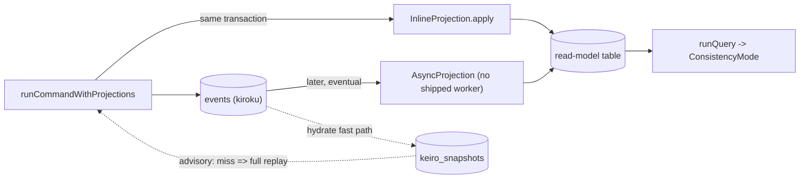
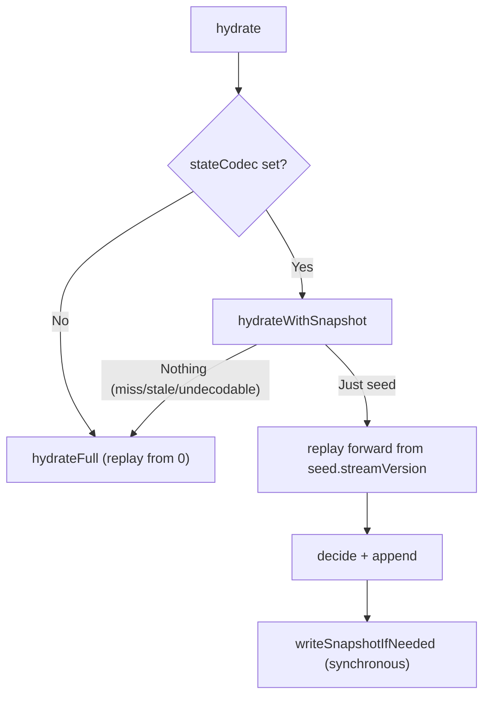

# Keiro read-side documentation: projections, read models, and snapshots

This ExecPlan is a living document. The sections Progress, Surprises & Discoveries,
Decision Log, and Outcomes & Retrospective must be kept up to date as work proceeds.


## Purpose / Big Picture

After this change, the keiro documentation set under `content/docs/keiro/` in this repository
gains a complete, accurate, navigable **read-side** documentation slice. "Read side" is the
half of an event-sourcing system that answers questions: after events are written, how do you
turn them into queryable state, and how do you make hydration (rebuilding an aggregate's state
from its events) fast? Today a reader who lands on `/docs/keiro` can learn the write path (the
command cycle, owned by sibling plan EP-8) but finds nothing about *reading* derived state.
This plan fills that gap.

A reader who finishes this slice can:

- **Tell apart the three read-side primitives that are easy to conflate.** keiro ships three
  distinct things, and the docs teach the distinction explicitly: a **projection** is the
  *worker/verb* that folds events into a table; a **read model** is the *queryable noun* (a
  named, versioned SQL table plus the query that reads it, with an explicit consistency mode); a
  **snapshot** is a *cached fold of an aggregate's state* used only to skip replay during
  hydration and never queried by application code.
- **Choose a consistency mode and understand a sharp gotcha.** A read-model query runs under one
  of three `ConsistencyMode`s — `Strong`, `Eventual`, or `PositionWait`. The docs teach that in
  the shipped `runQuery`, `Strong` and `Eventual` are *behaviorally identical* (both skip
  waiting); only `PositionWait` with a `Just target` position actually blocks until the
  projection has caught up. This is a real, easily-missed property of the source, and getting it
  wrong leads to silently-stale reads.
- **Understand the failure-mode asymmetry.** When a read model's schema drifts from what is
  registered, a query *hard-fails* with `ReadModelStaleSchema` (because users would otherwise
  read wrong data). When a snapshot is missing, stale, or undecodable, hydration *silently falls
  back* to a full replay (because a snapshot is only an optimization). The docs draw this
  contrast on purpose.
- **Build a working read model and a working snapshot, end-to-end, against the real jitsurei
  worked example.** "jitsurei" (実例, "worked example") is a runnable package shipped in the keiro
  repo. The tutorial anchors to `jitsurei/src/Jitsurei/ReadModels.hs` and the command
  `just jitsurei-fulfillment`; the snapshot how-to anchors to `jitsurei/src/Jitsurei/Snapshots.hs`
  (which re-exports `snapshotOrderEventStream` from `Jitsurei/OrderStream.hs`) and
  `just jitsurei-snapshots`.

You can see it working by running the docs dev server from the repo root
(`/Users/shinzui/Keikaku/bokuno/keiro-runtime-docs`) with `pnpm dev` (which runs `vite dev`), or a
production build with `pnpm build` (which runs `vite build` and emits a static single-page app
under `.output/public`). Browsing `http://localhost:3000/docs/keiro` shows the new read-side
pages in the sidebar: two explanation essays, three reference pages, one tutorial, four how-to
guides, and a four-part code walkthrough under `walkthrough/read-side/`. Haskell snippets render
(with ligatures once the font/highlighter plan has landed) and at least two `mermaid` diagrams
render as diagrams.

This is a **content** plan. It populates `content/docs/keiro/` only. It does **not** build the
app, the highlighter, the font, the Mermaid component, or the IA/template system — those are
owned by MasterPlan #1's plans and are already complete. Every Haskell snippet documents keiro
**as shipped at the pinned upstream commit `3f5dc9c` (keiro 0.1.0.0)**; where the keiro repo's
own `docs/research/*` design notes diverge from the shipped code, this plan follows the source.


## Progress

Use a checklist to summarize granular steps. Every stopping point must be documented here,
even if it requires splitting a partially completed task into two ("done" vs. "remaining").
This section must always reflect the actual current state of the work.

- [ ] M0. Preconditions verified — EP-7 Complete (overview/getting-started/jitsurei map +
      `docs/keiro-source-sync.md` exist); toolchain present; `content/docs/keiro/` + its section
      subdirs exist; baseline `pnpm build` clean; keiro source readable at the pinned commit.
- [ ] M1. Explanation pages authored (`explanation/projections-read-models-and-snapshots.mdx`,
      `explanation/consistency-and-snapshots.mdx`), each with a `mermaid` diagram.
- [ ] M2. Reference pages authored (`reference/projection.mdx`, `reference/read-model.mdx`,
      `reference/snapshot.mdx`).
- [ ] M3. Tutorial authored (`tutorials/your-first-read-model.mdx`).
- [ ] M4. How-to guides authored (`how-to/choose-a-consistency-mode.mdx`,
      `how-to/make-an-async-projection-idempotent.mdx`, `how-to/rebuild-a-read-model.mdx`,
      `how-to/add-a-snapshot.mdx`).
- [ ] M5. Walkthrough authored (`walkthrough/read-side/` subdir + its `meta.json`:
      `00-start-here.mdx`, `01-snapshots-in-the-command-path.mdx`,
      `02-the-read-model-query-path.mdx`, `03-projections.mdx`).
- [ ] M6. meta.json appends done (section `meta.json`s + `walkthrough/read-side/meta.json` +
      "read-side" in `walkthrough/meta.json`); full `pnpm build` prerenders new pages with zero
      crawler warnings; Haskell-name and link audits pass.


## Surprises & Discoveries

Document unexpected behaviors, bugs, optimizations, or insights discovered during
implementation. Provide concise evidence.

(None yet.)


## Decision Log

Record every decision made while working on the plan.

- Decision: Document the read side **as shipped at the pinned commit `3f5dc9c` (keiro 0.1.0.0)**,
  not as the keiro repo's `docs/research/*` design notes describe it. The notes diverge from the
  code in several concrete, load-bearing ways that this plan documents the *shipped* version of.
  Rationale: self-containment and accuracy — documenting unshipped behavior would make every
  example wrong and uncompilable. Verified by reading the source modules listed in Context.
  Date: 2026-06-01
- Decision: Document the read-model **rebuild lifecycle as a skeleton**. `Keiro.ReadModel.Rebuild`
  ships `rebuild`/`promote`/`abandonRebuild` as thin wrappers over status transitions only — there
  is **no** shadow-table swap and **no** automated replay/repopulation. The research design's
  eight-step rebuild protocol is *not* implemented. The how-to says so plainly and shows the
  manual repopulation the user must do between `rebuild` and `promote`.
  Rationale: Honesty about gaps; a reader following an unimplemented protocol would be stranded.
  Evidence: `keiro/src/Keiro/ReadModel/Rebuild.hs` is three wrappers over `markRebuilding`/
  `markLive`/`markAbandoned` and nothing else.
  Date: 2026-06-01
- Decision: Document that **keiro ships no async-projection worker loop**. `AsyncProjection`'s
  boundary is a bare `RecordedEvent -> Tx.Transaction ()` (via `applyAsyncProjection`); wiring it
  to a subscription worker and advancing the checkpoint is the *caller's* job. The how-to and the
  projections walkthrough state this explicitly.
  Rationale: Avoid implying a runtime that does not exist. Evidence: `Keiro.Projection` exports
  only `applyAsyncProjection`, with no `runAsyncProjection`/worker entry point.
  Date: 2026-06-01
- Decision: Document the **snapshot write as synchronous**, performed by `writeSnapshotIfNeeded`
  after the append *within* the command-running effect, not as a fire-and-forget post-commit task
  (which is what the research notes describe).
  Rationale: Accuracy. Evidence: `Keiro.Command.writeSnapshotIfNeeded` is called inline in the
  command-run path (`Keiro/Command.hs`), and `writeSnapshotRow` runs a `runTransaction`
  synchronously.
  Date: 2026-06-01
- Decision: Document the **`Strong` == `Eventual` in `runQuery`** behavior as a first-class gotcha
  on both the read-model reference and the consistency explanation/how-to.
  Rationale: It is a sharp, easily-missed property. Evidence: `Keiro.ReadModel.waitIfNeeded` returns
  `Right ()` immediately for both `Strong` and `Eventual`; only `PositionWait (Just _)` blocks.
  Date: 2026-06-01


## Outcomes & Retrospective

Summarize outcomes, gaps, and lessons learned at major milestones or at completion.
Compare the result against the original purpose.

(To be filled during and after implementation.)


## Context and Orientation

Read this whole section before editing. It is written so a novice with only this file and the
working tree can complete the work. You will write MDX content files; you will not write or
compile Haskell. The Haskell appears only as *quoted snippets* inside the docs, and every snippet
must match the real source transcribed below.

### What you are building, and where

This repository (`/Users/shinzui/Keikaku/bokuno/keiro-runtime-docs`) is a **fumadocs**
documentation site (fumadocs-ui + fumadocs-mdx) built on **TanStack Start as a static single-page
app** (React + MDX + TypeScript, bundled with **Vite**), built and served with **pnpm** on
**Node 22**. `pnpm dev` runs `vite dev`; `pnpm build` runs `vite build` and emits a static SPA
under `.output/public`. Content lives under `content/docs/`. Each directory has a `meta.json`
whose `pages` array lists child page slugs (and nested directory names) in sidebar order. A
"page" is an `.mdx` file: YAML frontmatter (`title`, `description`) followed by an MDX body.

The documented **code samples are Haskell** (the site is TypeScript; the subject, keiro, is a
Haskell library). MDX components (`Callout`, `Cards`, `Card`, `Steps`, `Step`, `Tabs`, `Tab`,
`TypeTable`, `Accordion`, `Accordions`, and `Mermaid`) are **registered globally** in
`src/components/mdx.tsx` — so in page bodies you use them **bare, with no `import` lines**. This
matches every existing kiroku page. Do not add `import` statements for these.

### Where this plan sits in the larger effort (reference by path)

This is **EP-9** in the MasterPlan
`docs/masterplans/2-keiro-framework-documentation-set.md`. It is **Phase 2**.

- **HARD DEP — EP-7** (`docs/plans/7-keiro-overview-getting-started-and-the-jitsurei-example-spine.md`):
  EP-7 must be **Complete** before you start. EP-7 creates the `/docs/keiro` overview and
  getting-started pages your pages link back to, the core-concepts explanation, the introduction
  of the jitsurei worked example and its module map, the `docs/keiro-source-sync.md`
  source-of-truth pointer, the `walkthrough/index.mdx` hub and `walkthrough/meta.json`, and the
  shared authoring conventions. Verify EP-7 is done in M0; if `content/docs/keiro/index.mdx` or
  `docs/keiro-source-sync.md` is missing, stop and finish EP-7 first.
- **SOFT DEP — EP-8** (`docs/plans/8-keiro-command-cycle-and-write-path-documentation.md`):
  the command-cycle / write-path slice. EP-9's `runCommandWithProjections` is a thin wrapper over
  EP-8's `runCommandWithSqlEvents`, and snapshots live *in the command path*. Soft means
  non-blocking: you author absolute links to EP-8 pages (for example
  `/docs/keiro/reference/command` and `/docs/keiro/explanation/the-command-cycle`); they resolve
  once EP-8 lands. If you cannot confirm an EP-8 page's exact slug, link to the section landing
  (`/docs/keiro/reference` or `/docs/keiro/explanation`) and note the intended target in prose.

### Hard-won house rules (apply to every page you write)

1. **Absolute doc links only.** Cross-page links use absolute doc paths
   (`/docs/keiro/reference/read-model`), never relative `./sibling` or `../section/page`. Relative
   MDX links resolve *wrong* in the static SPA and trip the prerender crawler (a kiroku lesson
   recorded in `docs/plans/5`'s Surprises: a `./01-…` link from `…/walkthrough/00-start-here`
   resolved to a nonexistent nested route and emitted `[unhandledRejection] Failed to fetch`).
   This applies even to the code-walkthrough template's `[00 — Start here](./00-start-here)` line —
   when you copy that template, **rewrite the link to an absolute path**.
2. **Every fenced code block carries a language tag.** Use ` ```haskell `, ` ```sql `,
   ` ```json `, ` ```mermaid `, ` ```bash `, ` ```text `. Never a bare ```` ``` ````.
3. **Snippet accuracy is an acceptance criterion.** Every Haskell type, field, and function name
   you quote must appear in the pinned source. The verified transcription is below; cross-check
   against the files named before declaring a snippet done.
4. **No `import` lines for the MDX components** (see above).

### The subject, transcribed from source (use these REAL names)

Source of truth on disk (read-only — do **not** edit it):
`/Users/shinzui/Keikaku/bokuno/keiro`, pinned commit `3f5dc9c`. The facts below are transcribed
verbatim from that tree. Treat this as your API cheat-sheet. The files to cross-check are named
inline.

**THREE distinct primitives — do not conflate them.**

**(A) PROJECTION — the worker/verb** (`keiro/src/Keiro/Projection.hs`). Folds events into a
read-side table. Two flavors:

```haskell
-- Inline: runs in the SAME transaction as the command's append.
-- Strong consistency; an exception in `apply` aborts the append.
data InlineProjection co = InlineProjection
  { name  :: !Text
  , apply :: !(co -> RecordedEvent -> Tx.Transaction ())
  }

-- Async: run LATER by a subscription worker. Eventual consistency;
-- at-least-once delivery, so it needs an idempotency key.
data AsyncProjection = AsyncProjection
  { name             :: !Text
  , subscriptionName :: !Text                              -- checkpoint cursor name
  , applyRecorded    :: !(RecordedEvent -> Tx.Transaction ())
  , idempotencyKey   :: !(RecordedEvent -> EventId)        -- dedupe key on redelivery
  }

runCommandWithProjections ::
  forall phi rs s ci co es.
  ( HasCallStack, IOE :> es, Store :> es, Error StoreError :> es
  , BoolAlg phi (RegFile rs, ci), Eq co ) =>
  RunCommandOptions ->
  EventStream phi rs s ci co ->
  Stream (EventStream phi rs s ci co) ->
  ci ->
  [InlineProjection co] ->
  Eff es (Either CommandError (CommandResult (EventStream phi rs s ci co)))

-- Apply one event to an AsyncProjection, yielding the Tx the worker runs.
applyAsyncProjection :: AsyncProjection -> RecordedEvent -> Tx.Transaction ()
```

`runCommandWithProjections` **delegates to** `runCommandWithSqlEvents` (from `Keiro.Command`,
documented by EP-8): it runs the command and, in the same append transaction, applies each
`InlineProjection`'s `apply` to every `(decoded event, RecordedEvent)` pair the command emitted.
A projection failure aborts the whole transaction, so events and read-model update commit
together or not at all.

**GOTCHA to document honestly: keiro ships NO async-projection worker loop.** The boundary for an
`AsyncProjection` is the bare `RecordedEvent -> Tx.Transaction ()` returned by
`applyAsyncProjection`. Wiring it to a subscription and advancing the checkpoint is the caller's
job; `Keiro.Projection` exports no worker entry point.

**(B) READ MODEL — the queryable noun** (`keiro/src/Keiro/ReadModel.hs`).

```haskell
data ReadModel q r = ReadModel
  { name               :: !Text             -- logical identity + key in keiro_read_models
  , tableName          :: !Text             -- the underlying projection table
  , subscriptionName   :: !Text             -- cursor PositionWait polls
  , version            :: !Int              -- schema identity
  , shapeHash          :: !Text             -- schema identity
  , defaultConsistency :: !ConsistencyMode  -- mode runQuery uses
  , query              :: !(q -> Tx.Transaction r)
  }

data ConsistencyMode
  = Strong
  | Eventual
  | PositionWait !PositionWaitOptions
  deriving stock (Generic, Eq, Show)

data PositionWaitOptions = PositionWaitOptions
  { target        :: !(Maybe GlobalPosition)  -- Nothing => skip waiting entirely
  , timeoutMicros :: !Int
  , pollMicros    :: !Int
  }

data ReadModelError
  = ReadModelStaleSchema !Text !Int !Int !Text !Text   -- name, expVer, foundVer, expHash, foundHash
  | ReadModelWaitTimeout !Text !GlobalPosition !GlobalPosition  -- name, target, last observed
  | ReadModelNotLive     !Text !ReadModelStatus        -- name, current status
  deriving stock (Generic, Eq, Show)

runQuery     :: (IOE :> es, Store :> es) => ReadModel q r -> q -> Eff es (Either ReadModelError r)
runQueryWith :: (IOE :> es, Store :> es) => ConsistencyMode -> ReadModel q r -> q -> Eff es (Either ReadModelError r)
waitFor      :: (IOE :> es, Store :> es) => PositionWaitOptions -> ReadModel q r -> GlobalPosition -> Eff es (Either ReadModelError ())
```

`runQueryWith` does, in order: `ensureReadModel` (calls `registerReadModel` then
`validateMetadata`) → if schema/liveness OK, `waitIfNeeded` for the mode → run `query` in a
transaction. **GOTCHA: `Strong` and `Eventual` are behaviorally identical in `runQuery`.** The
internal `waitIfNeeded` returns `Right ()` immediately for both; only `PositionWait` with a
`Just target` polls `subscriptions.last_seen` (the kiroku-owned `subscriptions` table) until the
target `GlobalPosition` is reached or `timeoutMicros` elapses (→ `ReadModelWaitTimeout`). On
schema drift `runQuery` **hard-fails** with `ReadModelStaleSchema`; while a model is not `Live` it
fails with `ReadModelNotLive`.

**Read-model registry** (`keiro/src/Keiro/ReadModel/Schema.hs`):

```haskell
data ReadModelStatus = Live | Rebuilding | Paused | Abandoned
  deriving stock (Generic, Eq, Show)

data ReadModelMetadata = ReadModelMetadata
  { name        :: !Text
  , version     :: !Int
  , shapeHash   :: !Text
  , lastBuiltAt :: !(Maybe UTCTime)
  , status      :: !ReadModelStatus
  }

registerReadModel :: (Store :> es) => Text -> Int -> Text -> Eff es ReadModelMetadata
lookupReadModel   :: (Store :> es) => Text -> Eff es (Maybe ReadModelMetadata)
markRebuilding    :: (Store :> es) => Text -> Int -> Text -> Eff es ReadModelMetadata
markLive          :: (Store :> es) => Text -> Int -> Text -> Eff es ReadModelMetadata
markAbandoned     :: (Store :> es) => Text -> Int -> Text -> Eff es ReadModelMetadata
```

`registerReadModel` is an idempotent `INSERT … ON CONFLICT (name) DO NOTHING` returning the
existing row unchanged — it **never overwrites** the stored `version`/`shapeHash`. That is
*precisely* what lets `validateMetadata` detect drift: if your code's `version`/`shapeHash` differ
from the stored row, you get `ReadModelStaleSchema`. An unrecognized stored status decodes to
`Paused` defensively.

**Rebuild lifecycle** (`keiro/src/Keiro/ReadModel/Rebuild.hs`) — **SKELETON ONLY**:

```haskell
rebuild        :: (Store :> es) => ReadModel q r -> Eff es ReadModelMetadata  -- -> markRebuilding
promote        :: (Store :> es) => ReadModel q r -> Eff es ReadModelMetadata  -- -> markLive
abandonRebuild :: (Store :> es) => ReadModel q r -> Eff es ReadModelMetadata  -- -> markAbandoned
```

These are three thin wrappers that thread the model's `name`/`version`/`shapeHash` into the
status transitions. There is **no shadow-table swap and no automated replay** — repopulating the
table from the event log between `rebuild` and `promote` is manual. While not `Live`, `runQuery`
rejects with `ReadModelNotLive`. The research doc's eight-step rebuild protocol is **not**
implemented; say so.

**(C) SNAPSHOT — cached folded aggregate state** (`keiro/src/Keiro/Snapshot.hs`,
`Keiro/Snapshot/Codec.hs`, `Keiro/Snapshot/Schema.hs`, `keiro-core/src/Keiro/Snapshot/Policy.hs`).
**ADVISORY**: a miss, a stale snapshot, or an undecodable one silently falls through to a full
replay. **Never queried by application code** — it only accelerates hydration.

```haskell
-- Keiro.Snapshot
data SnapshotSeed rs s = SnapshotSeed
  { state         :: !s
  , registers     :: !(RegFile rs)
  , streamVersion :: !StreamVersion
  }

-- Nothing means "replay from the beginning". Decode failure is a benign miss.
hydrateWithSnapshot :: (Store :> es) => StreamName -> StateCodec (s, RegFile rs) -> Eff es (Maybe (SnapshotSeed rs s))
writeSnapshot       :: (Store :> es) => StreamId -> StreamVersion -> StateCodec state -> state -> Eff es ()

-- Keiro.Snapshot.Codec
-- JSON {state, registers}; shapeHash = SHA-256 over the register-file SHAPE
-- (any slot change invalidates older snapshots). The Int is the explicit stateCodecVersion.
defaultStateCodec ::
  forall rs s. (FromJSON s, KnownRegFileShape rs, RegFileToJSON rs, ToJSON s) =>
  Int -> StateCodec (s, RegFile rs)

-- Keiro.Snapshot.Policy (keiro-core)
-- Bool = terminality flag (from Keiki.isFinal); Every n fires when version is a positive multiple of n.
shouldSnapshot :: SnapshotPolicy state -> Bool -> state -> StreamVersion -> Bool

-- Keiro.Snapshot.Schema
lookupSnapshot   :: (Store :> es) => StreamId -> Int -> Text -> Eff es (Maybe SnapshotRow)  -- filters stream_id + codec_version + shape_hash, ORDER BY stream_version DESC LIMIT 1
writeSnapshotRow :: (Store :> es) => SnapshotWrite -> Eff es ()                              -- upsert with monotonicity guard: WHERE stream_version <= EXCLUDED.stream_version
```

`StateCodec` carries `stateCodecVersion :: Int`, `shapeHash :: Text`, `encode`, `decode` (it is
defined in `Keiro.EventStream`; EP-8 owns its reference page). An `EventStream` with
`stateCodec = Nothing` disables snapshotting regardless of policy.

**GOTCHA: `writeSnapshotIfNeeded` runs SYNCHRONOUSLY after the append**, inside the command-run
effect (`keiro/src/Keiro/Command.hs`). The research design described a fire-and-forget post-commit
write; it is not. Hydration consults it via `hydrate` → `hydrateWithSnapshot` (skipped when
`stateCodec = Nothing`), then replays forward from the seed's `streamVersion`; if replay from the
seed fails it falls back to `hydrateFull` (replay from the beginning).

**THE ASYMMETRY TO TEACH:** read-model schema drift = **hard error** (it guards user-queryable
data); snapshot incompatibility = **cache miss** (it is only an optimization).

### Database schema (read-only background)

From `keiro-migrations/sql-migrations/2026-05-17-00-00-00-keiro-bootstrap.sql`:

```sql
CREATE TABLE IF NOT EXISTS keiro_snapshots (
  stream_id           BIGINT PRIMARY KEY,
  stream_version      BIGINT NOT NULL,
  state               JSONB NOT NULL,
  state_codec_version BIGINT NOT NULL,
  regfile_shape_hash  TEXT NOT NULL,
  created_at          TIMESTAMPTZ NOT NULL DEFAULT now(),
  updated_at          TIMESTAMPTZ NOT NULL DEFAULT now()
);
CREATE INDEX IF NOT EXISTS keiro_snapshots_compat_idx
  ON keiro_snapshots (stream_id, state_codec_version, regfile_shape_hash, stream_version DESC);

CREATE TABLE IF NOT EXISTS keiro_read_models (
  name          TEXT PRIMARY KEY,
  version       BIGINT NOT NULL,
  shape_hash    TEXT NOT NULL,
  last_built_at TIMESTAMPTZ,
  status        TEXT NOT NULL,           -- no CHECK constraint on status
  updated_at    TIMESTAMPTZ NOT NULL DEFAULT now()
);
```

`keiro_snapshots` is one row per stream (PK `stream_id`); the compat index backs the
`lookupSnapshot` filter and ordering. `keiro_read_models` has no `CHECK` on `status`. The
`subscriptions` table that `PositionWait` reads (`last_seen`) is **kiroku-owned**, not in this
migration.

### The jitsurei worked example (your anchor for tutorial + how-to)

`jitsurei/src/Jitsurei/ReadModels.hs` defines an **inline projection**
(`orderSummaryInlineProjection :: InlineProjection OrderEvent`) writing the table
`jitsurei_order_summary`, plus a **read model** (`orderSummaryReadModel :: ReadModel
OrderSummaryQuery (Maybe OrderSummary)`) with `defaultConsistency = Strong`, `version = 1`,
`shapeHash = "jitsurei-order-summary-v1"`, `subscriptionName = "jitsurei-order-summary-inline"`.
Run target: `just jitsurei-fulfillment`.

`jitsurei/src/Jitsurei/Snapshots.hs` re-exports `snapshotOrderEventStream` from
`Jitsurei/OrderStream.hs`, which sets `snapshotPolicy = Every 2` and
`stateCodec = Just (defaultStateCodec @OrderRegs @OrderState 1)` (contrast the non-snapshotting
stream, which uses `snapshotPolicy = Never`, `stateCodec = Nothing`). Run target:
`just jitsurei-snapshots`. Both targets depend on `just jitsurei-migrate`.

### The pages this plan authors (all under `content/docs/keiro/`)

Explanations: `explanation/projections-read-models-and-snapshots.mdx`,
`explanation/consistency-and-snapshots.mdx`. References: `reference/projection.mdx`,
`reference/read-model.mdx`, `reference/snapshot.mdx`. Tutorial:
`tutorials/your-first-read-model.mdx`. How-tos: `how-to/choose-a-consistency-mode.mdx`,
`how-to/make-an-async-projection-idempotent.mdx`, `how-to/rebuild-a-read-model.mdx`,
`how-to/add-a-snapshot.mdx`. Walkthrough (new subdir): `walkthrough/read-side/00-start-here.mdx`,
`walkthrough/read-side/01-snapshots-in-the-command-path.mdx`,
`walkthrough/read-side/02-the-read-model-query-path.mdx`, `walkthrough/read-side/03-projections.mdx`,
plus `walkthrough/read-side/meta.json`.

### Templates to copy from

Per Diátaxis type, copy the matching template's frontmatter + skeleton from
`content/docs/_templates/`: `explanation.mdx`, `reference.mdx`, `tutorial.mdx`, `how-to.mdx`,
`code-walkthrough.mdx`. Good in-repo exemplars to imitate for tone and component usage:
`content/docs/kiroku/how-to/build-a-projection.mdx`, `content/docs/kiroku/reference/core-types.mdx`
(for `<TypeTable>`), and `content/docs/kiroku/explanation/optimistic-concurrency.mdx`.


## Plan of Work

The work is six milestones. M0 verifies preconditions. M1–M5 each author one page-group and are
independently verifiable by building the site and viewing the new pages. M6 wires the sidebar and
runs the full acceptance gate. Author in the order below; the explanations establish vocabulary
the references and how-tos lean on.

### M0 — Preconditions

Confirm EP-7 is Complete and the toolchain/tree are ready. At the end you can run `pnpm build`
on the existing keiro tree with zero errors. Acceptance: the build succeeds before you add any
EP-9 page, and `docs/keiro-source-sync.md` + `content/docs/keiro/index.mdx` exist.

### M1 — Explanation set (2 pages)

`explanation/projections-read-models-and-snapshots.mdx` teaches the three-primitive distinction
(projection = verb, read model = noun, snapshot = cache), the visibility difference (snapshots are
never queried; read models are), and the failure-mode asymmetry (advisory snapshot vs hard-fail
read model). It carries a `mermaid` diagram placing the three primitives on the write→read flow.
`explanation/consistency-and-snapshots.mdx` teaches the three consistency modes including the
`Strong == Eventual`-in-`runQuery` gotcha, and how snapshots accelerate hydration (the joint
`(state, registers)` encoding, shape-hash/codec-version gating, the monotonicity guard). It
carries a `mermaid` of the hydrate→replay→write-snapshot loop. At the end: both pages build and
render with their diagrams. Acceptance: `pnpm build` prerenders both with no crawler warnings.

### M2 — Reference set (3 pages)

`reference/projection.mdx` documents `InlineProjection`, `AsyncProjection`,
`runCommandWithProjections`, `applyAsyncProjection` (with the no-worker caveat).
`reference/read-model.mdx` documents `ReadModel`, `ConsistencyMode`, `PositionWaitOptions`,
`ReadModelError`, `runQuery`/`runQueryWith`/`waitFor`, the `ReadModelStatus`/`ReadModelMetadata`
registry and transitions (noting rebuild is skeleton-only), and the `keiro_read_models` table.
`reference/snapshot.mdx` documents `SnapshotSeed`, `hydrateWithSnapshot`, `writeSnapshot`,
`defaultStateCodec`, `SnapshotPolicy`/`StateCodec`, `shouldSnapshot`, and the `keiro_snapshots`
table. Use `<TypeTable>` for record fields. At the end: every name above is present verbatim.
Acceptance: pages build; a grep audit (M6) finds every quoted Haskell name in the pinned source.

### M3 — Tutorial (1 page)

`tutorials/your-first-read-model.mdx`: define an `EventStream` with an `InlineProjection`, run a
command via `runCommandWithProjections`, and query the read model with `Strong`. Anchor to
`Jitsurei/ReadModels.hs` and `just jitsurei-fulfillment`. Use `<Steps>`. At the end: a reader can
follow the lesson end-to-end with real-API snippets. Acceptance: page builds; signatures match
M2's reference.

### M4 — How-to guides (4 pages)

`how-to/choose-a-consistency-mode.mdx`: a decision tree (also as a `mermaid`) ending in
`Strong`/`Eventual`/`PositionWait`; shows passing the command's returned `GlobalPosition` as the
`PositionWait` target for read-your-writes; states the `Strong == Eventual` gotcha.
`how-to/make-an-async-projection-idempotent.mdx`: the `source_event_id UNIQUE` + `ON CONFLICT DO
NOTHING` pattern keyed off `idempotencyKey`, plus the explicit no-worker caveat.
`how-to/rebuild-a-read-model.mdx`: bump `version`/`shapeHash`, then `rebuild` → repopulate (manual)
→ `promote`, with the skeleton-only limits called out. `how-to/add-a-snapshot.mdx`: set
`stateCodec = Just (defaultStateCodec n)` and `snapshotPolicy = Every k`; invalidate via `TRUNCATE
keiro_snapshots` or a codec-version bump; anchor to `Jitsurei/Snapshots.hs` and
`just jitsurei-snapshots`. At the end: each guide solves its one task. Acceptance: all build.

### M5 — Walkthrough (`walkthrough/read-side/`, 4 pages + meta.json)

A four-part ordered tour over the real source. `00-start-here.mdx` frames the read side and the
three primitives with an overview `mermaid`. `01-snapshots-in-the-command-path.mdx` traces
`hydrate` → `hydrateWithSnapshot` → replay-forward → `writeSnapshotIfNeeded`, with the
synchronous-write note. `02-the-read-model-query-path.mdx` traces `runQueryWith` →
`ensureReadModel`/`validateMetadata` → `waitFor` poll → `query`. `03-projections.mdx` contrasts the
inline in-tx path (`runCommandWithProjections`) with the async bare-`Tx` boundary
(`applyAsyncProjection`) and the no-worker caveat. At the end: the subdir exists with its own
`meta.json`. Acceptance: all four build; internal links are absolute.

### M6 — meta.json appends + full acceptance

Append EP-9's slugs to the section `meta.json`s, create `walkthrough/read-side/meta.json`, ensure
`"read-side"` is in `walkthrough/meta.json`, then run the full build and audits. Acceptance: see
Validation and Acceptance.


## Concrete Steps

Run all commands from the repo root `/Users/shinzui/Keikaku/bokuno/keiro-runtime-docs` unless
stated otherwise. The toolchain is **pnpm** on **Node 22** (enter the Nix dev shell first if the
repo uses one: `nix develop`).

### M0 — Preconditions

```bash
# Confirm EP-7's artifacts exist (HARD DEP). If either is missing, finish EP-7 first.
test -f content/docs/keiro/index.mdx && echo "keiro overview present"
test -f docs/keiro-source-sync.md && echo "source-sync pointer present"

# Confirm the section dirs you will write into exist.
for d in explanation reference how-to tutorials walkthrough; do
  test -d "content/docs/keiro/$d" && echo "have content/docs/keiro/$d"
done

# Install deps and confirm the existing site builds before you add pages.
pnpm install
pnpm build
```

Expected (abridged):

```text
keiro overview present
source-sync pointer present
have content/docs/keiro/explanation
have content/docs/keiro/reference
have content/docs/keiro/how-to
have content/docs/keiro/tutorials
have content/docs/keiro/walkthrough
✓ built in <N>s
```

Create the walkthrough subdir you will populate in M5:

```bash
mkdir -p content/docs/keiro/walkthrough/read-side
```

Optional but recommended — confirm the API names you will quote still exist at the pinned commit
(read-only; do not edit the keiro tree):

```bash
grep -RnE "runCommandWithProjections|applyAsyncProjection|hydrateWithSnapshot|runQueryWith|shouldSnapshot|defaultStateCodec" \
  /Users/shinzui/Keikaku/bokuno/keiro/keiro /Users/shinzui/Keikaku/bokuno/keiro/keiro-core
```

### M1 — Explanation pages

Author `content/docs/keiro/explanation/projections-read-models-and-snapshots.mdx` from the
`explanation.mdx` template. Open with the three-primitive table-in-prose, then the asymmetry, then
a diagram. The body is shown inside a four-backtick fence so the inner ` ```mermaid ` survives:

````mdx
---
title: "Projections, read models, and snapshots"
description: "Three read-side primitives that are easy to confuse — a verb, a noun, and a cache — and how they differ in visibility and failure mode."
---

keiro's read side has **three** distinct primitives. They are easy to conflate because all three
touch derived state, but they answer different questions and fail in different ways.

A **projection** is the *verb*: the worker that folds events into a table. A **read model** is the
*noun*: a named, versioned table plus the query that reads it, with an explicit consistency mode.
A **snapshot** is a *cache*: a folded copy of one aggregate's state, used only to skip replay
during hydration and **never** queried by application code.

<Callout type="warn">
The failure modes are deliberately asymmetric. A read model whose schema has drifted **hard-fails**
the query (`ReadModelStaleSchema`) — it guards user-facing data. A snapshot that is missing, stale,
or undecodable is a **silent cache miss**: hydration falls back to a full replay. One protects
correctness; the other only protects latency.
</Callout>

## Where each one lives on the flow



<Cards>
  <Card title="Consistency and snapshots" href="/docs/keiro/explanation/consistency-and-snapshots" />
  <Card title="Read model reference" href="/docs/keiro/reference/read-model" />
  <Card title="Your first read model" href="/docs/keiro/tutorials/your-first-read-model" />
</Cards>
````

Then author `content/docs/keiro/explanation/consistency-and-snapshots.mdx` (also from
`explanation.mdx`). It must (1) explain `Strong`/`Eventual`/`PositionWait` and state plainly that
`Strong` and `Eventual` behave identically in `runQuery` (both skip waiting; only `PositionWait`
with `Just target` blocks, polling `subscriptions.last_seen`); and (2) explain snapshots: the
joint `(state, registers)` JSON encoding, gating by `state_codec_version` + `regfile_shape_hash`,
and the monotonicity guard on write. Include a `mermaid` of the hydrate→replay→write loop, e.g.:



### M2 — Reference pages

Use the `reference.mdx` template and `<TypeTable>` for record fields (imitate
`content/docs/kiroku/reference/core-types.mdx`). Author the three files with these frontmatter
titles and the exact signatures from Context:

`reference/projection.mdx` (title `"Projection"`): one section each for `InlineProjection`,
`AsyncProjection`, `runCommandWithProjections`, `applyAsyncProjection`. State that
`runCommandWithProjections` delegates to `runCommandWithSqlEvents` (link
`/docs/keiro/reference/command`) and that there is no shipped async-projection worker.

`reference/read-model.mdx` (title `"Read model"`): `ReadModel`, `ConsistencyMode`,
`PositionWaitOptions`, `ReadModelError`, the three query functions, then the registry
(`ReadModelStatus`, `ReadModelMetadata`, `registerReadModel`/`lookupReadModel` and the three
`mark*`/rebuild wrappers — note skeleton-only), then the `keiro_read_models` DDL in a ` ```sql `
fence. Put the `Strong == Eventual` gotcha in a `<Callout type="warn">`.

`reference/snapshot.mdx` (title `"Snapshot"`): `SnapshotSeed`, `hydrateWithSnapshot`,
`writeSnapshot`, `defaultStateCodec`, `SnapshotPolicy`/`StateCodec` (note `StateCodec` is defined
in `Keiro.EventStream` — link `/docs/keiro/reference/event-stream` if EP-8 named it that, else the
section landing), `shouldSnapshot`, then the `keiro_snapshots` DDL. Put the synchronous-write and
advisory-miss facts in callouts.

Example `<TypeTable>` shape (for `ReadModel`):

```mdx
<TypeTable
  type={{
    name: { type: "Text", description: "Logical identity; key in keiro_read_models" },
    tableName: { type: "Text", description: "Underlying projection table" },
    subscriptionName: { type: "Text", description: "Cursor PositionWait polls (subscriptions.last_seen)" },
    version: { type: "Int", description: "Schema identity; drift => ReadModelStaleSchema" },
    shapeHash: { type: "Text", description: "Schema identity; drift => ReadModelStaleSchema" },
    defaultConsistency: { type: "ConsistencyMode", description: "Mode runQuery uses" },
    query: { type: "q -> Tx.Transaction r", description: "The SQL read" },
  }}
/>
```

### M3 — Tutorial

Author `content/docs/keiro/tutorials/your-first-read-model.mdx` from `tutorial.mdx`, wrapping the
lesson in `<Steps>`. Anchor every step to `Jitsurei/ReadModels.hs`. The shipped jitsurei read
model is real — quote its fields:

```haskell
-- jitsurei/src/Jitsurei/ReadModels.hs
orderSummaryReadModel :: ReadModel OrderSummaryQuery (Maybe OrderSummary)
orderSummaryReadModel = ReadModel
  { name               = "jitsurei-order-summary"
  , tableName          = "jitsurei_order_summary"
  , subscriptionName   = "jitsurei-order-summary-inline"
  , version            = 1
  , shapeHash          = "jitsurei-order-summary-v1"
  , defaultConsistency = Strong
  , query              = \(OrderSummaryQuery orderId) ->
      Tx.statement (orderIdText orderId) selectOrderSummaryStmt
  }

orderSummaryInlineProjection :: InlineProjection OrderEvent
orderSummaryInlineProjection = InlineProjection
  { name  = "jitsurei-order-summary-inline"
  , apply = applyOrderEvent      -- folds each OrderEvent into jitsurei_order_summary
  }
```

Show running the command and querying:

```haskell
result <- runCommandWithProjections options orderEventStream targetStream command
            [orderSummaryInlineProjection]
summary <- runQuery orderSummaryReadModel (OrderSummaryQuery theOrderId)   -- Strong: no waiting
```

Close with: `just jitsurei-fulfillment` runs the real thing. Link onward to
`/docs/keiro/how-to/choose-a-consistency-mode` and `/docs/keiro/explanation/consistency-and-snapshots`.

### M4 — How-to guides

Author the four files from `how-to.mdx`. Key content per file:

`how-to/choose-a-consistency-mode.mdx` — decision tree as a `mermaid` plus prose. Show the
read-your-writes pattern (pass the `GlobalPosition` a command returned as the `PositionWait`
target):

```haskell
let waitOpts = PositionWaitOptions
      { target        = Just (result ^. #globalPosition)   -- from the command you just ran
      , timeoutMicros = 2_000_000
      , pollMicros    = 50_000
      }
runQueryWith (PositionWait waitOpts) orderSummaryReadModel (OrderSummaryQuery oid)
```

State the gotcha in a `<Callout type="warn">`: under `runQuery`, `Strong` and `Eventual` do **not**
wait — they are identical; choose `PositionWait` when you need read-your-writes.

`how-to/make-an-async-projection-idempotent.mdx` — the SQL pattern:

```sql
ALTER TABLE my_read_model ADD COLUMN source_event_id UUID;
CREATE UNIQUE INDEX my_read_model_source_event_id_uniq ON my_read_model (source_event_id);
-- in the projection's Tx, INSERT ... ON CONFLICT (source_event_id) DO NOTHING
```

```haskell
myAsyncProjection :: AsyncProjection
myAsyncProjection = AsyncProjection
  { name             = "orders-summary-async"
  , subscriptionName = "orders-summary-async"
  , applyRecorded    = \recorded -> Tx.statement (params recorded) upsertOnConflictDoNothingStmt
  , idempotencyKey   = \recorded -> recorded ^. #eventId
  }
```

Add a `<Callout type="warn">`: keiro ships **no** async-projection worker. `applyAsyncProjection`
gives you the `Tx`; you wire it to a kiroku subscription and advance the checkpoint yourself.

`how-to/rebuild-a-read-model.mdx` — show bumping `version`/`shapeHash`, then `rebuild model` →
manual repopulation → `promote model` (or `abandonRebuild model`). A `<Callout type="warn">`: these
are status transitions **only** — no shadow table, no automated replay; repopulation between
`rebuild` and `promote` is your job, and `runQuery` returns `ReadModelNotLive` meanwhile.

`how-to/add-a-snapshot.mdx` — anchor to `Jitsurei/Snapshots.hs`:

```haskell
-- jitsurei/src/Jitsurei/OrderStream.hs (re-exported by Jitsurei/Snapshots.hs)
snapshotOrderEventStream :: OrderEventStream
snapshotOrderEventStream = baseOrderEventStream
  { snapshotPolicy = Every 2
  , stateCodec     = Just (defaultStateCodec @OrderRegs @OrderState 1)
  }
```

Invalidation: `TRUNCATE keiro_snapshots;` or bump the `defaultStateCodec` version argument (a
version or register-shape change makes old rows uncompatible, so they are ignored on lookup).
Close: `just jitsurei-snapshots` runs it.

### M5 — Walkthrough

Copy `code-walkthrough.mdx` for each of the four files under
`content/docs/keiro/walkthrough/read-side/`. **Rewrite the template's `./00-start-here` link to the
absolute path `/docs/keiro/walkthrough/read-side/00-start-here`.** Each chapter quotes the real
source (note the file path above each block) and walks it in prose. Cross-links between chapters
are absolute (e.g. `/docs/keiro/walkthrough/read-side/02-the-read-model-query-path`).

- `00-start-here.mdx` (title `"00 — Start here"`): the three primitives + an overview `mermaid`;
  links to the three chapters.
- `01-snapshots-in-the-command-path.mdx` (title `"01 — Snapshots in the command path"`): quote
  `hydrate` (the `snapshotSeed`/`replayFrom`/`hydrateFull` branch) and `writeSnapshotIfNeeded`
  from `keiro/src/Keiro/Command.hs`; note the synchronous write.
- `02-the-read-model-query-path.mdx` (title `"02 — The read-model query path"`): quote
  `runQueryWith`, `ensureReadModel`/`validateMetadata`, `waitIfNeeded`, and `waitFor` from
  `keiro/src/Keiro/ReadModel.hs`; show the `Strong`/`Eventual` no-wait branches.
- `03-projections.mdx` (title `"03 — Projections: inline vs async"`): quote
  `runCommandWithProjections` and `applyAsyncProjection` from `keiro/src/Keiro/Projection.hs`;
  contrast in-tx vs the bare-`Tx` boundary; the no-worker caveat.

Then create `content/docs/keiro/walkthrough/read-side/meta.json`:

```json
{
  "title": "Read side",
  "pages": [
    "00-start-here",
    "01-snapshots-in-the-command-path",
    "02-the-read-model-query-path",
    "03-projections"
  ]
}
```

### M6 — meta.json appends + acceptance

Append **only** EP-9's slugs; never reorder or remove other plans' entries. After editing, the
relevant `pages` arrays should read like the following (existing entries kept, EP-9 entries
appended — other plans may have added their own slugs too, which you must preserve):

`content/docs/keiro/explanation/meta.json`:

```json
{
  "title": "Explanation",
  "pages": ["index", "projections-read-models-and-snapshots", "consistency-and-snapshots"]
}
```

`content/docs/keiro/reference/meta.json`:

```json
{
  "title": "Reference",
  "pages": ["index", "projection", "read-model", "snapshot"]
}
```

`content/docs/keiro/how-to/meta.json`:

```json
{
  "title": "How-To Guides",
  "pages": ["index", "choose-a-consistency-mode", "make-an-async-projection-idempotent", "rebuild-a-read-model", "add-a-snapshot"]
}
```

`content/docs/keiro/tutorials/meta.json`:

```json
{
  "title": "Tutorials",
  "pages": ["index", "your-first-read-model"]
}
```

`content/docs/keiro/walkthrough/meta.json` — ensure `"read-side"` (the subdirectory name) is in
`pages` (EP-7 may already list it; if not, append it):

```json
{
  "title": "Code Walkthrough",
  "pages": ["index", "read-side"]
}
```

Then build and audit:

```bash
pnpm build
```

Expected: `✓ built in <N>s` with no `[unhandledRejection]` / `Failed to fetch` lines.


## Validation and Acceptance

Acceptance is observable behavior, not just "files exist".

1. **The site builds and prerenders the new pages.** From the repo root:

   ```bash
   pnpm build
   ```

   Succeeds (`✓ built`) and the log shows the eleven new routes prerendered:
   `/docs/keiro/explanation/projections-read-models-and-snapshots`,
   `/docs/keiro/explanation/consistency-and-snapshots`, `/docs/keiro/reference/projection`,
   `/docs/keiro/reference/read-model`, `/docs/keiro/reference/snapshot`,
   `/docs/keiro/tutorials/your-first-read-model`, `/docs/keiro/how-to/choose-a-consistency-mode`,
   `/docs/keiro/how-to/make-an-async-projection-idempotent`, `/docs/keiro/how-to/rebuild-a-read-model`,
   `/docs/keiro/how-to/add-a-snapshot`, and the four `/docs/keiro/walkthrough/read-side/*` routes.

2. **Zero crawler warnings.** The build log contains no `[unhandledRejection]` or `Failed to fetch`
   lines. Confirm:

   ```bash
   pnpm build 2>&1 | grep -E "unhandledRejection|Failed to fetch" || echo "no crawler warnings"
   ```

   Expected: `no crawler warnings`.

3. **Absolute links only.** No relative MDX links in the pages you added:

   ```bash
   grep -RnE "\]\((\./|\.\./)" content/docs/keiro/explanation content/docs/keiro/reference \
     content/docs/keiro/how-to content/docs/keiro/tutorials content/docs/keiro/walkthrough/read-side \
     || echo "no relative links"
   ```

   Expected: `no relative links`.

4. **Quoted Haskell names exist in the pinned source.** Every key identifier you quoted appears in
   `/Users/shinzui/Keikaku/bokuno/keiro`:

   ```bash
   for name in InlineProjection AsyncProjection runCommandWithProjections applyAsyncProjection \
               ReadModel ConsistencyMode PositionWaitOptions ReadModelError runQueryWith waitFor \
               ReadModelStatus ReadModelMetadata registerReadModel markRebuilding \
               SnapshotSeed hydrateWithSnapshot writeSnapshot defaultStateCodec shouldSnapshot; do
     grep -Rqs "$name" /Users/shinzui/Keikaku/bokuno/keiro/keiro /Users/shinzui/Keikaku/bokuno/keiro/keiro-core \
       && echo "ok: $name" || echo "MISSING: $name"
   done
   ```

   Expected: every line says `ok:`.

5. **Every fence is language-tagged.** No bare ```` ``` ``` ```` opening fences in the new pages
   (an opening fence has a language word right after the backticks):

   ```bash
   grep -RnE "^```$" content/docs/keiro/explanation content/docs/keiro/reference \
     content/docs/keiro/how-to content/docs/keiro/tutorials content/docs/keiro/walkthrough/read-side \
     | grep -v "^.*```[a-z]" || echo "all fences tagged"
   ```

   (Closing fences are bare ```` ``` ````; eyeball any hits to confirm they are closers, not
   untagged openers.)

6. **The pages render in a browser.** Run `pnpm dev`, open
   `http://localhost:3000/docs/keiro/reference/read-model`, and confirm the `<TypeTable>` renders,
   the `Strong == Eventual` warning callout shows, and the read-side walkthrough appears nested
   under "Code Walkthrough" → "Read side" in the sidebar. (Ligature-glyph and Mermaid pan/zoom
   interactivity are browser-only checks; if the font/Mermaid plans have not landed, note the
   deferral in Progress — the fences still render.)


## Idempotence and Recovery

Every step is safe to repeat. Authoring `.mdx` files is additive; re-running `pnpm build` is
idempotent. If a page name needs to change, rename the file *and* update the matching `meta.json`
slug in the same edit — a slug pointing at a missing file (or a file missing from `pages`) yields a
broken sidebar entry, not a crash, so the build still exits 0; catch it with the browser check
(acceptance #6).

If `pnpm build` reports a `Failed to fetch` for a link, the cause is almost always a relative link
or a link to a page that does not exist yet. Run acceptance check #3 to find relative links and
fix them to absolute paths. For soft-dep links into EP-8 pages whose slug you could not confirm,
point at the section landing (`/docs/keiro/reference` or `/docs/keiro/explanation`) until EP-8
lands, then update.

Where the keiro source diverges from this plan's transcription, **follow the source** at the
pinned commit `3f5dc9c` and record the delta in Surprises & Discoveries and (if it changes an
instruction) the Decision Log. Do not edit the keiro tree.


## Interfaces and Dependencies

This plan depends on EP-7 (HARD) and EP-8 (SOFT), both in MasterPlan
`docs/masterplans/2-keiro-framework-documentation-set.md`. EP-7 must be Complete (it provides the
overview/getting-started pages, the jitsurei module map, `docs/keiro-source-sync.md`, the
`walkthrough/` hub + `walkthrough/meta.json`, and the authoring conventions). EP-8
(`docs/plans/8-keiro-command-cycle-and-write-path-documentation.md`) provides the command-cycle
reference: `runCommandWithProjections` is a thin wrapper over EP-8's `runCommandWithSqlEvents`, so
`reference/projection.mdx` and the snapshot walkthrough link to EP-8's command reference
(`/docs/keiro/reference/command`) and command explanation
(`/docs/keiro/explanation/the-command-cycle`); these are absolute links that resolve once EP-8
lands (non-blocking).

**Source of truth (read-only) at pinned commit `3f5dc9c`** — cross-checked while authoring:
`/Users/shinzui/Keikaku/bokuno/keiro/keiro/src/Keiro/Projection.hs`,
`.../Keiro/ReadModel.hs`, `.../Keiro/ReadModel/Rebuild.hs`, `.../Keiro/ReadModel/Schema.hs`,
`.../Keiro/Snapshot.hs`, `.../Keiro/Snapshot/Codec.hs`, `.../Keiro/Snapshot/Schema.hs`,
`.../Keiro/Command.hs` (the `hydrate` and `writeSnapshotIfNeeded` functions),
`/Users/shinzui/Keikaku/bokuno/keiro/keiro-core/src/Keiro/Snapshot/Policy.hs`,
`/Users/shinzui/Keikaku/bokuno/keiro/keiro-migrations/sql-migrations/2026-05-17-00-00-00-keiro-bootstrap.sql`,
and `/Users/shinzui/Keikaku/bokuno/keiro/jitsurei/src/Jitsurei/{ReadModels,Snapshots}.hs`
(+ `Jitsurei/OrderStream.hs` for the snapshot config).

**Files created (all under `content/docs/keiro/`):**

- `explanation/projections-read-models-and-snapshots.mdx` — title "Projections, read models, and snapshots".
- `explanation/consistency-and-snapshots.mdx` — title "Consistency and snapshots".
- `reference/projection.mdx` — title "Projection".
- `reference/read-model.mdx` — title "Read model".
- `reference/snapshot.mdx` — title "Snapshot".
- `tutorials/your-first-read-model.mdx` — title "Your first read model".
- `how-to/choose-a-consistency-mode.mdx` — title "Choose a consistency mode".
- `how-to/make-an-async-projection-idempotent.mdx` — title "Make an async projection idempotent".
- `how-to/rebuild-a-read-model.mdx` — title "Rebuild a read model".
- `how-to/add-a-snapshot.mdx` — title "Add a snapshot".
- `walkthrough/read-side/00-start-here.mdx` — title "00 — Start here".
- `walkthrough/read-side/01-snapshots-in-the-command-path.mdx` — title "01 — Snapshots in the command path".
- `walkthrough/read-side/02-the-read-model-query-path.mdx` — title "02 — The read-model query path".
- `walkthrough/read-side/03-projections.mdx` — title "03 — Projections: inline vs async".
- `walkthrough/read-side/meta.json` — new (title "Read side"; the four chapter slugs in order).

**Files edited (meta.json appends only — never reorder/remove other plans' slugs):**

- `content/docs/keiro/explanation/meta.json` — append `projections-read-models-and-snapshots`, `consistency-and-snapshots`.
- `content/docs/keiro/reference/meta.json` — append `projection`, `read-model`, `snapshot`.
- `content/docs/keiro/how-to/meta.json` — append `choose-a-consistency-mode`, `make-an-async-projection-idempotent`, `rebuild-a-read-model`, `add-a-snapshot`.
- `content/docs/keiro/tutorials/meta.json` — append `your-first-read-model`.
- `content/docs/keiro/walkthrough/meta.json` — ensure `read-side` is present (append if EP-7 did not already list it).

**Do not touch** other plans' pages or slugs, the top-level `content/docs/keiro/meta.json`
(EP-7/EP-12 own it), or any file outside `content/docs/keiro/`.

**Haskell interfaces that must be quoted correctly by the end** (present verbatim in the pinned
source; full signatures are in Context): from `Keiro.Projection` — `InlineProjection`,
`AsyncProjection`, `runCommandWithProjections`, `applyAsyncProjection`; from `Keiro.ReadModel` —
`ReadModel`, `ConsistencyMode`, `PositionWaitOptions`, `ReadModelError`, `runQuery`,
`runQueryWith`, `waitFor`; from `Keiro.ReadModel.Schema` — `ReadModelStatus`, `ReadModelMetadata`,
`registerReadModel`, `lookupReadModel`, `markRebuilding`, `markLive`, `markAbandoned`; from
`Keiro.ReadModel.Rebuild` — `rebuild`, `promote`, `abandonRebuild`; from `Keiro.Snapshot` —
`SnapshotSeed`, `hydrateWithSnapshot`, `writeSnapshot`; from `Keiro.Snapshot.Codec` —
`defaultStateCodec`; from `Keiro.Snapshot.Policy` — `shouldSnapshot`; from `Keiro.Snapshot.Schema`
— `SnapshotRow`, `SnapshotWrite`, `lookupSnapshot`, `writeSnapshotRow`.
